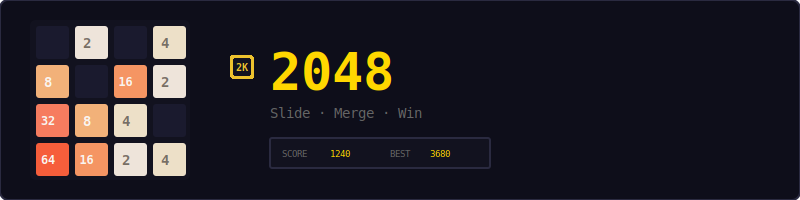
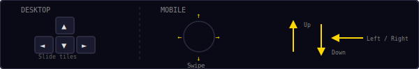
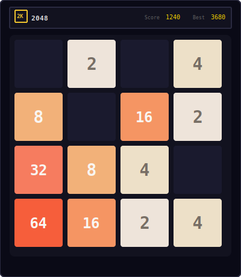
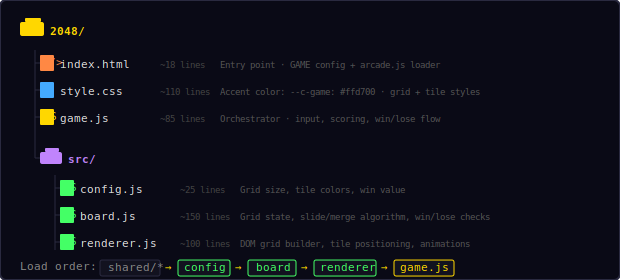
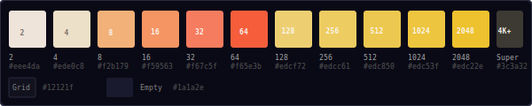
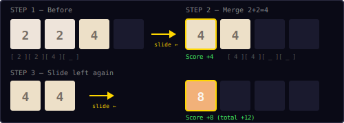
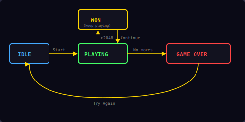

<p align="center">
  
</p>

<p align="center">
  A classic sliding tile puzzle built with vanilla JavaScript and DOM manipulation.<br/>
  Slide tiles, merge matching numbers, and reach 2048.
</p>

---

## ▶ Controls

<p align="center">
  
</p>

| Action | Desktop | Mobile |
|--------|---------|--------|
| Slide tiles | Arrow keys | Swipe |

---

## 🎮 Gameplay

<p align="center">
  
</p>

**Rules:**
- Slide all tiles in one of four directions (up, down, left, right)
- When two tiles with the same number collide, they **merge** into one tile with double the value
- After each move, a new tile (2 or 4) spawns in a random empty cell
- The goal is to create a tile with the value **2048**
- Reaching 2048 doesn't end the game — you can keep going for a higher score
- The game ends when no more moves are possible (no empty cells and no adjacent equal tiles)
- Score increases by the value of each merged tile
- High score is saved locally in your browser

---

## 📁 Project Structure

<p align="center">
  
</p>

---

## 🎨 Color Palette

<p align="center">
  
</p>

All tile colors are defined in `src/config.js`. Each power of 2 has a unique background and text color, progressing from warm beige (2) through orange (8–64) to gold (128–2048). Tiles beyond 2048 use a dark "super" style.

---

## 🔀 Merge Algorithm

<p align="center">
  
</p>

The slide algorithm processes one row (or column) at a time. For a **left** slide:

1. **Compress** — remove all zeros (empty cells), shifting tiles left
2. **Merge** — scan left-to-right; if two adjacent tiles are equal, combine them (double the left tile, remove the right one). Add the merged value to the score.
3. **Compress again** — fill remaining space with zeros to restore row length

```
Example: [2, 0, 2, 4]
  Step 1 — compress:  [2, 2, 4]
  Step 2 — merge:     [4, 4]      (score += 4)
  Step 3 — pad zeros: [4, 4, 0, 0]
```

For other directions, the grid is transformed before applying the left-slide logic:
- **Right:** reverse each row → slide left → reverse back
- **Up:** extract each column as a row → slide left → write back
- **Down:** extract each column reversed → slide left → reverse and write back

Each tile can only merge **once per move** — a row like `[2, 2, 2, 2]` becomes `[4, 4, 0, 0]`, not `[8, 0, 0, 0]`.

---

## 🎲 Tile Spawning

After every move, one new tile appears in a random empty cell:

| Value | Probability |
|-------|-------------|
| **2** | 90% |
| **4** | 10% |

The game starts with 2 random tiles on an empty board. If no empty cells remain after a move and no merges are possible, the game is over.

---

## 🔄 State Machine

<p align="center">
  
</p>

| State | What happens |
|-------|-------------|
| **Idle** | Start screen overlay shown, waiting for player |
| **Playing** | Accepting input, tiles slide and merge |
| **Won** | Toast "2048!" shown, but gameplay continues — player can keep merging |
| **Game Over** | No moves left, final score shown, "Try Again" button |

Reaching 2048 triggers a win toast but does **not** stop the game. The player can continue playing to achieve higher tiles (4096, 8192, etc.) and a higher score.

---

## 🔊 Sound & Effects

All sounds are synthesized in real-time using the Web Audio API — no audio files needed.

| Event | Sound | Visual |
|-------|-------|--------|
| Slide tiles | Short blip | Tiles animate to new positions |
| Merge tiles | Rising score tone | Merged tile pulses (scale 1.2×) |
| New tile spawns | — | Pop-in animation (scale 0→1) |
| Reach 2048 | Win fanfare | Toast message "2048!" |
| Game over | Descending tone | Overlay with final score |

---

## 🛠 Customization

All tweaks happen in `src/config.js`:

**Change grid size:**
```js
gridSize: 5,     // 5×5 grid (harder)
cellSize: 64,    // smaller cells to fit
```
> Note: also update `style.css` grid-template-columns to match.

**Change win target:**
```js
winValue: 1024,  // easier win condition
```

**Change spawn odds:**
In `src/board.js`, find the `addRandomTile` function:
```js
var value = Math.random() < 0.9 ? 2 : 4;
// Change 0.9 to 0.8 for more 4s (harder)
```

**Change tile colors:**
```js
tileColors: {
  2:  { bg: '#00ffcc', text: '#0a0a16' },  // cyan theme
  4:  { bg: '#00ddaa', text: '#0a0a16' },
  // ...
},
```

---

## 🧩 Shared Modules Used

| Module | What 2048 uses it for |
|--------|----------------------|
| `Shell` | HUD stats, overlay screens, toast messages |
| `Input` | Swipe detection initialization |
| `Audio8` | Move, merge, win, and game over sounds |
| `utils.js` | `onSwipe()`, `preventScroll()`, `saveHighScore()`, `loadHighScore()` |

This is a **DOM game** — it does not use `Engine` or `Particles`. The grid is built with CSS Grid and tiles are positioned with absolute positioning and CSS transitions.

---

<p align="center">
  <sub>Part of the <a href="../README.md">Mini Arcade</a> collection · MIT License</sub>
</p>
