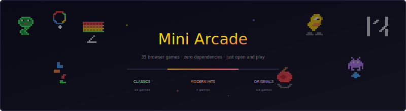
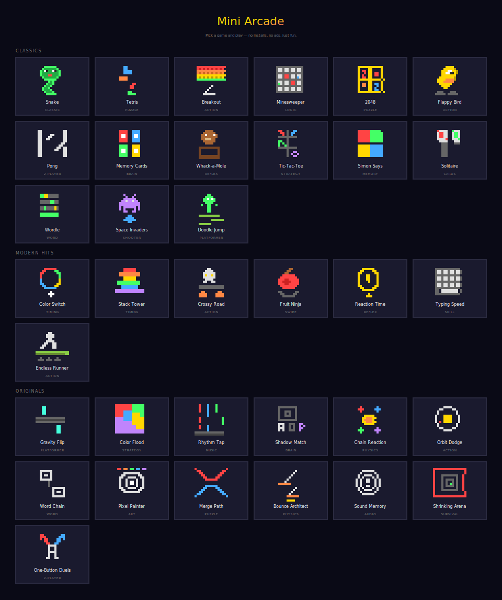

<p align="center">
  
</p>

<p align="center">
  A collection of 46 small, fun web games — playable in the browser on desktop and mobile.<br/>
  No dependencies, no build step. Just open and play.
</p>

---

## 🖥 Screenshot

<p align="center">
  
</p>

---

## 🎮 Games

### Classics

| # | Game | Description |
|---|------|-------------|
| 1 | [Snake](./snake) | Grow the snake, don't hit yourself |
| 2 | [Tetris](./tetris) | Classic falling block puzzle |
| 3 | [Breakout](./breakout) | Paddle + ball + bricks |
| 4 | [Minesweeper](./minesweeper) | Logic-based mine avoidance |
| 5 | [2048](./2048) | Slide and merge numbers to reach 2048 |
| 6 | [Flappy Bird](./flappy-bird) | Tap to fly through the pipes |
| 7 | [Pong](./pong) | 2-player or vs AI paddle game |
| 8 | [Memory Cards](./memory-cards) | Flip and match pairs of cards |
| 9 | [Whack-a-Mole](./whack-a-mole) | Tap the moles before they hide |
| 10 | [Tic-Tac-Toe](./tic-tac-toe) | Play against AI with difficulty levels |
| 11 | [Simon Says](./simon-says) | Repeat the color/sound sequence |
| 12 | [Solitaire](./solitaire) | Classic Klondike card game |
| 13 | [Wordle](./wordle) | Guess the 5-letter word in 6 tries |
| 14 | [Space Invaders](./space-invaders) | Shoot the descending alien waves |
| 15 | [Doodle Jump](./doodle-jump) | Endless vertical platformer |
| 16 | [Pac-Man](./pac-man) | Eat pellets, avoid ghosts, clear the maze |
| 17 | [Frogger](./frogger) | Guide the frog across traffic and rivers |
| 18 | [Asteroids](./asteroids) | Rotate, thrust, and shoot drifting rocks |
| 19 | [Connect Four](./connect-four) | Drop discs to get four in a row vs AI |
| 20 | [Sudoku](./sudoku) | Fill the 9×9 grid with logic |
| 21 | [Hangman](./hangman) | Guess the word letter by letter |

### Modern Hits

| # | Game | Description |
|---|------|-------------|
| 1 | [Color Switch](./color-switch) | Tap through rotating color gates |
| 2 | [Stack Tower](./stack-tower) | Time your taps to stack blocks perfectly |
| 3 | [Crossy Road](./crossy-road) | Endless road crossing |
| 4 | [Fruit Ninja](./fruit-ninja) | Swipe to slice flying fruit |
| 5 | [Reaction Time](./reaction-time) | Test your reflexes |
| 6 | [Typing Speed](./typing-speed) | Type words before they reach the edge |
| 7 | [Endless Runner](./endless-runner) | Jump and dodge in a side-scroller |
| 8 | [Cookie Clicker](./cookie-clicker) | Click to earn, buy upgrades, go idle |

### Originals

| # | Game | Description |
|---|------|-------------|
| 1 | [Gravity Flip](./gravity-flip) | Reverse gravity to navigate corridors |
| 2 | [Color Flood](./color-flood) | Flood the board in fewest moves |
| 3 | [Rhythm Tap](./rhythm-tap) | Tap notes in time with the beat |
| 4 | [Shadow Match](./shadow-match) | Memorize and identify rotated shapes |
| 5 | [Chain Reaction](./chain-reaction) | Click to trigger chain explosions |
| 6 | [Orbit Dodge](./orbit-dodge) | Switch orbit direction to dodge obstacles |
| 7 | [Word Chain](./word-chain) | Chain words by their last letter |
| 8 | [Pixel Painter](./pixel-painter) | Recreate pixel art from memory |
| 9 | [Merge Path](./merge-path) | Connect same-colored dots without crossing |
| 10 | [Bounce Architect](./bounce-architect) | Place pads to guide a ball to the goal |
| 11 | [Sound Memory](./sound-memory) | Simon Says with musical tones |
| 12 | [Shrinking Arena](./shrinking-arena) | Survive as the arena closes in |
| 13 | [One-Button Duels](./one-button-duels) | Two players, one button each, timing combat |
| 14 | [Hex Merge](./hex-merge) | Merge numbers on a hexagonal grid |
| 15 | [Laser Reflect](./laser-reflect) | Place mirrors to guide a laser to the target |
| 16 | [Gravity Well](./gravity-well) | Launch satellites between planetary orbits |
| 17 | [Lights Out](./lights-out) | Toggle lights to turn them all off |

---

## 🚀 How to Run

**Option 1 — GitHub Pages (recommended)**

1. Push this repo to GitHub
2. Go to **Settings → Pages → Deploy from `main` branch**
3. Your arcade is live!

**Option 2 — Local**

```bash
# Any static server works
npx serve .
# or
python3 -m http.server 8000
```

Then open `http://localhost:8000` (or whatever port your server uses).

---

## 📱 Mobile Support

All games are designed to work on mobile devices:

- Touch and swipe controls where applicable
- On-screen D-pad or action buttons for games that need them
- Responsive layouts that adapt to screen size
- Viewport scaling for crisp rendering

---

## 🛠 Tech Stack

- **HTML5 Canvas** for game rendering (most games)
- **DOM + CSS Grid** for board/card games (2048, Minesweeper, Wordle, etc.)
- **Web Audio API** for synthesized 8-bit sound effects — no audio files
- **Vanilla CSS** with a shared design token system for consistent retro styling
- **Vanilla JavaScript** with a modular architecture (IIFE pattern)
- Zero dependencies. Zero build step.

---

## 🏗 Architecture

The arcade uses a shared module system loaded by [`shared/arcade.js`](./shared/arcade.js). Each game is a self-contained folder that relies on these shared modules:

| Module | Purpose |
|--------|---------|
| [`Engine`](./shared/engine.js) | Game loop, state machine, canvas setup |
| [`Input`](./shared/input.js) | Keyboard + touch + swipe + mobile D-pad/action buttons |
| [`Audio8`](./shared/audio.js) | Web Audio synth — preset sounds + custom notes |
| [`Shell`](./shared/game-shell.js) | HUD, overlay screens, toast messages, game area container |
| [`Particles`](./shared/particles.js) | Particle emitter for visual effects |
| [`Grid`](./shared/grid.js) | Grid data structure + DOM renderer (for board games) |
| [`Timer`](./shared/timer.js) | Countdown + stopwatch |
| [`GameIcons`](./shared/icons.js) | 16×16 pixel art SVG icons for each game |
| [`Utilities`](./shared/utils.js) | `randInt()`, `clamp()`, `collides()`, `saveHighScore()`, `onSwipe()`, etc. |

---

## 📁 Project Structure

```
mini-arcade/
├── index.html              ← Arcade hub page (game selector)
├── README.md
├── assets/                 ← README images
│   ├── banner.svg
│   └── hub-screenshot.svg
│
├── shared/                 ← Shared modules (loaded by every game)
│   ├── arcade.js           ← Module loader
│   ├── engine.js           ← Game loop + state machine
│   ├── input.js            ← Keyboard / touch / mobile controls
│   ├── audio.js            ← Web Audio synth
│   ├── game-shell.js       ← HUD + overlays
│   ├── particles.js        ← Particle effects
│   ├── grid.js             ← Grid utilities
│   ├── timer.js            ← Countdown / stopwatch
│   ├── icons.js            ← 16×16 pixel art icons
│   ├── utils.js            ← Helper functions
│   └── css/                ← Shared CSS (tokens, layout, pixel borders)
│
├── snake/                  ┐
├── tetris/                 │
├── breakout/               │  Classics (15)
├── minesweeper/            │
├── 2048/                   │
├── flappy-bird/            │
├── pong/                   │
├── memory-cards/           │
├── whack-a-mole/           │
├── tic-tac-toe/            │
├── simon-says/             │
├── solitaire/              │
├── wordle/                 │
├── space-invaders/         │
├── doodle-jump/            ┘
├── pac-man/                │
├── frogger/                │  + New Classics (6)
├── asteroids/              │
├── connect-four/           │
├── sudoku/                 │
├── hangman/                ┘
│
├── color-switch/           ┐
├── stack-tower/            │
├── crossy-road/            │  Modern Hits (7)
├── fruit-ninja/            │
├── reaction-time/          │
├── typing-speed/           │
├── endless-runner/         ┘
├── cookie-clicker/         ← New Modern Hit
│
├── gravity-flip/           ┐
├── color-flood/            │
├── rhythm-tap/             │
├── shadow-match/           │
├── chain-reaction/         │
├── orbit-dodge/            │  Originals (13)
├── word-chain/             │
├── pixel-painter/          │
├── merge-path/             │
├── bounce-architect/       │
├── sound-memory/           │
├── shrinking-arena/        │
└── one-button-duels/       ┘
├── hex-merge/              │
├── laser-reflect/          │  + New Originals (4)
├── gravity-well/           │
└── lights-out/             ┘
```

Each game folder contains:

```
game-name/
├── index.html      ← Entry point (config + loader)
├── style.css       ← Game accent color + custom styles
├── game.js         ← Orchestrator (wires modules, runs Engine)
├── src/            ← Game-specific modules
│   ├── config.js   ← All tunable constants
│   └── ...         ← Entity / rendering / logic modules
├── assets/         ← SVG diagrams for the game README
└── README.md       ← Rich docs with gameplay, mechanics, state machine
```

---

## 🎨 Visual Style

The arcade uses a consistent retro pixel aesthetic:

- **Dark background** (`#0a0a16`) with raised surface panels (`#1a1a2e`)
- **Pixel font** — [Press Start 2P](https://fonts.google.com/specimen/Press+Start+2P) for all UI text
- **Pixel borders** — stepped corners via CSS `clip-path` that mimic pixel art edges
- **Gold accent** (`#ffd700`) as the default, overridable per-game via `--c-game`
- **16×16 pixel art icons** for every game, rendered as inline SVGs
- All design tokens live in [`shared/css/tokens.css`](./shared/css/tokens.css)

---

## 📄 License

MIT — do whatever you want with it.
