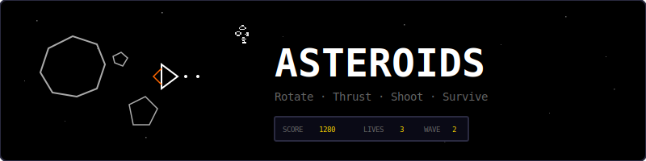
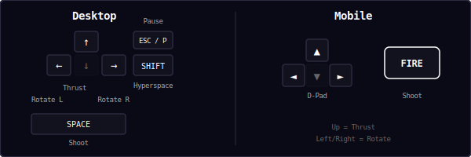
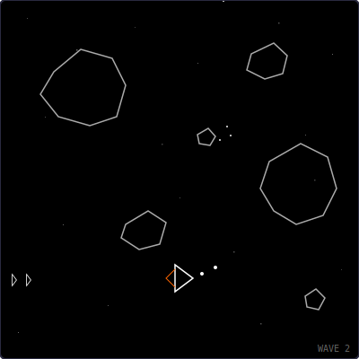
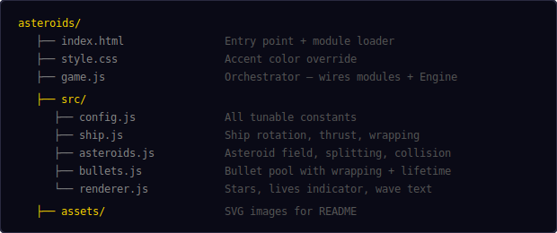
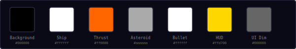
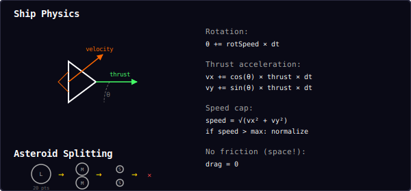
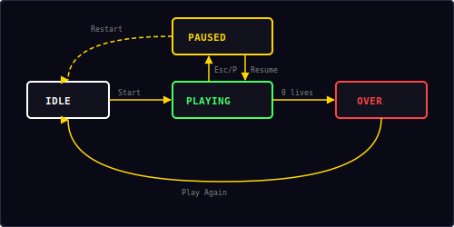

<p align="center">
  
</p>

<p align="center">
  Classic vector-style arcade shooter built with vanilla JavaScript and HTML5 Canvas.<br/>
  Rotate, thrust, shoot asteroids, survive the void.
</p>

---

## ▶ Controls

<p align="center">
  
</p>

| Action | Desktop | Mobile |
|--------|---------|--------|
| Rotate left / right | `←` `→` | D-pad left / right |
| Thrust forward | `↑` | D-pad up |
| Shoot | `Space` | FIRE button |
| Hyperspace | `Shift` | — |
| Pause / Resume | `Esc` / `P` | — |

---

## 🎮 Gameplay

<p align="center">
  
</p>

**Rules:**
- Pilot a ship in open space — rotate left/right, thrust forward, shoot bullets
- Asteroids drift across the screen in random directions, rotating slowly
- Shoot asteroids to destroy them: large → 2 medium → 2 small → destroyed
- All objects wrap around screen edges (go off right, appear on left)
- Bullets travel in a straight line and disappear after ~2 seconds
- Maximum 4 bullets on screen at once
- 3 lives — ship respawns at center with brief invulnerability after death
- Clear all asteroids to advance to the next wave
- Wave 1 starts with 4 large asteroids, each wave adds 1 more
- Press Shift for hyperspace — teleport to a random position (risky!)

**Scoring:**

| Asteroid | Size | Points |
|----------|------|--------|
| Large | 40px radius | 20 |
| Medium | 20px radius | 50 |
| Small | 10px radius | 100 |

Smaller asteroids are harder to hit, so they're worth more points.

---

## 📁 Project Structure

<p align="center">
  
</p>

---

## 🎨 Color Palette

<p align="center">
  
</p>

All colors are defined in `src/config.js`. The classic vector look uses white/grey outlines on a pure black background — no filled shapes, just wireframe lines.

---

## 🚀 Ship Physics

<p align="center">
  
</p>

The ship uses Newtonian physics in a frictionless environment:

- **Rotation:** Angular velocity from left/right input (`rotSpeed = 4.5 rad/s`)
- **Thrust:** Acceleration in the facing direction (`thrust = 200 px/s²`)
- **No friction:** Once moving, the ship keeps drifting (it's space!)
- **Speed cap:** Maximum velocity is capped at `250 px/s` to keep things playable
- **Wrapping:** All objects wrap around screen edges seamlessly

**Asteroid splitting:**
```
Large (40px, 20pts) → 2× Medium (20px, 50pts) → 2× Small (10px, 100pts) → Destroyed
```

Each split creates two smaller asteroids moving in random directions at higher speeds.

---

## 🔄 State Machine

<p align="center">
  
</p>

| State | What happens |
|-------|-------------|
| **Idle** | Start screen overlay, waiting for player |
| **Playing** | Game loop running — ship, asteroids, bullets, collisions |
| **Paused** | Loop stopped, pause overlay with Resume + Restart |
| **Over** | All lives lost, final score shown, Play Again button |

---

## 🔊 Sound & Effects

All sounds are synthesized in real-time using the Web Audio API — no audio files needed.

| Event | Sound | Particles |
|-------|-------|-----------|
| Thrust | Repeating move blip | — |
| Shoot | Short click | — |
| Asteroid destroyed | Hit thud | 6–16 grey/white pixels |
| Wave clear | Score fanfare + toast | — |
| Ship destroyed | Game over descending | 24 white/orange/red pixels |
| Hyperspace | Swoosh | 8 blue pixels |

---

## 🛠 Customization

All tweaks happen in `src/config.js`:

**Change ship handling:**
```js
shipRotSpeed: 6.0,      // faster rotation
shipThrust: 300,         // more powerful engines
shipMaxSpeed: 350,       // higher top speed
```

**Change asteroid difficulty:**
```js
startingAsteroids: 6,    // more asteroids per wave
asteroidSizes: {
  large:  { radius: 50, speed: 50,  points: 20  },
  medium: { radius: 25, speed: 90,  points: 50  },
  small:  { radius: 12, speed: 130, points: 100 },
},
```

**Change bullet behavior:**
```js
bulletSpeed: 400,        // faster bullets
bulletLife: 3.0,         // longer range
maxBullets: 6,           // more bullets on screen
```

**Change visual style:**
```js
shipColor: '#44ff66',    // green ship (classic arcade)
asteroidColor: '#44aaff',// blue asteroids
bgColor: '#0a0a16',     // dark blue background
```

---

## 🧩 Shared Modules Used

| Module | What Asteroids uses it for |
|--------|---------------------------|
| `Engine` | Game loop, state machine, canvas auto-setup |
| `Input` | Keyboard + touch + mobile d-pad/action button |
| `Audio8` | Thrust, shoot, hit, wave clear, and death sounds |
| `Particles` | Asteroid explosion and ship destruction effects |
| `Shell` | HUD stats, overlay screens, toast messages |
| `utils.js` | `saveHighScore()`, `loadHighScore()`, `clamp()` |

---

<p align="center">
  <sub>Part of the <a href="../README.md">Mini Arcade</a> collection · MIT License</sub>
</p>
