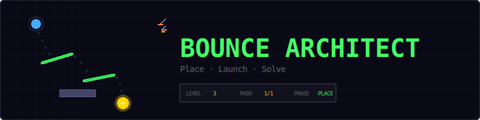
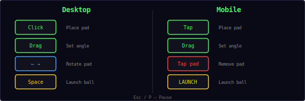
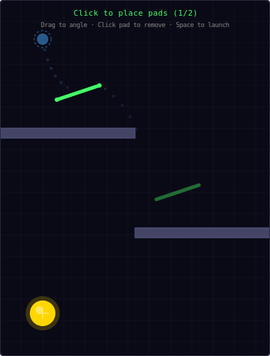
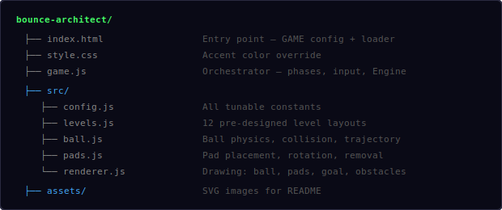
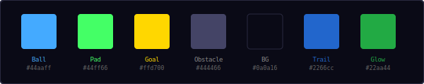
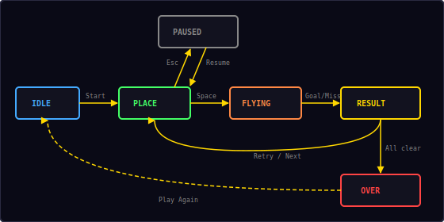

<p align="center">
  
</p>

<p align="center">
  A physics puzzle where you place bounce pads, then launch a ball to reach the goal.<br/>
  Think Peggle meets The Incredible Machine.
</p>

---

## ▶ Controls

<p align="center">
  
</p>

| Action | Desktop | Mobile |
|--------|---------|--------|
| Place pad | Click on canvas | Tap on canvas |
| Set pad angle | Drag after click | Drag after tap |
| Rotate pad | `←` `→` arrow keys | — |
| Remove pad | Click on existing pad | Tap on existing pad |
| Launch ball | `Space` | Launch button |
| Pause | `Esc` / `P` | — |

---

## 🎮 Gameplay

<p align="center">
  
</p>

**Two-phase puzzle:**

1. **PLACE phase** — See the level layout: ball start position, goal, and obstacles. Place a limited number of bounce pads by clicking/tapping. Drag to set the angle.
2. **LAUNCH phase** — Press Space or tap Launch. The ball falls under gravity and bounces off your pads.
3. **Ball reaches goal** = level complete. Ball falls off screen or times out = retry (pads reset).

**Rules:**
- Each level gives you a limited number of pads (0–5)
- Pads are 60px line segments that reflect the ball
- A trajectory preview shows the ball's predicted path
- The ball has a 10-second lifetime — reach the goal before time runs out
- 12 hand-designed levels with increasing complexity
- Level 1 is a tutorial (0 pads, ball drops straight into goal)

---

## 📁 Project Structure

<p align="center">
  
</p>

---

## 🎨 Color Palette

<p align="center">
  
</p>

All colors are defined in `src/config.js`. Change them there to reskin the entire game.

---

## ⚙ Ball Physics

The ball uses simple Newtonian physics:

```
velocity.y += gravity × dt        (gravity = 420 px/s²)
position += velocity × dt
```

**Bounce reflection:**
When the ball hits a pad, it reflects using the standard formula:

```
v' = v - 2(v · n)n
```

Where `n` is the pad's surface normal. Each bounce applies a 0.9× speed multiplier to prevent infinite bouncing.

**Wall collisions:**
- Left, right, and top walls reflect the ball (0.95× speed)
- Bottom edge = ball lost (no wall)

**Pad collision:**
- The ball checks distance to the nearest point on each pad's line segment
- If within `ballRadius + padThickness/2`, a reflection occurs
- The ball is pushed out of the pad to prevent tunneling

---

## 🗺 Level Design

All 12 levels are solvable by construction:

| Level | Pads | Description |
|-------|------|-------------|
| 1 | 0 | Tutorial — ball drops straight into goal |
| 2 | 1 | Goal offset right, redirect with one pad |
| 3 | 1 | Wall blocks direct path, bounce around it |
| 4–6 | 2 | Multiple obstacles, two-bounce solutions |
| 7–9 | 3 | Complex layouts, multi-bounce paths |
| 10–12 | 4–5 | Tight angles, many obstacles |

---

## 🔄 State Machine

<p align="center">
  
</p>

| State | What happens |
|-------|-------------|
| **Idle** | Start screen overlay, waiting for player |
| **Place** | Player places bounce pads, trajectory preview shown |
| **Flying** | Ball launched, physics simulation running |
| **Result** | Success or failure message, then advance or retry |
| **Paused** | Game paused via Esc/P, Resume + Restart options |
| **Over** | All 12 levels complete — win screen |

---

## 🔊 Sound & Effects

All sounds are synthesized using the Web Audio API — no audio files needed.

| Event | Sound | Visual |
|-------|-------|--------|
| Place pad | `click` | Pad appears with glow |
| Pad bounce | `move` | Green particle burst |
| Obstacle bounce | `click` | — |
| Reach goal | `score` | Gold particle burst + toast |
| Miss / timeout | `error` | "MISSED!" text |
| All levels clear | `win` | Win overlay |
| Launch ball | `whoosh` | Ball trail begins |

---

## 🛠 Customization

All tweaks happen in `src/config.js`:

**Change ball physics:**
```js
ballGravity: 300,         // lighter gravity
ballBounceLoss: 0.95,     // less energy loss
ballMaxLifetime: 15,      // more time per attempt
```

**Change pad size:**
```js
padWidth: 80,             // longer pads (easier)
padThickness: 8,          // thicker pads
```

**Change goal size:**
```js
goalRadius: 30,           // bigger target (easier)
```

**Change colors:**
```js
ballColor: '#ff4444',     // red ball
padColor: '#44aaff',      // blue pads
goalColor: '#44ff66',     // green goal
```

---

## 🧩 Shared Modules Used

| Module | What Bounce Architect uses it for |
|--------|----------------------------------|
| `Engine` | Game loop, state machine, canvas setup |
| `Input` | Keyboard input (Space, arrows, Esc) |
| `Audio8` | Bounce, place, launch, and result sounds |
| `Particles` | Bounce and goal-reach particle effects |
| `Shell` | HUD stats, overlay screens, toast messages |
| `utils.js` | `clamp()`, `onSwipe()` |

---

<p align="center">
  <sub>Part of the <a href="../README.md">Mini Arcade</a> collection · MIT License</sub>
</p>
