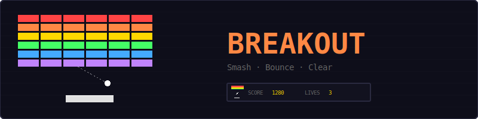
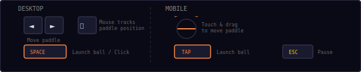
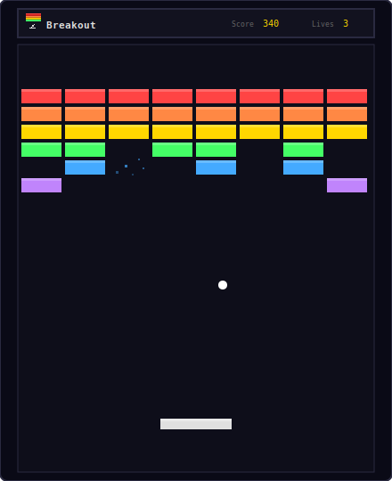
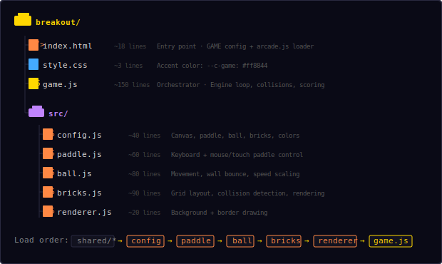
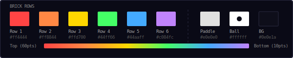
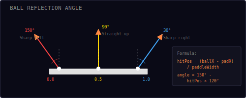
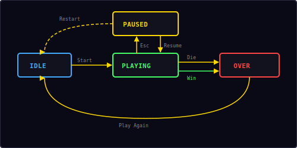

<p align="center">
  
</p>

<p align="center">
  A classic brick-breaking game built with vanilla JavaScript and HTML5 Canvas.<br/>
  Smash bricks, bounce the ball, clear all rows before running out of lives.
</p>

---

## ▶ Controls

<p align="center">
  
</p>

| Action | Desktop | Mobile |
|--------|---------|--------|
| Move paddle | Arrow keys / Mouse | Touch & drag |
| Launch ball | `Space` / Click | Tap |
| Pause / Restart | `Esc` / `P` | — |

> **Note:** Keyboard arrows work for paddle movement. If you've used the mouse, press an arrow key to switch back to keyboard control.

---

## 🎮 Gameplay

<p align="center">
  
</p>

**Rules:**
- 6 rows of colored bricks fill the top of the screen
- You have **3 lives** — lose a life each time the ball falls below the paddle
- The ball speeds up with every brick you break
- Top rows are worth more points: red = 60, orange = 50, gold = 40, green = 30, blue = 20, purple = 10
- Clear all 48 bricks to win
- The ball's bounce angle depends on where it hits the paddle — edges produce sharper angles
- High score is saved locally in your browser

---

## 📁 Project Structure

<p align="center">
  
</p>

---

## 🎨 Color Palette

<p align="center">
  
</p>

All colors are defined in `src/config.js`. Change them there to reskin the entire game.

---

## 🏓 Ball Reflection

<p align="center">
  
</p>

When the ball hits the paddle, the bounce angle is determined by *where* on the paddle it lands:

```
hitPos = (ballX - paddleX) / paddleWidth    // 0.0 = left edge, 1.0 = right edge
angle  = 150° - hitPos × 120°               // 150° (sharp left) → 30° (sharp right)
vx     = speed × cos(angle)
vy     = -speed × sin(angle)
```

| Hit position | Angle | Direction |
|-------------|-------|-----------|
| Left edge (0.0) | 150° | Sharp left |
| Center (0.5) | 90° | Straight up |
| Right edge (1.0) | 30° | Sharp right |

This gives the player precise control over the ball's trajectory. Hitting with the paddle edge creates steep angles useful for reaching bricks on the sides.

---

## 🧱 Scoring

| Row | Color | Points per brick | Speed increase |
|-----|-------|-----------------|----------------|
| 1 (top) | Red `#ff4444` | 60 | +15 px/s |
| 2 | Orange `#ff8844` | 50 | +15 px/s |
| 3 | Gold `#ffd700` | 40 | +15 px/s |
| 4 | Green `#44ff66` | 30 | +15 px/s |
| 5 | Blue `#44aaff` | 20 | +15 px/s |
| 6 (bottom) | Purple `#c084fc` | 10 | +15 px/s |

**Ball speed:** starts at 280 px/s, increases by 15 px/s per brick hit, capped at 500 px/s.

**Maximum possible score:** (8 × 60) + (8 × 50) + (8 × 40) + (8 × 30) + (8 × 20) + (8 × 10) = **1680 points**

---

## 🔄 State Machine

<p align="center">
  
</p>

The game has four states managed by the shared `Engine`:

| State | What happens |
|-------|-------------|
| **Idle** | Start screen overlay shown, waiting for player |
| **Playing** | Game loop running, input active |
| **Paused** | Loop stopped, pause overlay shown with Resume + Restart options |
| **Over** | Win or lose screen with score, "Play Again" button |

The "Win" path triggers when all 48 bricks are destroyed. The "Die" path triggers when all 3 lives are lost.

---

## 🔊 Sound & Effects

All sounds are synthesized in real-time using the Web Audio API — no audio files needed.

| Event | Sound | Particles |
|-------|-------|-----------|
| Brick hit | Rising two-note blip (`score`) | 8 colored pixels burst from brick |
| Paddle bounce | Short blip (`move`) | — |
| Ball lost | Low thud (`hit`) | 15 white/red pixels at ball position |
| Game over | Descending three-note (`gameover`) | — |
| Level clear | Ascending four-note (`win`) | — |

---

## 🛠 Customization

All tweaks happen in `src/config.js`:

**Change paddle size:**
```js
paddleW: 120,        // wider paddle (easier)
paddleSpeed: 500,    // faster keyboard movement
```

**Change difficulty:**
```js
ballBaseSpeed: 200,       // slower start
ballSpeedIncrement: 5,    // gentler ramp
ballMaxSpeed: 400,        // lower ceiling
lives: 5,                 // more forgiving
```

**Change brick layout:**
```js
brickRows: 8,             // more rows
brickCols: 10,            // more columns
brickColors: ['#ff0000', '#ff8800', '#ffff00', '#00ff00', '#0088ff', '#8800ff', '#ff00ff', '#ffffff'],
brickPoints: [80, 70, 60, 50, 40, 30, 20, 10],
```

**Change colors:**
```js
paddleColor: '#44aaff',   // blue paddle
ballColor: '#ffd700',     // gold ball
bgColor: '#1a0a0a',       // dark red background
```

---

## 🧩 Shared Modules Used

| Module | What Breakout uses it for |
|--------|--------------------------|
| `Engine` | Game loop, state machine, canvas auto-setup |
| `Input` | Keyboard + tap + mobile action button |
| `Audio8` | Brick hit, paddle bounce, ball lost, win/lose sounds |
| `Particles` | Brick destruction and ball lost visual effects |
| `Shell` | HUD stats, overlay screens |
| `utils.js` | `clamp()`, `collides()`, `saveHighScore()`, `loadHighScore()` |

---

<p align="center">
  <sub>Part of the <a href="../README.md">Mini Arcade</a> collection · MIT License</sub>
</p>
