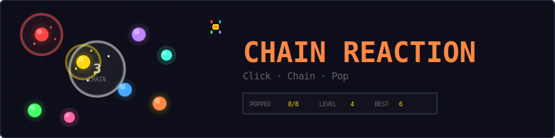
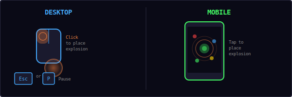
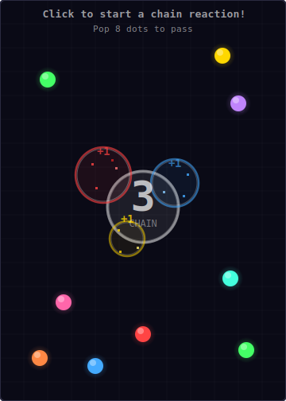
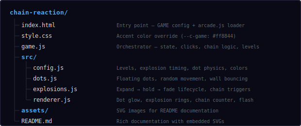
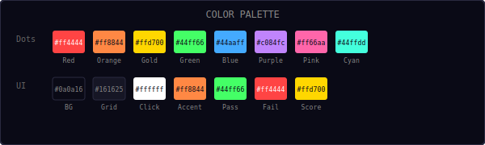
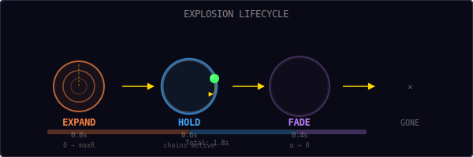
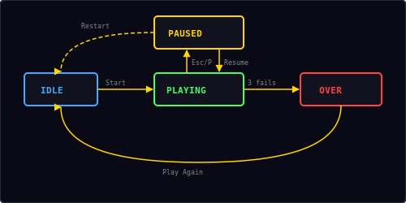

<p align="center">
  
</p>

<p align="center">
  A one-click chain reaction game built with vanilla JavaScript and HTML5 Canvas.<br/>
  Place one explosion, watch the chain unfold, pop enough dots to advance.
</p>

---

## ▶ Controls

<p align="center">
  
</p>

| Action | Desktop | Mobile |
|--------|---------|--------|
| Place explosion | Click | Tap |
| Pause / Resume | `Esc` / `P` | — |

> **Tip:** Aim for clusters! A single well-placed click near a group of dots can trigger a massive chain reaction.

---

## 🎮 Gameplay

<p align="center">
  
</p>

**Rules:**
- Colored dots float around the canvas, bouncing off walls
- You get **one click** per attempt to place an explosion
- The explosion grows as a circle — any dot it touches also explodes
- Each popped dot creates its own explosion, triggering a **chain reaction**
- Your goal: pop enough dots to meet the level target
- You have **3 attempts** per level — fail all 3 and it's game over
- Pass the target and you advance to the next level with more dots and a higher target
- Slow-motion kicks in during big chains for dramatic effect
- High score (highest level reached) is saved locally

---

## 📁 Project Structure

<p align="center">
  
</p>

---

## 🎨 Color Palette

<p align="center">
  
</p>

All colors are defined in `src/config.js`. Change them there to reskin the entire game.

---

## 💥 Explosion Lifecycle

<p align="center">
  
</p>

Every explosion follows a three-phase lifecycle:

| Phase | Duration | Behavior |
|-------|----------|----------|
| **Expand** | 0.8s | Grows from 0 to `maxRadius` (50px) with ease-out curve |
| **Hold** | 0.6s | Stays at full size — dots can still trigger chains |
| **Fade** | 0.4s | Alpha fades to 0, radius slightly expands (+20%) |

**Chain trigger rule:** During the Expand and Hold phases, any dot whose center is within `explosionRadius + dotRadius` of the explosion center will pop and create its own explosion.

The ease-out expansion formula:

```
radius = maxRadius × (1 - (1 - t)²)

where t = age / expandTime, clamped to [0, 1]
```

This gives a satisfying fast-start, slow-finish growth curve.

---

## 📈 Level Progression

Each level defines how many dots spawn and how many you need to pop:

| Level | Dots | Target | Difficulty |
|-------|------|--------|------------|
| 1 | 5 | 1 | Tutorial — almost any click works |
| 2 | 10 | 3 | Easy — aim near a small cluster |
| 3 | 15 | 5 | Medium — need a decent chain |
| 4 | 20 | 8 | Hard — strategic placement needed |
| 5 | 25 | 12 | Very hard — nearly half must pop |
| 6 | 30 | 15 | Expert — half the dots |

**Beyond level 6**, the formula scales:

```
dots   = 30 + (level - 6) × 5
target = 15 + (level - 6) × 3
```

You get **3 attempts** per level. Fail all 3 and the game ends.

---

## 🔄 State Machine

<p align="center">
  
</p>

The game has four engine states managed by the shared `Engine`, plus internal sub-phases during gameplay:

| State | What happens |
|-------|-------------|
| **Idle** | Start screen overlay, waiting for player |
| **Playing** | Game loop running — dots bouncing, click active |
| **Paused** | Loop stopped, pause overlay with Resume + Restart |
| **Over** | Game over screen with level reached, "Play Again" button |

### Internal Game Phases (during Playing)

| Phase | Description |
|-------|-------------|
| `waiting` | Dots bouncing, player hasn't clicked yet |
| `chaining` | Explosions active, chain reaction in progress |
| `settling` | All explosions finished, brief pause before result |
| `result` | Shows pass/fail message, then advances or retries |

---

## 🔊 Sound & Effects

All sounds are synthesized in real-time using the Web Audio API — no audio files needed.

| Event | Sound | Visual Effect |
|-------|-------|---------------|
| Click to explode | Low rumble (`note(60, 0.3, 'sine')`) | White expanding ring |
| Dot popped | Rising two-note (`score`) + rumble | Colored ring + 8 particle burst |
| Big chain (5+) | — | Screen flash (white, 0.15s) |
| Level passed | Ascending fanfare (`win`) | "LEVEL CLEAR!" text |
| Level failed | Low buzz (`error`) | "NOT ENOUGH!" text |
| Game over | Descending three-note (`gameover`) | Overlay screen |

### Visual Effects

- **Dot glow:** Radial gradient around each dot for a neon look
- **Dot trails:** Fading trail of previous positions (5 frames)
- **Explosion rings:** Outer colored ring + inner white ring + subtle fill
- **Chain counter:** Large number in center, scales up on each new chain, fades when done
- **Score popups:** "+1" text floats upward from each popped dot
- **Slow-motion:** Time scale drops to 0.7× when chain count ≥ 1
- **Particle bursts:** 8 colored pixels explode from each popped dot with gravity

---

## 🛠 Customization

All tweaks happen in `src/config.js`:

**Change difficulty:**
```js
maxAttempts: 5,            // more forgiving
levels: [
  [10, 1],                 // easier level 1
  [15, 3],
  [20, 5],
],
```

**Change explosion size:**
```js
explosionMaxRadius: 70,    // bigger explosions = easier chains
explosionExpandTime: 1.0,  // slower growth
explosionHoldTime: 0.8,    // longer active window
```

**Change dot behavior:**
```js
dotRadius: 14,             // bigger targets
dotMinSpeed: 20,           // slower = easier to predict
dotMaxSpeed: 50,
```

**Change visual effects:**
```js
slowMoFactor: 0.5,         // more dramatic slow-mo
bigChainThreshold: 3,      // flash earlier
dotTrailLength: 8,         // longer trails
```

**Change colors:**
```js
dotColors: [
  '#ff0000',
  '#00ff00',
  '#0000ff',
  '#ffff00',
],
```

---

## 🧩 Shared Modules Used

| Module | What Chain Reaction uses it for |
|--------|--------------------------------|
| `Engine` | Game loop, state machine, canvas auto-setup |
| `Input` | Keyboard (Esc/P for pause) |
| `Audio8` | Explosion rumble, score, win, error, game over sounds |
| `Particles` | Colored pixel bursts when dots pop |
| `Shell` | HUD stats (Popped, Level), overlay screens, toast |
| `utils.js` | `saveHighScore()`, `loadHighScore()` |

---

<p align="center">
  <sub>Part of the <a href="../README.md">Mini Arcade</a> collection · MIT License</sub>
</p>
