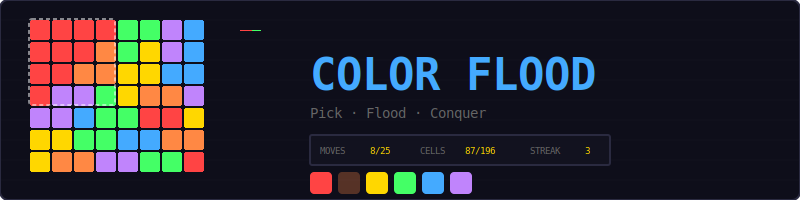
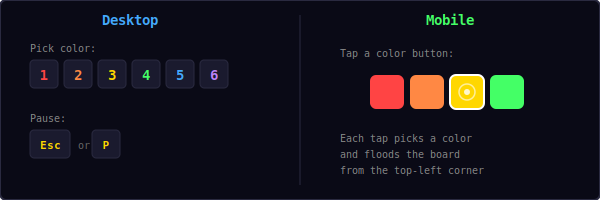
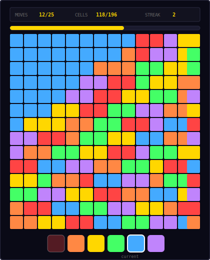
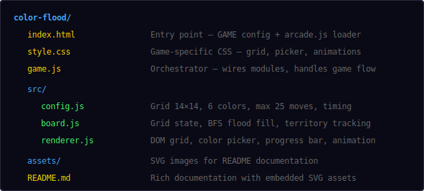
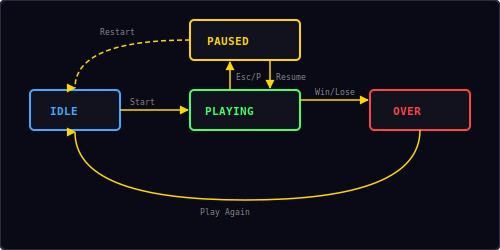

<p align="center">
  
</p>

<p align="center">
  A classic flood-fill puzzle built with vanilla JavaScript and DOM rendering.<br/>
  Pick colors to flood the board from the top-left corner — conquer all 196 cells in 25 moves or fewer.
</p>

---

## ▶ Controls

<p align="center">
  
</p>

| Action | Desktop | Mobile |
|--------|---------|--------|
| Pick color | Click button or press `1`–`6` | Tap color button |
| Pause / Restart | `Esc` / `P` | — |

---

## 🎮 Gameplay

<p align="center">
  
</p>

**Rules:**
- A 14×14 grid is filled with 6 random colors (196 cells total)
- You start from the **top-left corner** — that cell is your initial territory
- Pick a color from the 6 buttons below the grid
- Your entire territory changes to that color, absorbing all adjacent cells of that color
- Each color pick counts as **one move**
- **Win:** flood the entire board (all 196 cells) within 25 moves
- **Lose:** use all 25 moves without completing the flood
- The current territory color is dimmed in the picker — you can't pick it again
- A progress bar shows what percentage of the board you control
- Consecutive wins build a **streak** counter
- High score is saved locally in your browser

**Strategy tips:**
- Look ahead — which color will absorb the most cells?
- Prioritize colors that border your territory in large clusters
- The first few moves matter most — a good opening can save 3-4 moves
- Try to expand in multiple directions, not just one corridor

---

## 📁 Project Structure

<p align="center">
  
</p>

---

## 🎨 Color Palette

<p align="center">
  
</p>

All colors are defined in `src/config.js`. The 6 colors are chosen to be vibrant and easily distinguishable from each other, even on small screens.

---

## 🌊 Flood Fill Algorithm (BFS)

The core mechanic uses **Breadth-First Search** to find and expand the player's territory:

### Territory Computation

Starting from cell (0,0), BFS explores all orthogonally connected cells that share the same color:

```
function computeTerritory():
    color = grid[0][0]
    visited = { (0,0) }
    queue = [(0,0)]
    territory = []

    while queue is not empty:
        cell = queue.dequeue()
        territory.add(cell)

        for each neighbor in [up, down, left, right]:
            if neighbor is in bounds AND
               neighbor.color == color AND
               neighbor not in visited:
                visited.add(neighbor)
                queue.enqueue(neighbor)

    return territory
```

### Flood Move

When the player picks a new color:

1. **Change** all territory cells to the new color
2. **Find frontier** — territory cells adjacent to non-territory cells of the new color
3. **BFS outward** from the frontier in waves (for animation)
4. **Recompute** the full territory with a fresh BFS from (0,0)

The wave-based BFS produces a ripple effect — cells closer to the territory edge change first, creating a satisfying visual cascade.

### Complexity

- Territory computation: **O(n)** where n = number of cells (196)
- Each flood move: **O(n)** for the BFS + territory recomputation
- Total game: at most 25 moves × O(n) = **O(25n)** ≈ O(4900) operations

---

## 🔄 State Machine

<p align="center">
  
</p>

The game has four states managed by the shared `Engine`:

| State | What happens |
|-------|-------------|
| **Idle** | Start screen overlay shown, waiting for player |
| **Playing** | Board active, color picker enabled, moves counting |
| **Paused** | Input disabled, pause overlay with Resume + Restart |
| **Over** | Win or lose screen with stats, "Play Again" button |

Transitions:
- **Idle → Playing**: Player clicks "Start"
- **Playing → Paused**: Player presses Esc/P
- **Paused → Playing**: Player clicks "Resume"
- **Playing → Over**: Board fully flooded (win) or 25 moves used (lose)
- **Over → Playing**: Player clicks "Play Again"
- **Paused → Idle**: Player clicks "Restart"

---

## 🔊 Sound & Effects

All sounds are synthesized in real-time using the Web Audio API — no audio files needed.

| Event | Sound | Visual |
|-------|-------|--------|
| Color pick | Short click blip (`click`) | Picker button press animation |
| Cells absorbed (< 10) | Rising two-note (`score`) | Ripple wave animation |
| Big absorption (10+) | Three-note ascending (`clear`) | Ripple wave animation |
| Board flooded | Four-note fanfare (`win`) | Progress bar fills to 100% |
| Out of moves | Descending three-note (`gameover`) | — |

---

## 🛠 Customization

All tweaks happen in `src/config.js`:

**Change board size:**
```js
cols: 10,        // smaller board (easier)
rows: 10,
```

**Change difficulty:**
```js
maxMoves: 30,    // more moves (easier)
// or
maxMoves: 20,    // fewer moves (harder)
```

**Change colors:**
```js
colors: [
  '#ff0000',   // pure red
  '#ff8800',   // bright orange
  '#ffff00',   // pure yellow
  '#00ff00',   // lime green
  '#0088ff',   // sky blue
  '#ff00ff',   // magenta
],
```

**Change animation speed:**
```js
floodWaveDelay: 50,      // slower wave ripple
floodCellDuration: 300,  // slower cell transition
```

---

## 🧩 Shared Modules Used

| Module | What Color Flood uses it for |
|--------|------------------------------|
| `Engine` | State machine, pause/resume/restart (no canvas) |
| `Input` | Keyboard shortcuts (1-6, Esc, P) |
| `Audio8` | Click, score, clear, win, and game over sounds |
| `Shell` | HUD stats, overlay screens, toast messages |
| `utils.js` | `randInt()` for random grid generation |

---

<p align="center">
  <sub>Part of the <a href="../README.md">Mini Arcade</a> collection · MIT License</sub>
</p>
