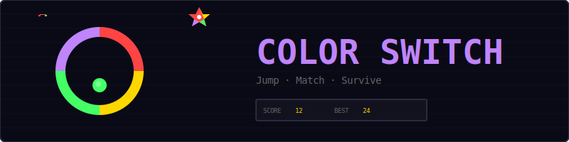
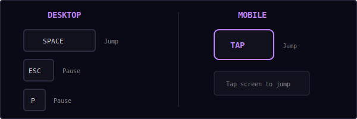
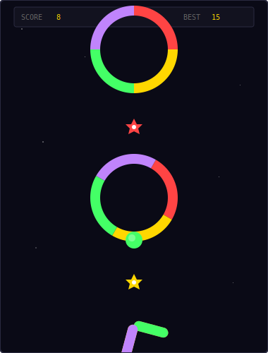
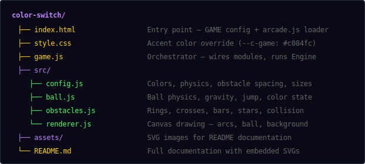
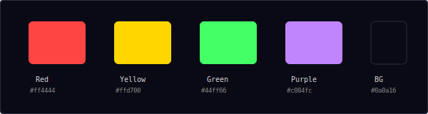
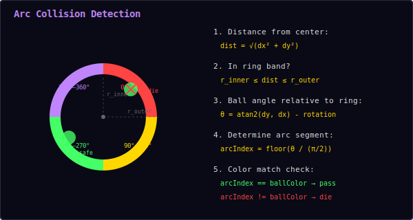
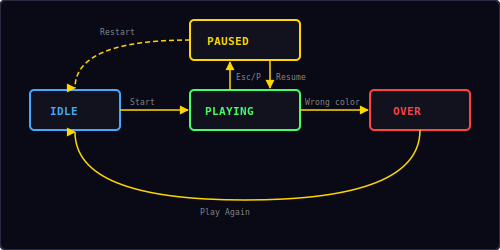

<p align="center">
  
</p>

<p align="center">
  A vertical jumping game where your ball must pass through rotating colored obstacles.<br/>
  Match the color, time your jumps, and climb as high as you can.
</p>

---

## ▶ Controls

<p align="center">
  
</p>

| Action | Desktop | Mobile |
|--------|---------|--------|
| Jump | `Space` / `↑` | Tap / TAP button |
| Pause | `Esc` / `P` | — |

---

## 🎮 Gameplay

<p align="center">
  
</p>

**Rules:**
- Your ball has one of 4 colors: red, yellow, green, or purple
- Rotating obstacles are divided into 4 colored arc segments
- You can only pass through the segment that matches your ball's color — hitting a different color ends the game
- **Color switch stars** appear between obstacles — collecting one changes your ball to a random different color
- Tap or press Space to make the ball jump upward against gravity
- The camera scrolls up as you rise — fall off the bottom and it's game over
- Score 1 point for each obstacle you pass through
- Obstacles rotate faster as your score increases
- Three obstacle types keep things interesting: **rings**, **crosses**, and **bars**
- High score is saved locally in your browser

---

## 📁 Project Structure

<p align="center">
  
</p>

---

## 🎨 Color Palette

<p align="center">
  
</p>

All colors are defined in `src/config.js`. The four game colors are used for obstacle arcs, the ball, and color switch stars.

---

## 🔄 Arc Collision Math

<p align="center">
  
</p>

The core mechanic is determining which colored arc segment the ball is touching on a rotating ring:

**Step 1 — Distance check:**
```
dist = √(dx² + dy²)
```
If `dist` is between `ringInner` and `ringOuter` (accounting for ball radius), the ball overlaps the ring band.

**Step 2 — Angle calculation:**
```
ballAngle = atan2(dy, dx)
relativeAngle = ballAngle - ringRotation
```
Normalize `relativeAngle` to `[0, 2π)`.

**Step 3 — Arc segment lookup:**
```
arcIndex = floor(relativeAngle / (π/2))
```
Each arc spans 90° (π/2 radians). The four segments map to color indices 0–3.

**Step 4 — Color match:**
```
if arcIndex === ballColorIndex → safe (pass through)
if arcIndex !== ballColorIndex → game over
```

### Cross & Bar Obstacles

**Cross obstacles** use rotated coordinate transforms. Each arm is checked by rotating the ball's position into the arm's local space and testing against a rectangle.

**Bar obstacles** are horizontal bars split into 4 equal colored segments. The ball position is rotated into the bar's local space, then the segment index is determined by horizontal position.

---

## ⚙ Physics

The ball uses simple gravity + impulse physics, similar to Flappy Bird:

```
velocity += gravity × dt        // gravity pulls down
position += velocity × dt        // update position

on tap:
  velocity = jumpForce           // instant upward impulse (-420 px/s)
```

| Parameter | Value | Effect |
|-----------|-------|--------|
| Gravity | 800 px/s² | Pulls ball downward |
| Jump force | -420 px/s | Upward impulse on tap |
| Max fall speed | 500 px/s | Terminal velocity cap |

The camera tracks the ball's highest point and smoothly scrolls upward. It never scrolls back down — if the ball falls below the camera view, the game ends.

---

## 🎯 Obstacle Types

| Type | Shape | Behavior |
|------|-------|----------|
| **Ring** | Circle divided into 4 colored arcs | Rotates around center point |
| **Cross** | Plus-sign with 4 colored arms | Rotates around center point |
| **Bar** | Horizontal bar with 4 colored segments | Rotates around center point |

All obstacle types rotate continuously. Rotation speed starts at 1.5 rad/s and increases by 3% per obstacle passed, capping at 3.5 rad/s. Alternating obstacles rotate in opposite directions.

---

## 🔄 State Machine

<p align="center">
  
</p>

The game has four states managed by the shared `Engine`:

| State | What happens |
|-------|-------------|
| **Idle** | Start screen overlay shown, waiting for player |
| **Playing** | Game loop running, ball physics active, obstacles rotating |
| **Paused** | Loop stopped, pause overlay with Resume + Restart options |
| **Over** | Death screen with final score, "Play Again" button |

---

## 🔊 Sound & Effects

All sounds are synthesized in real-time using the Web Audio API — no audio files needed.

| Event | Sound | Particles |
|-------|-------|-----------|
| Jump | Short click blip (`click`) | — |
| Pass obstacle | Rising two-note (`score`) | — |
| Collect color star | Click blip (`click`) | 12 multi-colored pixels |
| Wrong color hit | Descending three-note (`gameover`) | 20 multi-colored burst |

---

## 🛠 Customization

All tweaks happen in `src/config.js`:

**Change difficulty:**
```js
gravity: 600,              // less gravity (easier)
jumpForce: -350,           // weaker jump
rotationSpeed: 1.0,        // slower obstacles
rotationSpeedMax: 2.5,     // lower speed cap
obstacleSpacing: 260,      // more room between obstacles
```

**Change obstacle sizes:**
```js
ringRadius: 65,            // bigger rings
ringThickness: 18,         // thicker arcs
crossArmLength: 60,        // longer cross arms
barWidth: 200,             // wider bars
```

**Change colors:**
```js
colors: ['#ff0000', '#00ff00', '#0000ff', '#ffff00'],
```

**Change ball:**
```js
ballRadius: 16,            // bigger ball
maxFallSpeed: 400,         // slower terminal velocity
```

---

## 🧩 Shared Modules Used

| Module | What Color Switch uses it for |
|--------|-------------------------------|
| `Engine` | Game loop, state machine, canvas auto-setup |
| `Input` | Space/tap to jump, Esc to pause, mobile action button |
| `Audio8` | Jump, score, color switch, and game over sounds |
| `Particles` | Color switch pickup and death burst effects |
| `Shell` | HUD stats, overlay screens |
| `utils.js` | `saveHighScore()`, `loadHighScore()`, `clamp()` |

---

<p align="center">
  <sub>Part of the <a href="../README.md">Mini Arcade</a> collection · MIT License</sub>
</p>
