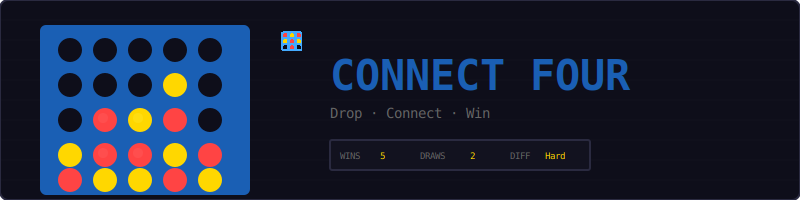
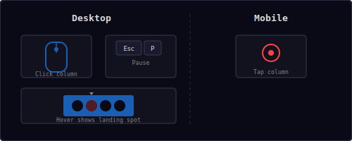
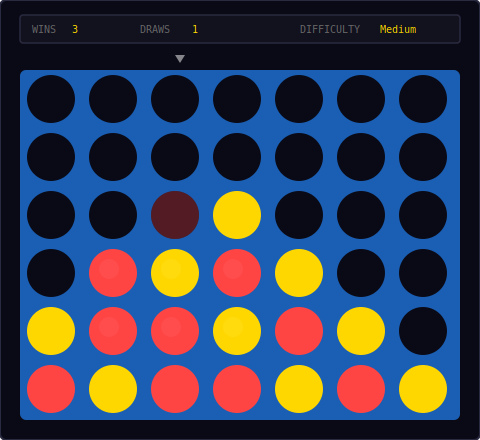
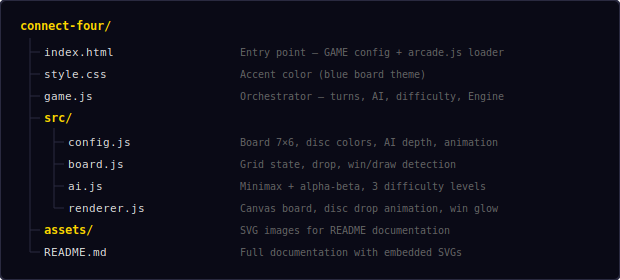
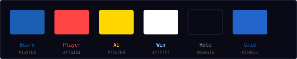
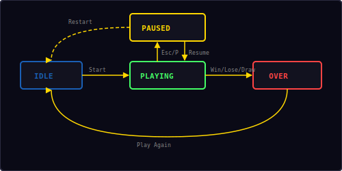

<p align="center">
  
</p>

<p align="center">
  A classic Connect Four game built with vanilla JavaScript and HTML5 Canvas.<br/>
  Drop red discs against an AI opponent — get 4 in a row to win.
</p>

---

## ▶ Controls

<p align="center">
  
</p>

| Action | Desktop | Mobile |
|--------|---------|--------|
| Drop disc | Click column | Tap column |
| Pause / Restart | `Esc` / `P` | — |

Click or tap any column to drop your red disc. The AI responds with a yellow disc after a brief delay. A hover indicator shows where your disc will land. Press `Esc` or `P` to pause — the overlay includes Resume and Restart buttons.

---

## 🎮 Gameplay

<p align="center">
  
</p>

**Rules:**
- 7-column × 6-row vertical grid
- You are **red**, the AI is **yellow**
- You always go first
- Discs fall to the lowest empty row in the chosen column
- Get four in a row (horizontal, vertical, or diagonal) to win
- If all 42 cells are filled with no winner, it's a draw
- Choose from three AI difficulty levels before each game
- Score tracking: wins, losses, draws

---

## 🤖 AI Difficulty Levels

| Level | Strategy | Description |
|-------|----------|-------------|
| **Easy** | Random | Picks any valid column at random |
| **Medium** | Tactical | Blocks your wins, takes its own wins, prefers center |
| **Hard** | Minimax | Alpha-beta pruning, depth 6, position heuristic |

Choose difficulty at the start of each game. Medium is selected by default.

---

## 📁 Project Structure

<p align="center">
  
</p>

---

## 🎨 Color Palette

<p align="center">
  
</p>

All colors are defined in `src/config.js`. Change them there to reskin the entire game.

---

## 🧠 Minimax Algorithm

The Hard AI uses **minimax with alpha-beta pruning** to search the game tree:

1. The AI simulates every possible move recursively up to depth 6
2. At each level, it alternates between maximizing (AI) and minimizing (player)
3. Terminal states are scored: **+100000** for AI win, **-100000** for player win, **0** for draw
4. Depth is added to the score so the AI prefers faster wins and delays losses
5. Alpha-beta pruning skips branches that can't change the outcome
6. Columns are evaluated center-first for better pruning efficiency

**Position evaluation heuristic** (at depth limit):
- Scores every window of 4 cells across the board
- 3-in-a-row with 1 empty: +5 (AI) or -4 (player)
- 2-in-a-row with 2 empty: +2 (AI) or -1 (player)
- Center column preference: +3 per AI disc in center

```
score(AI wins)     = 100000 + depth   // prefer faster wins
score(Player wins) = -100000 - depth  // delay losses
score(draw)        = 0
```

---

## 🏆 Win Detection

The board checks all possible 4-in-a-row patterns:

| Direction | Check |
|-----------|-------|
| Horizontal | Every row, sliding window of 4 columns |
| Vertical | Every column, sliding window of 4 rows |
| Diagonal ↘ | Top-left to bottom-right, all valid positions |
| Diagonal ↗ | Bottom-left to top-right, all valid positions |

A win is detected when all four cells in any window contain the same disc. A draw occurs when all 42 cells are filled and no winning pattern exists.

---

## 🎬 Animations

| Animation | Description |
|-----------|-------------|
| **Disc drop** | Gravity fall from top of board with acceleration |
| **Bounce** | Slight bounce when disc lands in position |
| **Win pulse** | Winning 4 discs glow with a pulsing white ring |
| **Hover ghost** | Semi-transparent disc shows landing position |
| **Particles** | Burst of colored particles on player win |

---

## 🔄 State Machine

<p align="center">
  
</p>

| State | What happens |
|-------|-------------|
| **Idle** | Difficulty selection overlay, waiting for player |
| **Playing** | Board active, alternating turns between player and AI |
| **Paused** | Board frozen, pause overlay with Resume + Restart |
| **Over** | Result screen (win/lose/draw) with score, "Play Again" button |

---

## 🔊 Sound & Effects

All sounds are synthesized in real-time using the Web Audio API — no audio files needed.

| Event | Sound | Preset |
|-------|-------|--------|
| Drop disc | Low thud | `drop` |
| Player wins | Ascending two-note | `score` |
| AI wins | Descending three-note | `gameover` |
| Draw | Low buzz | `error` |
| Column hover | Short click | `click` |

---

## 🛠 Customization

All tweaks happen in `src/config.js`:

**Change board size:**
```js
cols: 8,              // wider board
rows: 7,              // taller board
cellSize: 56,         // smaller cells
```

**Change AI difficulty:**
```js
minimaxDepth: 8,      // deeper search (slower but stronger)
aiDelay: 0.3,         // faster AI response
```

**Change colors:**
```js
boardColor: '#2a7e19',    // green board
playerColor: '#ff66aa',   // pink discs
aiColor: '#44ffdd',       // cyan discs
```

**Change animation speed:**
```js
dropSpeed: 2400,          // faster disc drops
bounceHeight: 6,          // bouncier landing
winPulseSpeed: 5,         // faster win glow
```

---

## 🧩 Shared Modules Used

| Module | What Connect Four uses it for |
|--------|-------------------------------|
| `Engine` | Game loop, state machine, canvas auto-setup |
| `Input` | Keyboard for pause (`Esc`/`P`) |
| `Shell` | HUD stats (wins, draws), overlay screens |
| `Audio8` | Drop, win, draw, and game over sounds |
| `Particles` | Win celebration visual effects |
| `utils.js` | `saveHighScore()`, `loadHighScore()` |

---

<p align="center">
  <sub>Part of the <a href="../README.md">Mini Arcade</a> collection · MIT License</sub>
</p>
