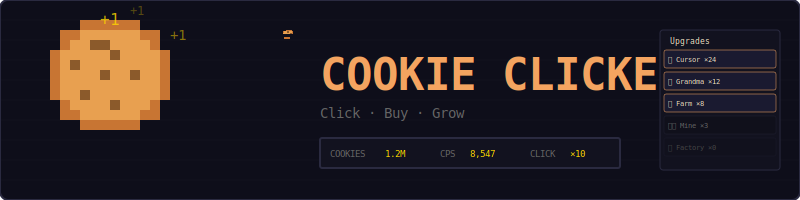
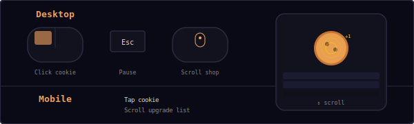
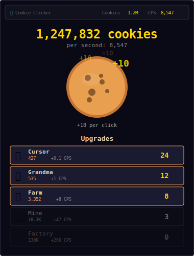
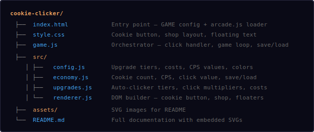
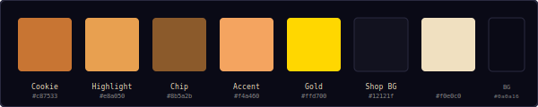
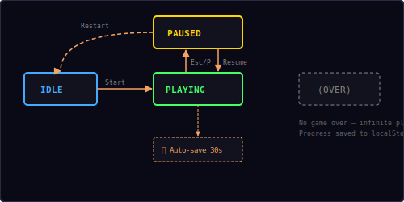

<p align="center">
  
</p>

<p align="center">
  An idle/incremental clicker game built with vanilla JavaScript and DOM.<br/>
  Click the cookie, buy upgrades, watch the numbers grow.
</p>

---

## ▶ Controls

<p align="center">
  
</p>

| Action | Desktop | Mobile |
|--------|---------|--------|
| Click cookie | Left click | Tap |
| Browse upgrades | Scroll | Scroll |
| Buy upgrade | Click item | Tap item |
| Pause | `Esc` / `P` | — |

---

## 🎮 Gameplay

<p align="center">
  
</p>

**Rules:**
- Click the big cookie to earn cookies (starts at 1 per click)
- Spend cookies on **auto-clicker upgrades** that generate Cookies Per Second (CPS)
- Each upgrade tier has increasing cost and CPS output
- Costs scale by **15% per purchase** of the same tier
- Buy **click multipliers** to earn more per click (2×, 3×, 10×)
- Numbers grow exponentially — formatted as 1K, 1M, 1B, 1T for readability
- Floating "+N" text appears on each click
- Milestone toasts fire at every 10× cookie threshold
- Progress **auto-saves every 30 seconds** to localStorage
- Saved game loads automatically on return — including idle earnings

---

## 📁 Project Structure

<p align="center">
  
</p>

---

## 🎨 Color Palette

<p align="center">
  
</p>

All colors are defined in `src/config.js`. Change them there to reskin the entire game.

---

## 📈 Upgrade Tiers

8 auto-clicker tiers with exponential cost/CPS scaling:

| Tier | Name | Base Cost | CPS | Icon |
|------|------|-----------|-----|------|
| 1 | Cursor | 15 | +0.1 | 👆 |
| 2 | Grandma | 100 | +1 | 👵 |
| 3 | Farm | 1,100 | +8 | 🌾 |
| 4 | Mine | 12,000 | +47 | ⛏️ |
| 5 | Factory | 130,000 | +260 | 🏭 |
| 6 | Bank | 1,400,000 | +1,400 | 🏦 |
| 7 | Temple | 20,000,000 | +7,800 | 🛕 |
| 8 | Wizard Tower | 330,000,000 | +44,000 | 🧙 |

**Cost formula:**
```
cost = floor(baseCost × 1.15^owned)
```

### Click Multipliers

| Upgrade | Cost | Effect |
|---------|------|--------|
| Double Click | 100 | 2× per click |
| Triple Click | 10,000 | 3× per click |
| Mega Click | 1,000,000 | 10× per click |

---

## 🔢 Number Formatting

Large numbers are shortened for readability:

| Range | Format | Example |
|-------|--------|---------|
| < 1,000 | Full number | 847 |
| 1,000+ | K suffix | 1.2K |
| 1,000,000+ | M suffix | 3.5M |
| 1,000,000,000+ | B suffix | 1.2B |
| 1,000,000,000,000+ | T suffix | 4.7T |

---

## 🔄 State Machine

<p align="center">
  
</p>

The game has four states managed by the shared `Engine`:

| State | What happens |
|-------|-------------|
| **Idle** | Start screen overlay shown, waiting for player |
| **Playing** | Game loop running — clicking, CPS generation, shop active |
| **Paused** | Loop stopped, pause overlay shown with Resume + Restart |
| **(Over)** | Not used — Cookie Clicker is an infinite idle game |

Auto-save runs every 30 seconds during the Playing state. On page unload, the game saves immediately.

---

## 💾 Save System

- **Auto-save** every 30 seconds during gameplay
- **Manual save** on page close (`beforeunload` event)
- **Idle earnings** calculated on load: `earned = CPS × seconds_away`
- Stored in `localStorage` under key `mini-arcade-cookie-clicker-save`
- Saved data: cookies, CPS, click multiplier, upgrade counts, timestamp

---

## 🔊 Sound & Effects

All sounds are synthesized in real-time using the Web Audio API — no audio files needed.

| Event | Sound | Visual |
|-------|-------|--------|
| Cookie click | Short click blip | Cookie bounce + floating "+N" |
| Buy upgrade | Score jingle | Shop item updates |
| Milestone (10× cookies) | Clear fanfare | Toast notification |
| Can't afford | Error buzz | — |

---

## 🛠 Customization

All tweaks happen in `src/config.js`:

**Change click value:**
```js
baseClickValue: 5,    // start with 5 per click
```

**Change cost scaling:**
```js
costScale: 1.10,      // gentler cost increase (default 1.15)
```

**Add new upgrade tiers:**
```js
upgrades: [
  ...existing,
  { name: 'Alchemy Lab', baseCost: 5000000000, cps: 260000, icon: '⚗️' },
],
```

**Change auto-save interval:**
```js
autoSaveInterval: 10,  // save every 10 seconds
```

**Change milestone frequency:**
```js
milestoneBase: 100,    // toast every 100× instead of 10×
```

---

## 🧩 Shared Modules Used

| Module | What Cookie Clicker uses it for |
|--------|-------------------------------|
| `Engine` | Game loop, state machine (no canvas — DOM game) |
| `Input` | Keyboard pause (Esc/P) |
| `Audio8` | Click, score, clear, and error sounds |
| `Shell` | HUD stats, overlay screens, toast messages |
| `utils.js` | `onSwipe()` for touch support |

---

<p align="center">
  <sub>Part of the <a href="../README.md">Mini Arcade</a> collection · MIT License</sub>
</p>
