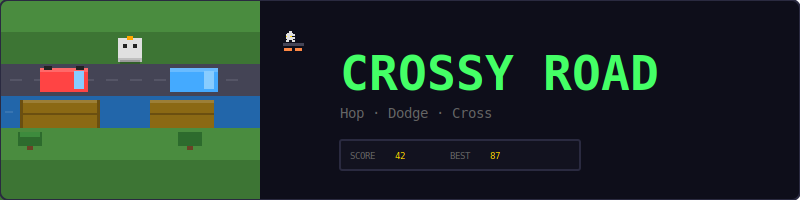
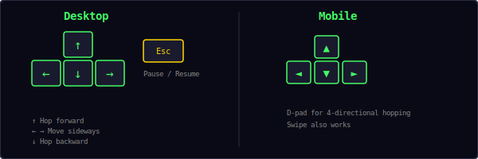
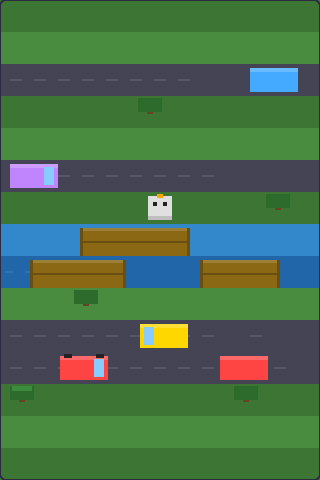
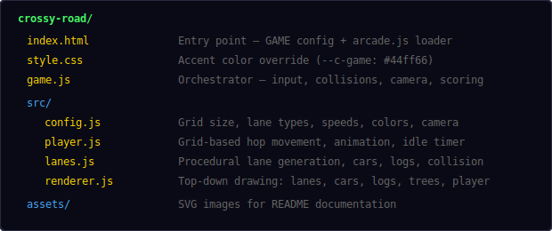
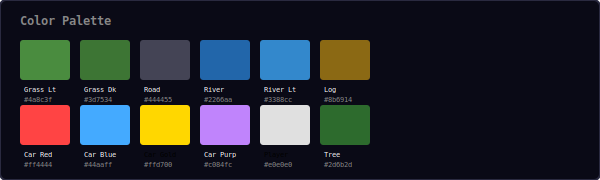
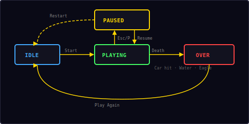

<p align="center">
  
</p>

<p align="center">
  A top-down endless hopper built with vanilla JavaScript and HTML5 Canvas.<br/>
  Hop through traffic, ride logs across rivers, and dodge trees to set a high score.
</p>

---

## ▶ Controls

<p align="center">
  
</p>

| Action | Desktop | Mobile |
|--------|---------|--------|
| Hop forward | `↑` | D-pad ▲ / Swipe up |
| Hop backward | `↓` | D-pad ▼ / Swipe down |
| Move left | `←` | D-pad ◄ / Swipe left |
| Move right | `→` | D-pad ► / Swipe right |
| Pause / Resume | `Esc` / `P` | — |

---

## 🎮 Gameplay

<p align="center">
  
</p>

**Rules:**
- Hop forward through an endless series of lanes — grass, roads, and rivers
- **Grass lanes** are safe resting spots, but trees block certain cells
- **Road lanes** have cars moving horizontally — getting hit is instant death
- **River lanes** have floating logs — hop onto a log to ride across, but fall in the water and you drown
- On a log, hop left/right to move along it — when you reach the edge, a **big hop** automatically jumps you to the nearest adjacent log
- The camera scrolls forward as you advance — don't fall behind
- If you stay idle too long (12 seconds), an eagle swoops down and carries you away
- **Score = furthest row reached** — each new row forward earns 1 point
- Lanes are procedurally generated with random speeds, directions, and obstacle density
- High score is saved locally in your browser

---

## 📁 Project Structure

<p align="center">
  
</p>

---

## 🎨 Color Palette

<p align="center">
  
</p>

All colors are defined in `src/config.js`. Change them there to reskin the entire game.

---

## 🐔 Movement System

The player moves on a grid where each cell is 32×32 pixels. Movement is discrete — one hop per input — with a smooth animation between cells:

```
hopDuration = 0.15s
ease(t) = 1 - (1 - t)²     // ease-out quadratic
px = from.x + (to.x - from.x) × ease(t)
py = from.y + (to.y - from.y) × ease(t)
bounce = -sin(t × π) × 6   // vertical arc during hop
```

The player can hop in 4 directions: forward (up), backward (down), left, and right. Each hop moves exactly one cell. Hops are blocked by trees and screen boundaries.

**Input buffering:** If you press a direction during a hop, it queues up and executes immediately when the current hop finishes. This makes rapid movement feel responsive.

**Straight hops:** Up/down hops keep the same X position, left/right hops keep the same Y position — no diagonal movement.

---

## 🪵 Log-to-Log Hopping

On river lanes, left/right movement works differently:

| Position on log | Left/Right input | Result |
|----------------|-----------------|--------|
| Middle of log | Normal small hop (one cell) along the log |
| Near the edge (within ~25px) | **Big hop** to the nearest edge of the adjacent log |
| Edge with no adjacent log | Hop blocked — stay put |

This means you walk to the edge of your current log, then the big jump triggers automatically to carry you across the water gap to the next log. You never fall in the water during a log-to-log hop.

---

## 🛣 Lane Generation

Lanes are procedurally generated ahead of the camera and recycled behind it. The generator enforces variety rules:

| Rule | Value |
|------|-------|
| Max consecutive road lanes | 3 |
| Max consecutive river lanes | 2 |
| Lane type distribution | ~35% grass, ~35% road, ~30% river |
| Generate ahead | 18 lanes beyond camera |

Each lane gets random parameters:
- **Road:** car speed (40–120 px/s), direction (left/right), gap between cars (80–200 px), random car color
- **River:** log speed (30–70 px/s), direction, log width (80–140 px), gap (40–90 px), minimum 3 logs per lane
- **Grass:** 25% chance of a tree per cell, with guaranteed clear path through the middle

---

## ⚠️ Idle Timeout

If the player doesn't hop forward for 12 seconds, an eagle warning appears:

```
idleTimeout = 12.0s   // time before warning
eagleWarning = 3.0s   // warning duration before death
```

1. After 12s idle → red screen flash + "MOVE!" text + eagle appears above
2. Eagle swoops down over 3 seconds
3. If player hops forward, the timer resets and the eagle disappears
4. If 3s pass without a forward hop → eagle catches player → game over

---

## 🔄 State Machine

<p align="center">
  
</p>

| State | What happens |
|-------|-------------|
| **Idle** | Start screen overlay, waiting for player |
| **Playing** | Game loop running — hopping, cars moving, logs floating |
| **Paused** | Loop stopped, pause overlay with Resume + Restart |
| **Over** | Death screen with score, "Play Again" button |

Three death causes transition from Playing → Over:
- **Car hit** — player occupies same space as a car
- **Water** — player is on a river lane but not on a log
- **Eagle** — idle timeout expired

---

## 🔊 Sound & Effects

All sounds are synthesized in real-time using the Web Audio API — no audio files needed.

| Event | Sound | Particles |
|-------|-------|-----------|
| Hop | Short blip (`move`) | — |
| New high row | Rising two-note (`score`) | — |
| Car collision | Low thud (`hit`) | 20 red/gold/white pixels |
| Water death | Drop sound (`drop`) | 15 blue splash pixels |
| Eagle / game over | Descending three-note (`gameover`) | — |

---

## 🛠 Customization

All tweaks happen in `src/config.js`:

**Change grid size:**
```js
cellSize: 24,    // smaller cells = more lanes visible
cols: 14,        // wider playing field
```

**Change difficulty:**
```js
carMinSpeed: 60,       // faster minimum car speed
carMaxSpeed: 180,      // faster maximum car speed
idleTimeout: 8.0,      // less time before eagle
eagleWarning: 2.0,     // faster eagle swoop
```

**Change lane generation:**
```js
maxConsecutiveRoad: 5,   // allow longer road stretches
maxConsecutiveRiver: 3,  // allow longer river stretches
treeChance: 0.4,         // denser forests
```

**Change player appearance:**
```js
playerBody: '#44ff66',   // green chicken
playerBeak: '#ff4444',   // red beak
playerEye: '#ffffff',    // white eyes
```

---

## 🧩 Shared Modules Used

| Module | What Crossy Road uses it for |
|--------|------------------------------|
| `Engine` | Game loop, state machine, canvas auto-setup |
| `Input` | Keyboard + swipe + mobile d-pad |
| `Audio8` | Hop, score, hit, drop, and game over sounds |
| `Particles` | Death visual effects (car hit, water splash) |
| `Shell` | HUD stats, overlay screens |
| `utils.js` | `saveHighScore()`, `loadHighScore()`, `randInt()` |

---

<p align="center">
  <sub>Part of the <a href="../README.md">Mini Arcade</a> collection · MIT License</sub>
</p>
