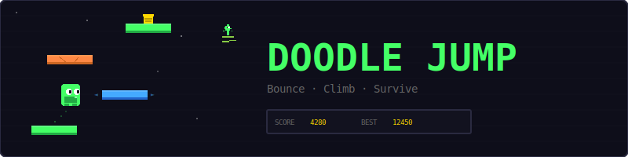
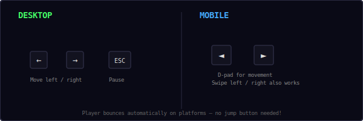
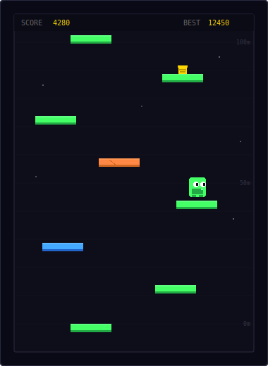
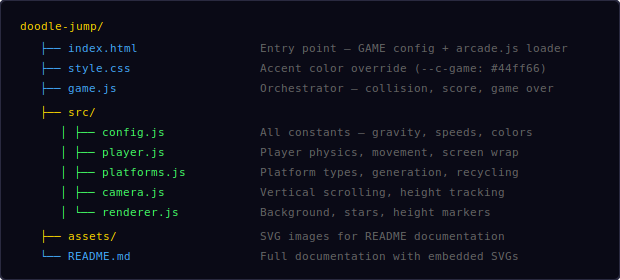
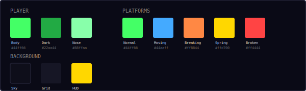
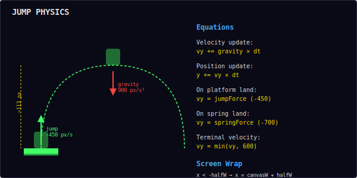
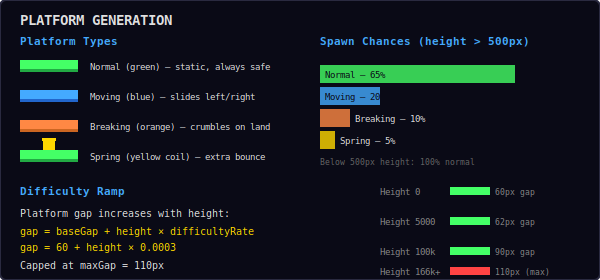
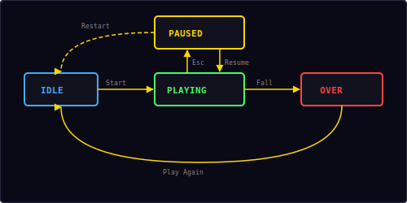

<p align="center">
  
</p>

<p align="center">
  A vertical platformer built with vanilla JavaScript and HTML5 Canvas.<br/>
  Bounce upward on platforms, dodge hazards, and climb as high as you can.
</p>

---

## ▶ Controls

<p align="center">
  
</p>

| Action | Desktop | Mobile |
|--------|---------|--------|
| Move left / right | `←` `→` | D-pad or swipe |
| Pause / Restart | `Esc` / `P` | — |

> **Note:** The player bounces automatically when landing on a platform — no jump button needed. Just steer left and right!

---

## 🎮 Gameplay

<p align="center">
  
</p>

**Rules:**
- Your doodler bounces upward automatically when it lands on a platform
- Steer left and right to land on the next platform above
- The camera scrolls up as you climb — you can never go back down
- If you fall below the bottom of the screen, the game is over
- The player wraps around screen edges — go off the left side, appear on the right
- Score equals the maximum height reached
- Platform spacing increases with height, making the game progressively harder
- High score is saved locally in your browser

**Platform types:**
- **Green (Normal)** — Static and always safe to land on
- **Blue (Moving)** — Slides horizontally back and forth
- **Orange (Breaking)** — Crumbles after you land on it — one-time use!
- **Spring (Yellow coil)** — Gives a super-powered bounce, launching you extra high

---

## 📁 Project Structure

<p align="center">
  
</p>

---

## 🎨 Color Palette

<p align="center">
  
</p>

All colors are defined in `src/config.js`. Change them there to reskin the entire game.

---

## 🔬 Jump Physics

<p align="center">
  
</p>

The player follows simple projectile physics with constant gravity:

```
vy += gravity × dt        // accelerate downward (900 px/s²)
y  += vy × dt             // update position

On platform land:
  vy = jumpForce           // -450 px/s (normal bounce)
  vy = springForce          // -700 px/s (spring bounce)
```

| Parameter | Value | Effect |
|-----------|-------|--------|
| Gravity | 900 px/s² | Pulls player down |
| Jump force | -450 px/s | Normal bounce height (~113 px) |
| Spring force | -700 px/s | Super bounce height (~272 px) |
| Terminal velocity | 600 px/s | Max fall speed |
| Horizontal speed | 250 px/s | Left/right movement |

**Screen wrapping:** When the player exits one side of the screen, they appear on the opposite side. This is calculated using the player's half-width as the threshold.

**Collision detection:** The player only collides with platforms when falling (vy ≥ 0). The player's feet position is checked against the platform's top edge.

---

## 🏗 Platform Generation

<p align="center">
  
</p>

Platforms are generated procedurally as the player climbs:

1. **Initial fill** — Screen is populated with platforms from bottom to top
2. **Dynamic generation** — New platforms spawn above the camera as the player rises
3. **Recycling** — Platforms below the camera bottom are removed from memory
4. **Difficulty ramp** — Vertical gap between platforms increases with height

```
gap = min(baseGap + height × difficultyRate, maxGap)
gap = min(60 + height × 0.0003, 110)
```

**Type selection** (above 500px height):
| Type | Chance | Behavior |
|------|--------|----------|
| Normal | 65% | Static, always safe |
| Moving | 20% | Slides horizontally at 60 px/s |
| Breaking | 10% | Crumbles on contact, one-time use |
| Spring | 5% | Extra bounce (-700 px/s vs -450 px/s) |

Below 500px height, all platforms are normal to give the player a safe start.

---

## 📷 Camera System

The camera tracks the player's highest point and scrolls upward:

- Player is kept in the lower 35% of the screen (`cameraOffset: 0.35`)
- Camera only moves up, never down — once you pass a height, there's no going back
- Score is derived from the camera's maximum height: `score = |maxHeight| × 0.1`
- New platforms are generated one screen-height above the camera
- Old platforms are cleaned up when they fall below the camera bottom

---

## 🔄 State Machine

<p align="center">
  
</p>

The game has four states managed by the shared `Engine`:

| State | What happens |
|-------|-------------|
| **Idle** | Start screen overlay shown, waiting for player |
| **Playing** | Game loop running, player bouncing, platforms scrolling |
| **Paused** | Loop stopped, pause overlay shown with Resume + Restart options |
| **Over** | Fall screen with final score, "Play Again" button |

---

## 🔊 Sound & Effects

All sounds are synthesized in real-time using the Web Audio API — no audio files needed.

| Event | Sound | Particles |
|-------|-------|-----------|
| Normal bounce | Short blip (`move`) | — |
| Spring bounce | Rising two-note (`score`) | 10 gold pixels burst |
| Breaking platform | Low thud (`hit`) | 8 orange/red pixels crumble |
| Game over (fall) | Descending three-note (`gameover`) | — |

---

## 🛠 Customization

All tweaks happen in `src/config.js`:

**Change difficulty:**
```js
gravity: 600,              // lower gravity = floatier jumps
jumpForce: -350,           // weaker bounce
platformGap: 40,           // closer platforms (easier)
platformMaxGap: 80,        // lower ceiling on difficulty
platformDifficultyRate: 0.0001, // slower ramp
```

**Change platform mix:**
```js
normalChance: 0.50,        // fewer normal platforms
movingChance: 0.75,        // more moving (25%)
breakingChance: 0.90,      // more breaking (15%)
// remaining 10% = spring
```

**Change player speed:**
```js
playerSpeed: 350,          // faster horizontal movement
springForce: -900,         // super-powered springs
```

**Change colors:**
```js
playerBody: '#ff8844',     // orange doodler
normalColor: '#44aaff',    // blue platforms
bgColor: '#1a0a0a',       // dark red sky
```

---

## 🧩 Shared Modules Used

| Module | What Doodle Jump uses it for |
|--------|------------------------------|
| `Engine` | Game loop, state machine, canvas auto-setup |
| `Input` | Keyboard + swipe + mobile d-pad |
| `Audio8` | Bounce, spring, break, and game over sounds |
| `Particles` | Spring bounce and breaking platform effects |
| `Shell` | HUD stats, overlay screens, toast messages |
| `utils.js` | `clamp()`, `saveHighScore()`, `loadHighScore()` |

---

<p align="center">
  <sub>Part of the <a href="../README.md">Mini Arcade</a> collection · MIT License</sub>
</p>
