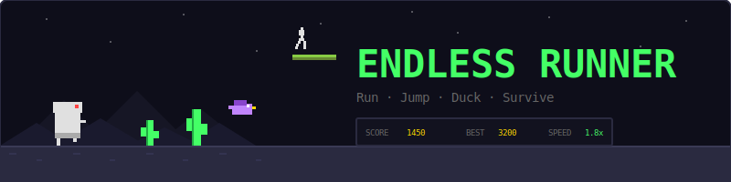
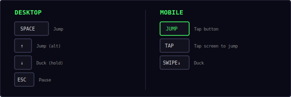
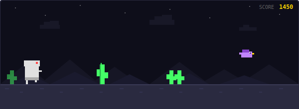
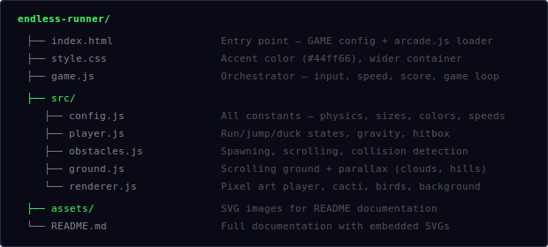
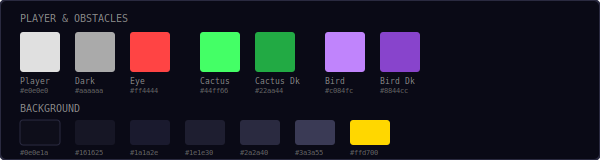
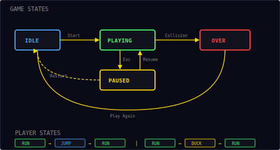

<p align="center">
  
</p>

<p align="center">
  A Chrome Dino-style side-scrolling runner built with vanilla JavaScript and HTML5 Canvas.<br/>
  Run, jump over cacti, duck under birds, and survive as long as you can.
</p>

---

## ▶ Controls

<p align="center">
  
</p>

| Action | Desktop | Mobile |
|--------|---------|--------|
| Jump | `Space` / `↑` | JUMP button / Tap screen |
| Duck | `↓` (hold) | Swipe down |
| Pause / Restart | `Esc` / `P` | — |

> **Tip:** You can't jump while ducking, and you can't duck while in the air. Time your actions carefully.

---

## 🎮 Gameplay

<p align="center">
  
</p>

**Rules:**
- Your character runs automatically — the ground scrolls left at increasing speed
- **Jump** to clear ground-level obstacles (cacti)
- **Duck** to slide under high-flying birds
- Four obstacle types appear with increasing frequency:
  - **Small cactus** — single narrow cactus, jump over it
  - **Large cactus** — taller and wider, needs a well-timed jump
  - **Double cactus** — two cacti side by side, wider gap needed
  - **Bird** — flies at low, medium, or high altitude
- Score increases continuously based on distance traveled
- Every **100 points** triggers a milestone sound and toast notification
- Speed increases over time — the longer you survive, the harder it gets
- A **day/night cycle** shifts the background colors periodically
- **Parallax background** with stars, clouds, mountains, and hills
- High score is saved locally in your browser

---

## 📁 Project Structure

<p align="center">
  
</p>

---

## 🎨 Color Palette

<p align="center">
  
</p>

All colors are defined in `src/config.js`. Change them there to reskin the entire game.

---

## 🏃 Player Physics

The player has three states: **Run**, **Jump**, and **Duck**.

**Jump mechanics:**
```
velocity += gravity × dt        // gravity = 1800 px/s²
y += velocity × dt
```

| Parameter | Value | Effect |
|-----------|-------|--------|
| Jump force | -550 px/s | Initial upward velocity |
| Gravity | 1800 px/s² | Pulls player back down |
| Max fall speed | 800 px/s | Terminal velocity cap |

**Hitbox sizes:**

| State | Width | Height |
|-------|-------|--------|
| Run / Jump | 28px | 40px |
| Duck | 34px | 24px |

Ducking makes the hitbox shorter (24px vs 40px) so the player slides under high-flying birds. The hitbox is slightly padded inward (4px) for forgiving collision detection.

---

## 🌵 Obstacle Types

| Type | Size | Appears | Strategy |
|------|------|---------|----------|
| Small cactus | 14×28 | Always | Jump |
| Large cactus | 18×40 | Always | Jump (higher) |
| Double cactus | 30×28 | Always | Jump (wider) |
| Bird (low) | 30×20 | After 10s | Jump over |
| Bird (mid) | 30×20 | After 10s | Jump or duck |
| Bird (high) | 30×20 | After 10s | Duck under |

Birds fly at three altitudes:
- **Low** (y=145): Jump over them
- **Medium** (y=120): Jump or duck
- **High** (y=90): Duck to avoid

---

## ⚡ Speed & Scoring

Ground speed increases linearly over time:

```
speed = min(maxSpeed, baseSpeed + playTime × speedIncrement)
score = playTime × scoreRate × (speed / baseSpeed)
```

| Parameter | Value |
|-----------|-------|
| Base speed | 280 px/s |
| Max speed | 700 px/s |
| Speed increment | 0.4 px/s per second |
| Score rate | 10 pts/s at base speed |
| Milestone interval | Every 100 points |

The obstacle spawn gap also shrinks over time, making obstacles appear more frequently as speed increases.

---

## 🔄 State Machine

<p align="center">
  
</p>

**Game states** (managed by shared Engine):

| State | What happens |
|-------|-------------|
| **Idle** | Start screen overlay, waiting for player |
| **Playing** | Game loop running — player runs, obstacles spawn |
| **Paused** | Loop stopped, Resume + Restart buttons shown |
| **Over** | Collision detected, final score shown, Play Again button |

**Player states:**

| State | Trigger | Exit |
|-------|---------|------|
| **Run** | Default / land from jump / release duck | Jump or Duck input |
| **Jump** | Space / Up / Tap | Land on ground (y reaches groundY) |
| **Duck** | Down arrow held | Release Down arrow |
| **Dead** | Collision with obstacle | Game restart |

---

## 🌙 Day/Night Cycle

The background shifts between day and night using a sine wave:

```
nightFactor = (sin(time / cycleDuration × 2π) + 1) / 2
```

- **Day** (nightFactor ≈ 0): Brighter sky, dimmer stars
- **Night** (nightFactor ≈ 1): Darker sky, brighter stars, subtle overlay tint
- Full cycle duration: 60 seconds

---

## 🔊 Sound & Effects

All sounds are synthesized in real-time using the Web Audio API — no audio files needed.

| Event | Sound | Particles |
|-------|-------|-----------|
| Jump | Short blip (`move`) | — |
| Milestone (100 pts) | Rising two-note (`score`) | Toast notification |
| Collision | Low thud (`hit`) | 20 colored pixels burst |
| Game over | Descending three-note (`gameover`) | — |

---

## 🛠 Customization

All tweaks happen in `src/config.js`:

**Change difficulty:**
```js
baseSpeed: 200,          // slower start
maxSpeed: 500,           // lower ceiling
speedIncrement: 0.2,     // gentler ramp
gravity: 1400,           // floatier jumps
jumpForce: -500,         // lower jumps
```

**Change obstacle frequency:**
```js
minObstacleGap: 1.0,    // more breathing room
maxObstacleGap: 2.5,    // longer gaps early on
gapShrinkRate: 0.005,   // slower difficulty ramp
```

**Change player colors:**
```js
playerBody: '#44aaff',   // blue player
playerDark: '#2266cc',
playerEye: '#ffd700',    // gold eye
```

**Change obstacle colors:**
```js
cactusColor: '#ff8844',  // orange cacti
cactusDark: '#cc6622',
birdColor: '#44aaff',    // blue birds
birdDark: '#2266cc',
```

---

## 🧩 Shared Modules Used

| Module | What Endless Runner uses it for |
|--------|---------------------------------|
| `Engine` | Game loop, state machine, canvas auto-setup |
| `Input` | Keyboard + swipe + mobile action button |
| `Audio8` | Jump, milestone, collision, and game over sounds |
| `Particles` | Death burst visual effect |
| `Shell` | HUD stats, overlay screens, toast messages |
| `utils.js` | `randInt()`, `clamp()`, `collides()`, `saveHighScore()`, `loadHighScore()` |

---

<p align="center">
  <sub>Part of the <a href="../README.md">Mini Arcade</a> collection · MIT License</sub>
</p>
