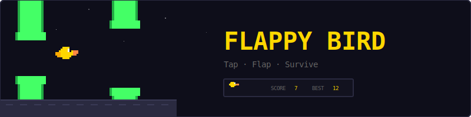
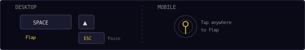
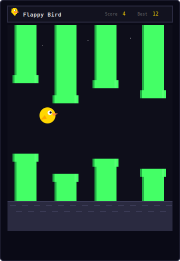
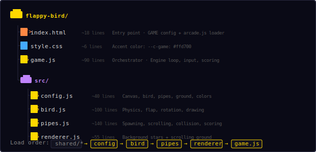
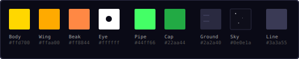
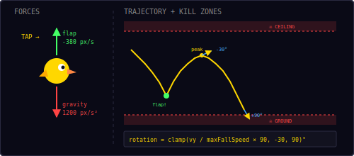
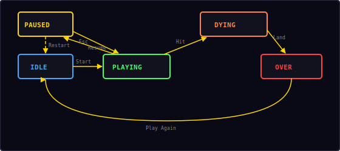

<p align="center">
  
</p>

<p align="center">
  A Flappy Bird clone built with vanilla JavaScript and HTML5 Canvas.<br/>
  Tap to flap, dodge the pipes, chase your high score.
</p>

---

## ▶ Controls

<p align="center">
  
</p>

| Action | Desktop | Mobile |
|--------|---------|--------|
| Flap | `Space` / `↑` Arrow | Tap anywhere |
| Pause / Restart | `Esc` / `P` | — |

---

## 🎮 Gameplay

<p align="center">
  
</p>

**Rules:**
- The bird falls under gravity — tap to flap upward
- Pipes scroll from right to left at a constant speed
- Fly through the gap between each pipe pair to score **+1 point**
- Hitting a pipe, the ground, or the ceiling kills the bird
- After a hit, the bird tumbles to the ground before the game-over screen appears
- High score is saved locally in your browser

---

## 📁 Project Structure

<p align="center">
  
</p>

---

## 🎨 Color Palette

<p align="center">
  
</p>

All colors are defined in `src/config.js`. Change them there to reskin the entire game.

---

## 🐦 Physics

<p align="center">
  
</p>

The bird uses simple Euler integration for its vertical movement:

**Each frame (dt seconds):**
1. Apply gravity: `vy += gravity × dt` (1200 px/s²)
2. Cap terminal velocity: `vy = min(vy, 600)`
3. Update position: `y += vy × dt`
4. On flap: `vy = -380` (instant upward velocity)

**Rotation** follows velocity to give the bird a natural tilt:

```
rotation = clamp(vy / maxFallSpeed × 90, -30, 90) degrees
```

| Velocity | Rotation | Visual |
|----------|----------|--------|
| vy = -380 (just flapped) | -30° | Nose up |
| vy = 0 (peak of arc) | 0° | Level |
| vy = 300 (falling) | +45° | Nose down |
| vy = 600 (terminal) | +90° | Diving |

---

## 🏗 Pipe Generation

Pipes spawn at a fixed interval and scroll left at constant speed:

| Parameter | Value |
|-----------|-------|
| Pipe width | 52 px |
| Gap height | 140 px |
| Scroll speed | 150 px/s |
| Spawn interval | 1.6 seconds |
| Cap height | 16 px |

**Gap positioning** is randomized each spawn:

```
topH = random(60, canvasH - groundH - pipeGap - 60)
     = random(60, 280)
```

The minimum margin of 60px above and below ensures the gap is never flush against the ceiling or ground, keeping every gap reachable.

---

## 💥 Collision Detection

The bird's hitbox is a **circle** (75% of visual radius for forgiving gameplay). Each pipe is two **rectangles** (top and bottom).

**Circle-rect collision:**
1. Find the closest point on the rectangle to the circle center
2. Compute distance from circle center to that point
3. If distance < radius → collision

```
closestX = clamp(cx, rect.x, rect.x + rect.w)
closestY = clamp(cy, rect.y, rect.y + rect.h)
collision = (cx - closestX)² + (cy - closestY)² < radius²
```

**Additional checks — instant death:**
- **Ground:** `bird.y + radius >= canvasH - groundH` → bird dies on contact
- **Ceiling:** `bird.y - radius <= 0` → bird dies on contact

Hitting the ground or ceiling is an immediate kill, same as hitting a pipe. The bird cannot fly above the screen or land on the ground.

---

## 🔄 State Machine

<p align="center">
  
</p>

| State | What happens |
|-------|-------------|
| **Idle** | Start screen overlay shown, waiting for player |
| **Playing** | Game loop running, bird flaps, pipes scroll |
| **Dying** | Bird hit something — falls to ground with particles |
| **Paused** | Loop stopped, pause overlay shown with Resume + Restart options |
| **Over** | Death screen with score, "Play Again" button |

The dying state is a brief animation phase: after a collision, the bird continues falling under gravity until it reaches the ground, then the game-over overlay appears.

---

## 🔊 Sound & Effects

All sounds are synthesized in real-time using the Web Audio API — no audio files needed.

| Event | Sound | Particles |
|-------|-------|-----------|
| Flap | Swoosh (`whoosh`) | — |
| Pass pipe | Rising blip (`score`) | — |
| Hit pipe/ground | Impact (`hit`) | 15 gold/orange/white pixels burst |
| Game over | — | Bird tumbles to ground |

---

## 🛠 Customization

All tweaks happen in `src/config.js`:

**Make it easier:**
```js
pipeGap: 180,        // wider gap
pipeSpeed: 100,      // slower pipes
gravity: 800,        // lighter gravity
```

**Make it harder:**
```js
pipeGap: 110,        // tighter gap
pipeSpeed: 200,      // faster pipes
pipeSpawnInterval: 1.2, // pipes closer together
```

**Change bird appearance:**
```js
birdBody: '#44aaff',  // blue bird
birdWing: '#2266cc',
birdBeak: '#ff4444',
birdSize: 16,         // smaller bird
```

**Change pipe colors:**
```js
pipeColor: '#ff8844',  // orange pipes
pipeDark: '#cc6622',
```

---

## 🧩 Shared Modules Used

| Module | What Flappy Bird uses it for |
|--------|------------------------------|
| `Engine` | Game loop, state machine, canvas auto-setup |
| `Input` | Keyboard + tap + mobile action button |
| `Audio8` | Flap, score, and hit sounds |
| `Particles` | Death burst visual effect |
| `Shell` | HUD stats, overlay screens |
| `utils.js` | `clamp()`, `saveHighScore()`, `loadHighScore()` |

---

<p align="center">
  <sub>Part of the <a href="../README.md">Mini Arcade</a> collection · MIT License</sub>
</p>
