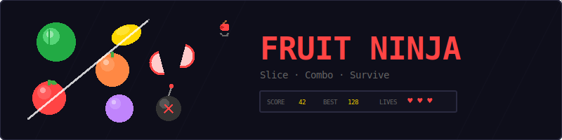
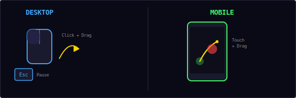
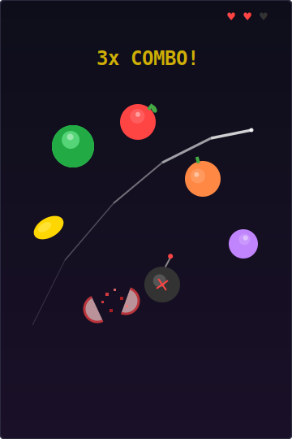
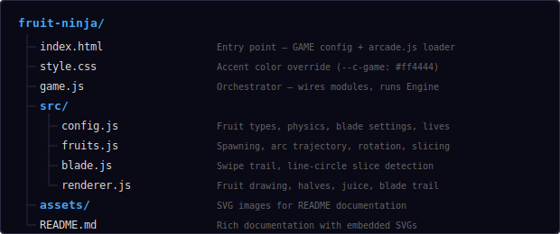
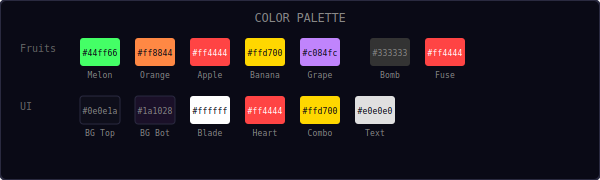
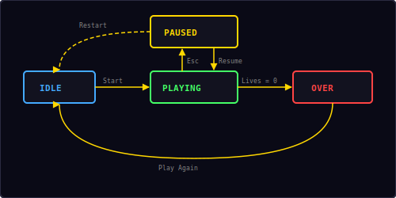

<p align="center">
  
</p>

<p align="center">
  A swipe-to-slice action game built with vanilla JavaScript and HTML5 Canvas.<br/>
  Slice fruits, chain combos, dodge bombs.
</p>

---

## ▶ Controls

<p align="center">
  
</p>

| Action | Desktop | Mobile |
|--------|---------|--------|
| Slice fruits | Click + drag | Touch + drag |
| Pause / Resume | `Esc` / `P` | — |

> **Tip:** Move fast! The blade only registers a slice when your swipe speed exceeds the minimum threshold. Slow drags won't cut it.

---

## 🎮 Gameplay

<p align="center">
  
</p>

**Rules:**
- Fruits are thrown upward from the bottom of the screen in arcs
- Swipe across fruits to slice them — each slice earns 1 point
- Sliced fruits split into two halves that tumble away with gravity
- **Bombs** appear occasionally (12% chance) — slicing a bomb costs a life
- **Missing a fruit** (it falls off screen unsliced) also costs a life
- You have **3 lives** — lose them all and it's game over
- Slice **3+ fruits in a single swipe** for a combo bonus
- Difficulty increases over time — more fruits per wave, shorter intervals
- High score is saved locally in your browser

---

## 📁 Project Structure

<p align="center">
  
</p>

---

## 🎨 Color Palette

<p align="center">
  
</p>

All colors are defined in `src/config.js`. Change them there to reskin the entire game.

---

## 🍉 Fruit Types

Five fruit types with distinct colors and sizes:

| Fruit | Color | Radius | Flesh Color |
|-------|-------|--------|-------------|
| Watermelon | `#44ff66` (green) | 26 px | `#ff6666` (pink) |
| Orange | `#ff8844` (orange) | 22 px | `#ffcc66` (light orange) |
| Apple | `#ff4444` (red) | 22 px | `#ffffcc` (cream) |
| Banana | `#ffd700` (yellow) | 20 px | `#ffffaa` (light yellow) |
| Grape | `#c084fc` (purple) | 18 px | `#ddaaff` (lavender) |

Each fruit is drawn as a circle with a darker bottom half, a highlight spot, and a white shine. Apples and oranges have a green stem and leaf.

---

## 🎯 Projectile Arc Math

Fruits follow a parabolic arc — launched upward with random velocity, pulled back down by gravity:

```
x(t) = x₀ + vx × t
y(t) = y₀ + vy × t + ½ × g × t²

where:
  vx ∈ [-80, 80] px/s       (horizontal, biased toward center)
  vy ∈ [-620, -480] px/s    (upward — negative is up)
  g  = 600 px/s²            (gravity pulling down)
```

The arc peaks when `vy + g × t = 0`, which gives:

```
t_peak = -vy / g ≈ 0.8–1.0 seconds
y_peak = y₀ + vy × t_peak + ½ × g × t_peak²
```

With the canvas height at 540 px and fruits spawning from below, the peak lands roughly in the middle of the screen — the sweet spot for slicing.

Fruits that spawn near the edges get their horizontal velocity biased toward center to keep them on screen.

---

## ⚔️ Swipe Detection

The blade tracks mouse/touch positions and uses **line-circle intersection** to detect slices:

```
Given: line segment P1→P2, circle center C, radius r

1. Compute: f = P1 - C
2. Quadratic: a = d·d, b = 2(f·d), c = f·f - r²
   where d = P2 - P1
3. Discriminant: Δ = b² - 4ac
4. If Δ < 0 → no intersection
5. Else: t₁ = (-b - √Δ) / 2a
         t₂ = (-b + √Δ) / 2a
6. If t₁ or t₂ ∈ [0, 1] → segment intersects circle
```

A slice only registers if the swipe speed exceeds 80 px/s — this prevents accidental taps from counting as slices.

---

## 💥 Combo System

Slicing multiple fruits in a single swipe triggers a combo:

| Slices in swipe | Bonus points | Effect |
|----------------|-------------|--------|
| 1–2 | 0 | Normal slice |
| 3 | +3 | "3x COMBO!" toast + clear sound |
| 4 | +6 | "4x COMBO!" toast |
| 5+ | +3 per extra | Scales linearly |

**Formula:** `bonus = 3 × (slices - 2)` for slices ≥ 3

The combo window is tracked per swipe — from mouse/touch down to mouse/touch up. All fruits sliced during that continuous drag count toward the combo.

---

## 🔄 State Machine

<p align="center">
  
</p>

| State | What happens |
|-------|-------------|
| **Idle** | Start screen overlay, waiting for player |
| **Playing** | Game loop running — fruits flying, blade active |
| **Paused** | Loop stopped, pause overlay with Resume + Restart |
| **Over** | Death screen with score, "Play Again" button |

Two ways to lose a life:
- **Bomb slice** — swiping across a bomb
- **Missed fruit** — a fruit falls off screen without being sliced

When lives reach 0, the game transitions to Over.

---

## 🔊 Sound & Effects

All sounds are synthesized in real-time using the Web Audio API — no audio files needed.

| Event | Sound | Particles |
|-------|-------|-----------|
| Swipe start | Swoosh (`whoosh`) | — |
| Fruit sliced | Rising two-note (`score`) | 10 colored juice pixels |
| Bomb hit | Low thud (`hit`) | 15 red/orange/dark pixels |
| Combo (3+) | Ascending three-note (`clear`) | — |
| Game over | Descending three-note (`gameover`) | — |

Sliced fruits also produce two tumbling halves that show the fruit's interior flesh color.

---

## 🛠 Customization

All tweaks happen in `src/config.js`:

**Change difficulty:**
```js
bombChance: 0.2,          // more bombs (harder)
spawnInterval: 0.8,       // faster waves
spawnCountMax: 6,          // more fruits per wave
lives: 5,                  // more forgiving
```

**Change physics:**
```js
throwMinVY: -700,          // higher arcs
throwMaxVY: -550,
gravity: 500,              // floatier feel
bladeMinSpeed: 50,         // easier to slice
```

**Change fruit sizes:**
```js
fruits: [
  { name: 'watermelon', body: '#44ff66', highlight: '#88ffaa', dark: '#22aa44', radius: 32 },
  // ... bigger targets = easier game
],
```

**Change blade trail:**
```js
bladeTrailLength: 20,      // longer trail
bladeTrailWidth: 6,        // thicker trail
```

**Change combo threshold:**
```js
comboMinCount: 2,          // easier combos
comboBonus: 5,             // bigger bonus
```

---

## 🧩 Shared Modules Used

| Module | What Fruit Ninja uses it for |
|--------|------------------------------|
| `Engine` | Game loop, state machine, canvas auto-setup |
| `Input` | Keyboard (Esc/P for pause) |
| `Audio8` | Whoosh, score, hit, clear, and game over sounds |
| `Particles` | Juice splashes on fruit slice, bomb explosion |
| `Shell` | HUD stats, overlay screens, toast messages |
| `utils.js` | `saveHighScore()`, `loadHighScore()`, `randInt()` |

---

<p align="center">
  <sub>Part of the <a href="../README.md">Mini Arcade</a> collection · MIT License</sub>
</p>
