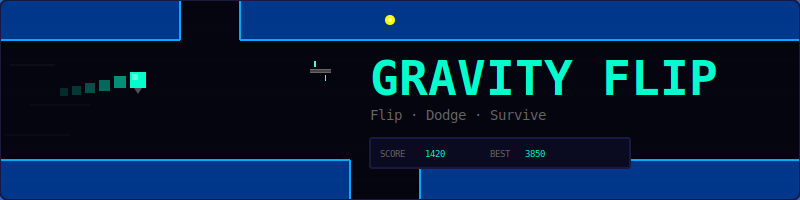
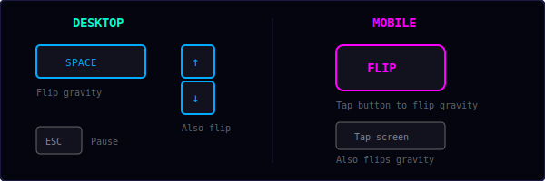
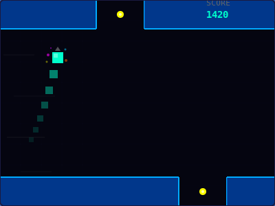
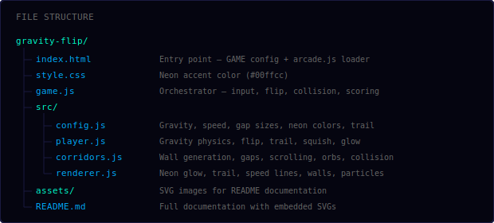
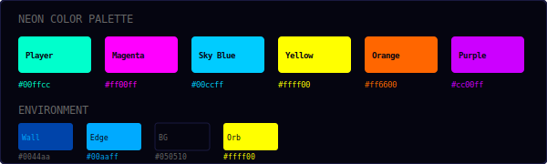
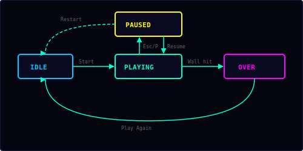

<p align="center">
  
</p>

<p align="center">
  A neon corridor runner where you flip gravity to survive.<br/>
  One button. Infinite corridors. Pure reflex.
</p>

---

## ▶ Controls

<p align="center">
  
</p>

| Action | Desktop | Mobile |
|--------|---------|--------|
| Flip gravity | `Space` / `↑` / `↓` | Tap FLIP button or screen |
| Pause / Resume | `Esc` / `P` | — |

This is a **one-button game**. Tap to flip gravity — that's it. Timing is everything.

---

## 🎮 Gameplay

<p align="center">
  
</p>

**Rules:**
- You are a glowing square hurtling through a neon corridor
- Gravity pulls you toward the floor (down) or ceiling (up)
- **Tap to flip gravity** — you'll accelerate in the opposite direction
- Corridor walls scroll from right to left with **gaps** in the top and bottom
- Gaps alternate between top and bottom, forcing you to flip at the right moment
- Collect **yellow orbs** in the gaps for bonus points (+5 each)
- The corridor **speeds up** over time — reflexes get tested harder and harder
- Gaps **shrink** with distance — the further you go, the tighter the squeezes
- Occasional **safe zones** give you a moment to breathe
- Score = distance traveled + orb bonuses
- Hit a wall and it's game over
- High score is saved locally in your browser

**What makes it addictive:**
- The gravity flip feels *satisfying* — instant velocity reversal with a squish animation
- Neon trail follows your path, creating beautiful patterns
- Colors shift over time, making every run visually unique
- Speed ramps smoothly — you don't notice getting faster until it's too late

---

## 📁 Project Structure

<p align="center">
  
</p>

---

## 🎨 Color Palette

<p align="center">
  
</p>

All colors are defined in `src/config.js`. The neon palette cycles through 6 hues over time using HSL rotation, creating a constantly shifting visual experience.

---

## ⚡ Gravity Physics

The core mechanic is a simple but satisfying gravity flip:

```
gravityDir = 1 (down) or -1 (up)

On each frame:
  vy += gravity × gravityDir × dt
  vy = clamp(vy, -terminalVel, terminalVel)
  y  += vy × dt

On flip:
  gravityDir *= -1
  vy = gravityDir × flipBoost    // instant velocity in new direction
```

| Parameter | Value | Effect |
|-----------|-------|--------|
| Gravity | 900 px/s² | How fast you accelerate |
| Terminal velocity | 450 px/s | Max fall speed |
| Flip boost | 280 px/s | Instant velocity on flip |

The flip boost gives an immediate "kick" in the new direction, making the flip feel responsive rather than sluggish. Combined with the squish animation (0.18s stretch/compress), it creates a satisfying tactile feel.

---

## 🏗 Corridor Generation

Corridors are built from segments that scroll left:

```
Each segment:
  - topH:    top wall thickness (28–100px, increases with distance)
  - bottomH: bottom wall thickness (same range)
  - gap:     opening in top OR bottom wall (alternates)

Gap sizing:
  gapWidth = 80 - difficulty × (80 - 50)    // shrinks from 80px to 50px
  difficulty = clamp(distance / 5000, 0, 1)

Gap spacing:
  180–320px apart (decreases with difficulty)
```

Gaps **alternate** between top and bottom walls. This forces the player to flip gravity repeatedly — you can't just ride one surface. The alternation creates a natural rhythm: flip up, fly through top gap, flip down, fly through bottom gap.

**Safe zones** (12% chance) have minimal wall thickness, giving brief relief.

---

## ✨ Visual Effects

| Effect | How it works |
|--------|-------------|
| **Neon trail** | 12 position samples follow the player, fading from full opacity to transparent |
| **Squish animation** | On flip: 0.6× width, 1.5× height for 0.18s, easing out |
| **Glow pulse** | Player glow oscillates 8–18px blur, intensifying with speed |
| **Color cycling** | All neon colors shift hue at 15°/s — the whole tunnel changes color over time |
| **Speed lines** | 20 horizontal lines scroll faster as speed increases (0.04–0.12 alpha) |
| **Screen shake** | 8px intensity for 0.3s on death |
| **Flip particles** | 10 colored sparks burst from the player on each gravity flip |
| **Wall edge glow** | 6px blur on wall edges creates the neon tunnel look |
| **Orb pulse** | Collectible orbs pulse in size with a sine wave |

---

## 📈 Difficulty Ramp

Speed and gap difficulty increase smoothly over time:

```
speed = min(corridorSpeed + corridorAccel × time, corridorSpeedMax)
```

| Distance | Speed | Gap width | Feel |
|----------|-------|-----------|------|
| 0 | 140 px/s | 80 px | Relaxed, learn the mechanic |
| 1000 | ~160 px/s | 74 px | Getting comfortable |
| 2500 | ~200 px/s | 65 px | Requires focus |
| 5000+ | 320 px/s (max) | 50 px (min) | Pure reflex survival |

---

## 🔄 State Machine

<p align="center">
  
</p>

| State | What happens |
|-------|-------------|
| **Idle** | Start screen, waiting for player |
| **Playing** | Corridor scrolling, gravity active, input enabled |
| **Paused** | Loop stopped, Resume + Restart options |
| **Over** | Wall collision, final score shown, Play Again button |

---

## 🔊 Sound & Effects

All sounds are synthesized in real-time using the Web Audio API.

| Event | Sound | Visual |
|-------|-------|--------|
| Gravity flip | Click blip + 80Hz sine pulse | Squish animation + particle burst |
| Orb collected | Rising two-note score | Yellow particle burst |
| Wall collision | Sawtooth hit | Screen shake + 25 neon particles |
| Game over | Descending three-note | — |

The low-frequency pulse (80Hz sine, 0.15s) on each flip gives a satisfying "thump" feel that reinforces the gravity change.

---

## 🛠 Customization

All tweaks happen in `src/config.js`:

**Make it easier:**
```js
gravity: 600,           // slower acceleration
terminalVel: 300,       // slower max speed
corridorSpeed: 100,     // slower scrolling
gapWidth: 100,          // wider gaps
gapWidthMin: 70,        // wider minimum gaps
```

**Make it harder:**
```js
gravity: 1200,          // snappier gravity
corridorSpeed: 200,     // faster start
corridorSpeedMax: 400,  // higher top speed
gapWidth: 60,           // narrower gaps
gapWidthMin: 40,        // tighter minimum
```

**Change the vibe:**
```js
playerColor: '#ff00ff',     // magenta player
wallColor: '#440044',       // purple walls
wallEdgeColor: '#ff00ff',   // magenta edges
bgColor: '#0a000a',         // dark purple background
hueShiftSpeed: 30,          // faster color cycling
```

**Adjust trail:**
```js
trailLength: 20,        // longer trail
trailSpacing: 0.01,     // denser trail samples
```

---

## 🧩 Shared Modules Used

| Module | What Gravity Flip uses it for |
|--------|-------------------------------|
| `Engine` | Game loop, state machine, canvas auto-setup |
| `Input` | Space/arrow keys + tap + mobile FLIP button |
| `Audio8` | Flip click, orb score, wall hit, game over + custom 80Hz pulse |
| `Particles` | Flip sparks, orb collection, death burst |
| `Shell` | HUD stats, overlay screens |
| `utils.js` | `clamp()`, `randInt()`, `saveHighScore()`, `loadHighScore()` |

---

<p align="center">
  <sub>Part of the <a href="../README.md">Mini Arcade</a> collection · MIT License</sub>
</p>
