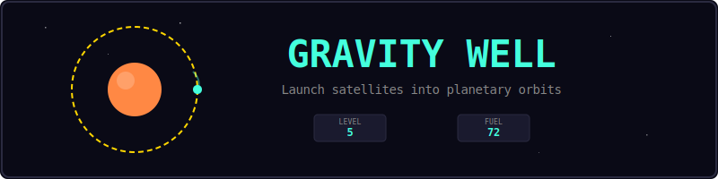
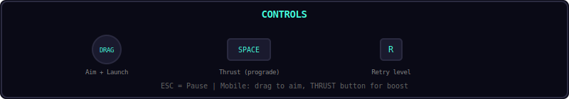
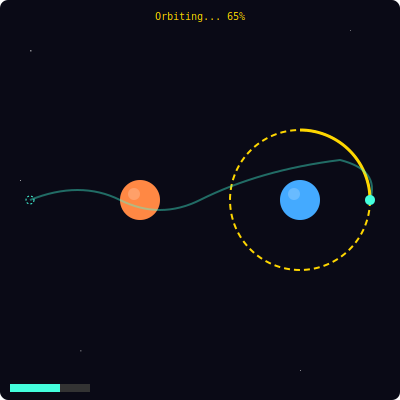
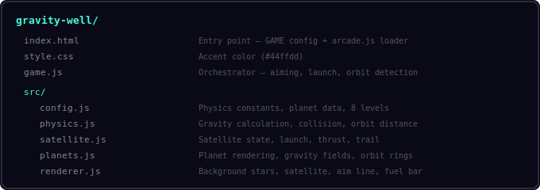
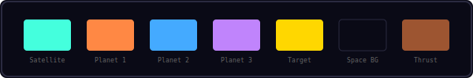
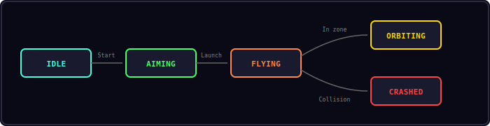

<p align="center">
  
</p>

<p align="center">
  Launch a satellite and use planetary gravity to achieve a stable orbit around the target.
</p>

---

## Controls

<p align="center">
  
</p>

| Input | Action |
|-------|--------|
| Click + Drag | Aim launch direction and power |
| Release | Launch satellite |
| Space / Thrust button | Prograde thrust (burns fuel) |
| R | Retry current level |
| Esc | Pause |

---

## Gameplay

<p align="center">
  
</p>

Each level has planets with gravity fields and a dashed gold target orbit ring. Your goal:

1. Drag from the satellite to aim direction and power
2. Release to launch — the satellite follows physics
3. Use thrust (Space) to adjust your trajectory — burns fuel
4. Stay within the target orbit zone for 2 seconds to complete the level
5. Crash into a planet or fly off-screen and you retry

8 levels with increasing complexity — from single-planet orbits to three-body navigation.

---

## Project Structure

<p align="center">
  
</p>

---

## Color Palette

<p align="center">
  
</p>

---

## Core Mechanics

### Gravity

Each planet exerts gravitational force on the satellite:

```
F = G * M / r²
```

Where G is the gravitational constant, M is planet mass, and r is distance. Force is applied as acceleration toward the planet center.

### Thrust

Pressing Space applies thrust in the prograde direction (same direction as current velocity). This burns fuel at a constant rate.

### Orbit Detection

The target orbit is a ring at a specific radius from a planet. The satellite must stay within the tolerance zone (orbit radius ± 20px) for 2 continuous seconds to win.

### Speed Cap

Satellite speed is capped at 300 px/s to prevent numerical instability and keep gameplay manageable.

---

## State Machine

<p align="center">
  
</p>

| State | Description |
|-------|-------------|
| IDLE | Start screen |
| AIMING | Dragging to set launch vector |
| FLYING | Satellite in motion, affected by gravity |
| ORBITING | In target zone, timer counting |
| CRASHED | Hit planet or flew off-screen |

---

## Sound Effects

| Event | Sound |
|-------|-------|
| Launch | `whoosh` |
| Orbit achieved | `win` |
| Crash | `hit` |
| Level complete | toast |

---

## Customization

```js
// gravity-well/src/config.js
Config.G = 1200;           // Stronger gravity
Config.orbitTime = 3.0;    // Longer orbit requirement
Config.maxFuel = 150;      // More fuel
Config.thrustForce = 200;  // Stronger thrust
```

---

## Shared Modules Used

| Module | Usage |
|--------|-------|
| Engine | Game loop, state machine, canvas |
| Input | Keyboard, touch, action button |
| Shell | HUD, overlays, toasts |
| Audio8 | Sound effects |

---

<p align="center">
  <a href="../index.html">Back to Mini Arcade</a>
</p>
