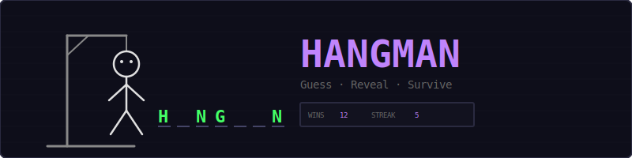
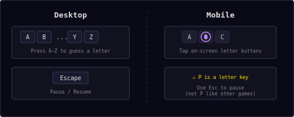
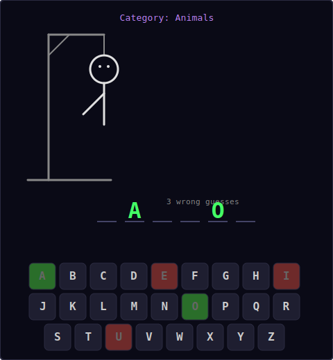
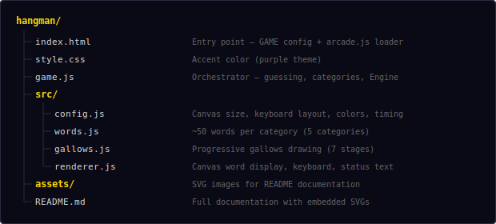
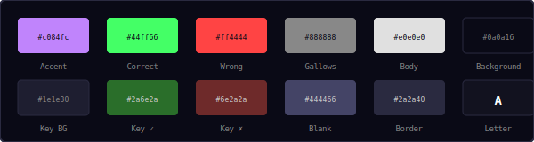
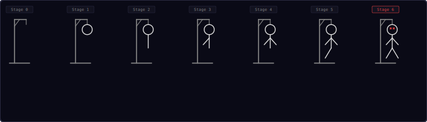
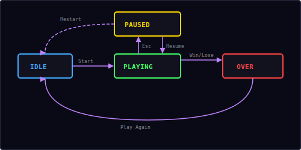

<p align="center">
  
</p>

<p align="center">
  A classic Hangman game built with vanilla JavaScript and HTML5 Canvas.<br/>
  Guess the word letter by letter before the stick figure is complete.
</p>

---

## ▶ Controls

<p align="center">
  
</p>

| Action | Desktop | Mobile |
|--------|---------|--------|
| Guess a letter | Press `A`–`Z` | Tap on-screen key |
| Pause / Resume | `Esc` | — |

**Important:** The `P` key is a valid letter guess in Hangman, so pause is `Esc` only (unlike other arcade games that also use `P`).

---

## 🎮 Gameplay

<p align="center">
  
</p>

**Rules:**
- A random word is chosen from the selected category
- The word is displayed as underscores — one per letter
- Guess one letter at a time by pressing a key or tapping the on-screen keyboard
- Correct guesses reveal all instances of that letter in the word (shown in green)
- Wrong guesses add a body part to the gallows (key turns red)
- You get **6 wrong guesses** before the stick figure is complete (game over)
- Guess all letters in the word to win
- Win streak is tracked across rounds
- After each round, choose a new category or play random

---

## 📂 Word Categories

Choose a category before each game, or pick **Random** for a surprise:

| Category | Examples |
|----------|---------|
| **Animals** | tiger, falcon, dolphin, iguana |
| **Food** | pizza, waffle, burrito, ginger |
| **Countries** | japan, brazil, sweden, cyprus |
| **Sports** | tennis, karate, javelin, sprint |
| **Technology** | pixel, server, neural, shader |

Each category contains ~50 words, all between 4–10 letters long.

---

## 📁 Project Structure

<p align="center">
  
</p>

---

## 🎨 Color Palette

<p align="center">
  
</p>

All colors are defined in `src/config.js`. Change them there to reskin the entire game.

---

## 🪢 Gallows Progression

<p align="center">
  
</p>

The gallows drawing builds progressively with each wrong guess:

| Stage | Wrong Guesses | Body Part Added |
|-------|--------------|-----------------|
| 0 | 0 | Empty gallows (base + pole + beam + rope) |
| 1 | 1 | Head (circle) |
| 2 | 2 | Body (vertical line) |
| 3 | 3 | Left arm (diagonal) |
| 4 | 4 | Right arm (diagonal) |
| 5 | 5 | Left leg (diagonal) |
| 6 | 6 | Right leg — **HANGED** (game over) |

At stage 6, the eyes change to X marks to indicate defeat.

---

## 🔄 State Machine

<p align="center">
  
</p>

The game has four states managed by the shared `Engine`:

| State | What happens |
|-------|-------------|
| **Idle** | Category selection overlay, waiting for player choice |
| **Playing** | Gallows canvas active, letter input enabled, guessing in progress |
| **Paused** | Canvas frozen, pause overlay with Resume + Restart options |
| **Over** | Win or lose screen with full word revealed, "Play Again" button |

---

## 🔊 Sound & Effects

All sounds are synthesized in real-time using the Web Audio API — no audio files needed.

| Event | Sound | Preset |
|-------|-------|--------|
| Letter guess | Short click | `click` |
| Correct letter | Rising two-note | `score` |
| Wrong letter | Low buzz | `error` |
| Word guessed (win) | Ascending fanfare | `win` |
| Hanged (game over) | Descending three-note | `gameover` |

---

## 🏆 Scoring & Streaks

- **Win streak** tracks consecutive words guessed correctly
- Streak resets to 0 on any loss
- Best streak is saved to localStorage with `saveHighScore('hangman', streak)`
- The HUD shows current wins and current streak

---

## 🛠 Customization

All tweaks happen in `src/config.js`:

**Change canvas size:**
```js
canvasW: 600,
canvasH: 640,
```

**Change max wrong guesses:**
```js
maxWrong: 8,    // more body parts = easier game
```

**Change colors:**
```js
accent: '#ff8844',          // orange theme
correctColor: '#00e5ff',    // cyan for correct letters
wrongColor: '#ff66aa',      // pink for wrong letters
gallowsColor: '#aaaaaa',   // lighter gallows
```

**Change keyboard layout:**
```js
keyboardRows: [
  ['Q','W','E','R','T','Y','U','I','O','P'],
  ['A','S','D','F','G','H','J','K','L'],
  ['Z','X','C','V','B','N','M']
],
```

**Add words to a category** (in `src/words.js`):
```js
Animals: [
  'tiger', 'eagle', ..., 'platypus', 'armadillo'
],
```

---

## 🧩 Shared Modules Used

| Module | What Hangman uses it for |
|--------|-------------------------|
| `Engine` | Game loop, state machine, canvas auto-setup |
| `Input` | Keyboard A–Z input + Esc for pause |
| `Shell` | HUD stats (wins, streak), overlay screens |
| `Audio8` | Click, correct, wrong, win, and game over sounds |
| `utils.js` | `saveHighScore()`, `loadHighScore()`, `randPick()` |

---

<p align="center">
  <sub>Part of the <a href="../README.md">Mini Arcade</a> collection · MIT License</sub>
</p>
