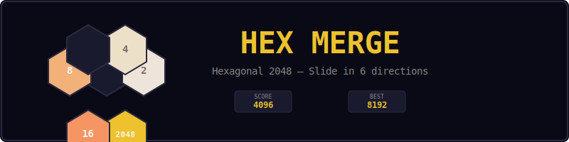
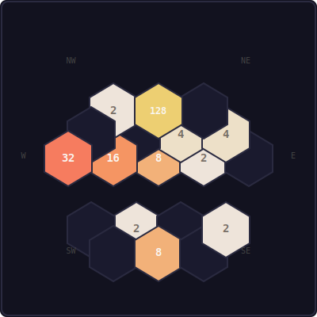
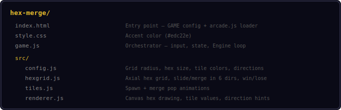
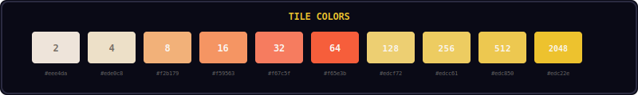
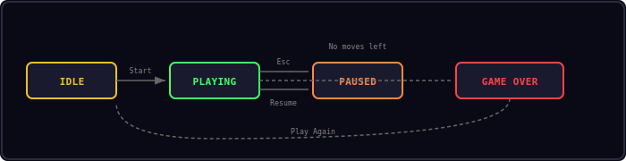

<p align="center">
  
</p>

<p align="center">
  Slide and merge numbered tiles on a hexagonal grid — reach 2048 to win.
</p>

---

## Controls

<p align="center">
  
</p>

| Input | Action |
|-------|--------|
| Q | Slide NW |
| W / Up Arrow | Slide NE |
| E | Slide E |
| A / Left Arrow | Slide W |
| S / Down Arrow | Slide SW |
| D / Right Arrow | Slide SE |
| Swipe (6 directions) | Slide in swipe direction |
| Esc | Pause |

---

## Gameplay

<p align="center">
  
</p>

The board is a hexagonal grid with 19 cells (radius 2). Each turn:

1. Choose one of 6 directions to slide all tiles
2. Tiles slide as far as possible in that direction
3. When two tiles with the same number collide, they merge into their sum
4. A new tile (2 or 4) spawns in a random empty cell
5. The game ends when no moves are possible

Reach 2048 on any tile to win — but you can keep playing for a higher score.

---

## Project Structure

<p align="center">
  
</p>

---

## Color Palette

<p align="center">
  
</p>

---

## Core Mechanics

### Hexagonal Grid (Axial Coordinates)

The grid uses axial coordinates (q, r) where valid cells satisfy:

```
max(|q|, |r|, |q + r|) <= radius
```

For radius 2, this gives 19 cells arranged in a honeycomb pattern.

### Six Slide Directions

| Direction | Axial Delta (dq, dr) |
|-----------|---------------------|
| East | (+1, 0) |
| NE | (+1, -1) |
| NW | (0, -1) |
| West | (-1, 0) |
| SW | (-1, +1) |
| SE | (0, +1) |

### Merge Rules

- Tiles slide until hitting the edge or another tile
- Two equal tiles merge into one tile with double the value
- Each tile can only merge once per turn
- Score increases by the merged tile's value

### Tile Spawn

- 90% chance of spawning a 2
- 10% chance of spawning a 4

---

## State Machine

<p align="center">
  
</p>

| State | Description |
|-------|-------------|
| IDLE | Start screen — press Start to begin |
| PLAYING | Active gameplay — slide tiles in 6 directions |
| PAUSED | Esc pressed — Resume or Restart |
| GAME OVER | No valid moves remaining |

---

## Sound Effects

| Event | Sound |
|-------|-------|
| Tile slide | `move` |
| Tiles merge | `score` |
| Reach 2048 | `win` |
| No moves left | `gameover` |

---

## Customization

```js
// hex-merge/src/config.js

Config.gridRadius = 3;    // Larger grid (37 cells)
Config.hexSize = 30;      // Smaller hexes for bigger grid
Config.winValue = 4096;   // Harder win condition
Config.startTiles = 3;    // More starting tiles
```

---

## Shared Modules Used

| Module | Usage |
|--------|-------|
| Engine | Game loop, state machine, canvas |
| Input | Keyboard input, swipe detection |
| Shell | HUD stats, overlays, toasts |
| Audio8 | Sound effects |

---

<p align="center">
  <a href="../index.html">Back to Mini Arcade</a>
</p>
