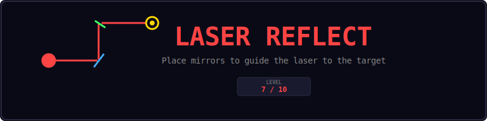
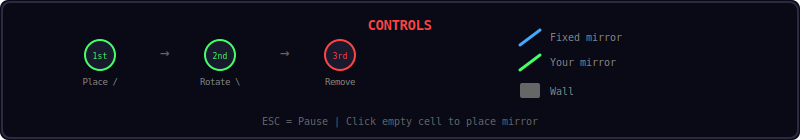
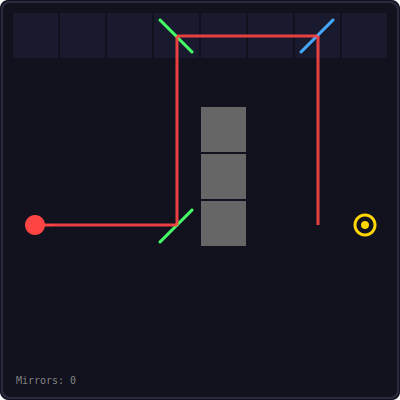
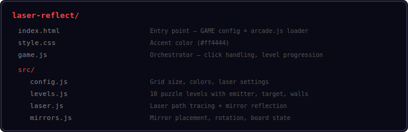
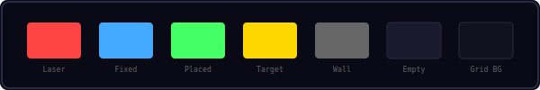
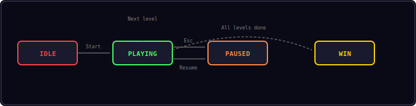

<p align="center">
  
</p>

<p align="center">
  Place and rotate mirrors to guide a laser beam from the emitter to the target.
</p>

---

## Controls

<p align="center">
  
</p>

| Input | Action |
|-------|--------|
| Click empty cell | Place a / mirror |
| Click your mirror | Rotate to \ |
| Click again | Remove mirror |
| Esc | Pause |

---

## Gameplay

<p align="center">
  
</p>

Each level has:
- A red emitter that shoots a laser in one direction
- A gold target the laser must reach
- Gray walls that block the laser
- Blue fixed mirrors that cannot be moved
- A limited number of green mirrors you can place

Click empty cells to place mirrors. Click your mirrors to rotate them (/ to \). Click again to remove. The laser updates in real time as you place mirrors.

---

## Project Structure

<p align="center">
  
</p>

---

## Color Palette

<p align="center">
  
</p>

---

## Core Mechanics

### Mirror Reflection

Two mirror types reflect the laser differently:

| Mirror | Input Direction | Output Direction |
|--------|----------------|-----------------|
| / | Right | Up |
| / | Down | Left |
| / | Left | Down |
| / | Up | Right |
| \ | Right | Down |
| \ | Up | Left |
| \ | Left | Up |
| \ | Down | Right |

### Laser Tracing

The laser traces from the emitter cell-by-cell:
1. Move one cell in the current direction
2. If mirror: reflect and continue
3. If wall or edge: stop
4. If target: level complete

### Level Progression

10 hand-crafted levels with increasing complexity:
- Levels 1-3: Basic mirror placement
- Levels 4-6: Fixed mirrors and walls
- Levels 7-10: Complex routing with multiple mirrors

---

## State Machine

<p align="center">
  
</p>

| State | Description |
|-------|-------------|
| IDLE | Start screen |
| PLAYING | Place mirrors, laser updates live |
| PAUSED | Esc pressed — Resume or Restart |
| WIN | All 10 levels completed |

---

## Sound Effects

| Event | Sound |
|-------|-------|
| Place/rotate mirror | `click` |
| Laser hits target | `win` |
| Level complete | toast |

---

## Customization

```js
// laser-reflect/src/config.js
Config.cols = 10;        // Larger grid
Config.rows = 10;
Config.cellSize = 36;    // Smaller cells
Config.maxBounces = 100; // More reflections allowed
```

---

## Shared Modules Used

| Module | Usage |
|--------|-------|
| Engine | Game loop, state machine, canvas |
| Input | Keyboard (Esc for pause) |
| Shell | HUD, overlays, toasts |
| Audio8 | Sound effects |

---

<p align="center">
  <a href="../index.html">Back to Mini Arcade</a>
</p>
