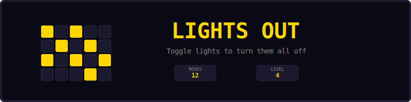
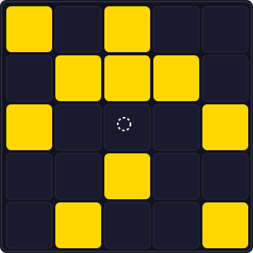
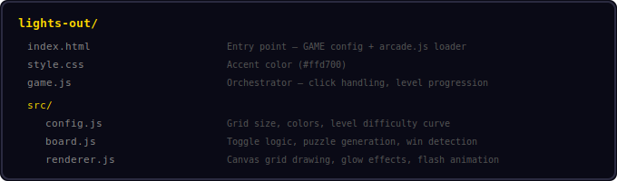
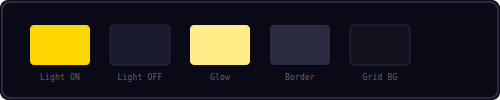
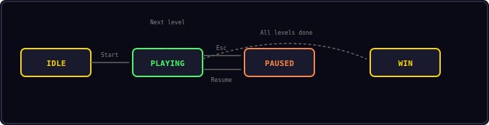

<p align="center">
  
</p>

<p align="center">
  Click lights to toggle them and their neighbors — turn all lights off to win.
</p>

---

## Controls

<p align="center">
  
</p>

| Input | Action |
|-------|--------|
| Click / Tap | Toggle cell + 4 neighbors |
| Esc | Pause |

---

## Gameplay

<p align="center">
  
</p>

A 5x5 grid of lights, some on (gold) and some off (dark). When you click a light:

1. That light toggles (on becomes off, off becomes on)
2. The 4 orthogonal neighbors also toggle
3. Your goal is to turn ALL lights off

Every puzzle is guaranteed solvable — generated by applying random toggles to an all-off board, so reversing those toggles always works.

15 levels with increasing difficulty (more initial toggles = harder puzzles).

---

## Project Structure

<p align="center">
  
</p>

---

## Color Palette

<p align="center">
  
</p>

---

## Core Mechanics

### Toggle Pattern

Clicking cell (x, y) toggles these 5 cells:
- (x, y) — the clicked cell
- (x-1, y) — left neighbor
- (x+1, y) — right neighbor
- (x, y-1) — top neighbor
- (x, y+1) — bottom neighbor

Edge and corner cells have fewer neighbors (3 or 2 toggles).

### Puzzle Generation

Puzzles are generated by starting from an all-off board and applying N random toggles. Since every toggle is its own inverse, the puzzle is always solvable by clicking the same cells that were used to generate it.

### Difficulty Curve

| Level | Random Toggles |
|-------|---------------|
| 1 | 3 |
| 2 | 4 |
| 3 | 5 |
| 5 | 7 |
| 10 | 14 |
| 15 | 25 |

More toggles create more complex patterns that require more moves to solve.

---

## State Machine

<p align="center">
  
</p>

| State | Description |
|-------|-------------|
| IDLE | Start screen |
| PLAYING | Click lights to solve the puzzle |
| PAUSED | Esc pressed — Resume or Restart |
| WIN | All 15 levels completed |

---

## Sound Effects

| Event | Sound |
|-------|-------|
| Toggle cell | `click` |
| Puzzle solved | `win` |
| Level complete | toast |

---

## Customization

```js
// lights-out/src/config.js
Config.cols = 7;              // Larger grid
Config.rows = 7;
Config.cellSize = 44;         // Smaller cells
Config.lightOn = '#44ff66';   // Green lights instead of gold
```

---

## Shared Modules Used

| Module | Usage |
|--------|-------|
| Engine | Game loop, state machine, canvas |
| Input | Keyboard (Esc for pause) |
| Shell | HUD, overlays, toasts |
| Audio8 | Sound effects |

---

<p align="center">
  <a href="../index.html">Back to Mini Arcade</a>
</p>
