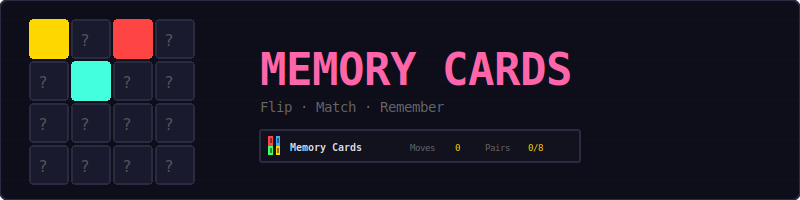
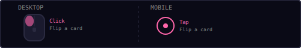
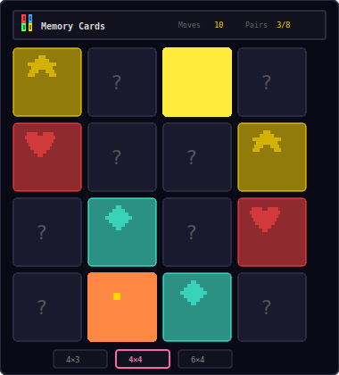
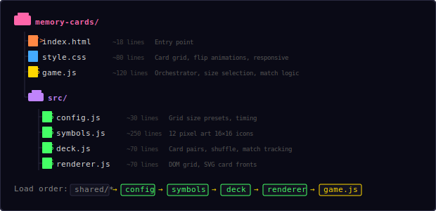
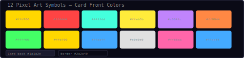
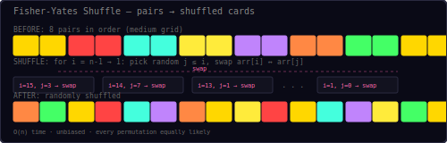
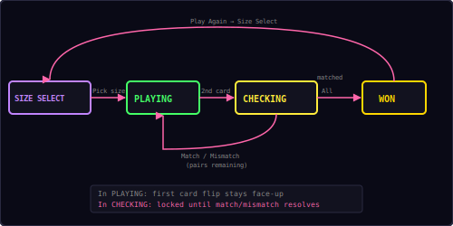

<p align="center">
  
</p>

<p align="center">
  A card-matching memory game with pixel art icons.<br/>
  Choose your grid size, flip cards, find all matching pairs.
</p>

---

## ▶ Controls

<p align="center">
  
</p>

| Action | Desktop | Mobile |
|--------|---------|--------|
| Flip a card | Click | Tap |

Simple one-action game — click or tap any face-down card to flip it. No right-click, no long-press, no keyboard needed.

---

## 🎮 Gameplay

<p align="center">
  
</p>

**Rules:**
- Choose a grid size before each game: Small, Medium, or Large
- Cards show pixel art icons — 12 unique symbols rendered as 16×16 inline SVGs
- Flip two cards per turn — if they match, they stay face-up (dimmed)
- If they don't match, both cards flip back face-down after a short delay
- Each pair of flips counts as one move
- Find all pairs to win — fewer moves is better
- A stopwatch tracks your time from the first flip

---

## 📐 Grid Sizes

| Size | Grid | Cards | Pairs | Symbols Used |
|------|------|-------|-------|-------------|
| **Small** | 4×3 | 12 | 6 | 6 of 12 |
| **Medium** | 4×4 | 16 | 8 | 8 of 12 |
| **Large** | 6×4 | 24 | 12 | All 12 |

The size selector appears before each game and after winning. Medium (4×4) is the default.

---

## 📁 Project Structure

<p align="center">
  
</p>

---

## 🎨 Color Palette

<p align="center">
  
</p>

Each of the 12 symbols has a unique color used for both the pixel art icon and the card's subtle background tint. All colors are defined in `src/symbols.js`. The card back uses a dark theme (`#1a1a2e`) with a `?` indicator, and the game accent color is `#ff66aa`.

---

## 🎴 Pixel Art Symbols

The game uses 12 hand-crafted 16×16 pixel art icons, defined as character grids in `src/symbols.js` and rendered as inline SVGs with `shape-rendering="crispEdges"`:

| # | Symbol | Color | Description |
|---|--------|-------|-------------|
| 0 | star | `#ffd700` | Five-pointed gold star |
| 1 | heart | `#ff4444` | Classic red heart |
| 2 | diamond | `#44ffdd` | Cyan gem with highlight |
| 3 | bolt | `#ffeb3b` | Yellow lightning bolt |
| 4 | note | `#c084fc` | Purple double music note |
| 5 | flame | `#ff8844` | Orange fire with yellow core |
| 6 | clover | `#44ff66` | Green four-leaf clover |
| 7 | crown | `#ffd700` | Gold royal crown |
| 8 | moon | `#44aaff` | Blue crescent moon |
| 9 | skull | `#e0e0e0` | White skull |
| 10 | potion | `#ff66aa` | Magenta potion bottle |
| 11 | shield | `#44aaff` | Blue heraldic shield |

Each icon is a 16-row array of 16-character strings. Characters map to a shared palette (`'r'` → `#ff4444`, `'g'` → `#44ff66`, etc.). The `Symbols.svg(name, size)` function converts any icon into a scalable SVG string at runtime.

---

## 🔀 Shuffle Algorithm

<p align="center">
  
</p>

Cards are shuffled using the **Fisher-Yates algorithm** — the gold standard for unbiased random permutations:

```
for i = n-1 down to 1:
    j = random integer where 0 ≤ j ≤ i
    swap arr[i] and arr[j]
```

**Properties:**
- **O(n)** time complexity — one pass through the array
- **Unbiased** — every permutation is equally likely
- **In-place** — no extra memory needed beyond a single temp variable

The deck creates card pairs (count depends on grid size), then shuffles them before placing on the grid.

---

## 🃏 Matching Logic

The card-flipping mechanic uses a two-phase check:

**Phase 1 — First card:**
- Player clicks a face-down card → it flips face-up
- The card index is stored as `firstCard`
- Player can now click a second card

**Phase 2 — Second card:**
- Player clicks another face-down card → it flips face-up
- The board is **locked** (no more clicks) while checking
- Move counter increments

**Check:**
- If `card1.symbolName === card2.symbolName` → **Match!**
  - Both cards get the `matched` class (stay face-up, dimmed glow)
  - Pairs counter increments
  - If all pairs found → **Win!**
- If symbols differ → **Mismatch**
  - After `800ms` delay, both cards flip back face-down
  - Board unlocks for the next turn

---

## 🔄 State Machine

<p align="center">
  
</p>

| State | What happens |
|-------|-------------|
| **Size Select** | Grid size overlay shown, player picks Small / Medium / Large |
| **Playing** | Cards clickable, waiting for first or second card flip |
| **Checking** | Two cards flipped, board locked, comparing symbols |
| **Won** | All pairs found, timer stopped, score overlay → back to Size Select |

The `locked` flag prevents clicking during the checking phase. After a match or mismatch resolves, the game returns to the playing state. Winning loops back to size selection for the next round.

---

## 🔊 Sound & Effects

All sounds are synthesized in real-time using the Web Audio API — no audio files needed.

| Event | Sound | Preset |
|-------|-------|--------|
| Flip a card | Short click blip | `click` |
| Match found | Ascending two-note score | `score` |
| Mismatch | Descending buzz | `error` |
| Win (all pairs) | Four-note victory fanfare | `win` |

---

## 🛠 Customization

All tweaks happen in `src/config.js` and `src/symbols.js`:

**Add a new symbol** — in `src/symbols.js`, add to the `icons` object and the `names` array:
```js
sword: {
  color: '#aaaaaa',
  grid: [
    '................',
    // ... 16 rows of 16 characters
  ]
},
// Then add 'sword' to the names array
```

**Change grid size presets** — in `src/config.js`:
```js
sizes: {
  small:  { cols: 4, rows: 3, pairs: 6,  label: '4×3' },
  medium: { cols: 4, rows: 4, pairs: 8,  label: '4×4' },
  large:  { cols: 6, rows: 4, pairs: 12, label: '6×4' },
  // Add: huge: { cols: 6, rows: 6, pairs: 18, label: '6×6' }
},
```

**Adjust timing:**
```js
flipDelay: 1200,   // slower mismatch reveal (ms)
matchDelay: 100,    // faster match confirmation (ms)
```

**Change card back appearance:**
```js
cardBack: '#2a1a3e',    // purple-tinted back
cardBorder: '#4a3a60',  // matching border
```

---

## 🧩 Shared Modules Used

| Module | What Memory Cards uses it for |
|--------|-------------------------------|
| `Shell` | HUD stats (moves, pairs), overlay screens, toast messages |
| `Audio8` | Click, score, error, and win sounds |
| `Timer` | Stopwatch for tracking solve time |
| `utils.js` | `saveHighScore()`, `loadHighScore()` for best move count |

Note: Memory Cards is a **DOM game** — it does not use `Engine` (no canvas) or `Input` (click handlers are attached directly to card elements). The card grid is built with plain DOM elements and CSS 3D transforms for the flip animation. Pixel art icons are rendered as inline SVGs by the `Symbols` module.

---

<p align="center">
  <sub>Part of the <a href="../README.md">Mini Arcade</a> collection · MIT License</sub>
</p>
