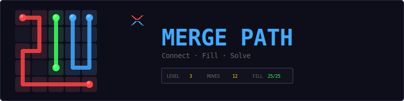
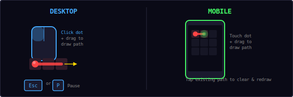
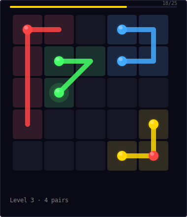
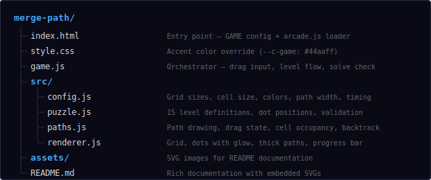
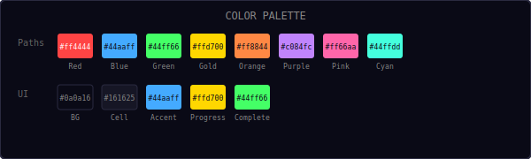
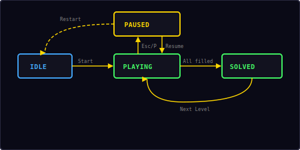

<p align="center">
  
</p>

<p align="center">
  A flow puzzle game built with vanilla JavaScript and HTML5 Canvas.<br/>
  Connect matching colored dots — fill every cell to solve the puzzle.
</p>

---

## ▶ Controls

<p align="center">
  
</p>

| Action | Desktop | Mobile |
|--------|---------|--------|
| Start drawing | Click a dot | Tap a dot |
| Extend path | Drag through adjacent cells | Drag through adjacent cells |
| Finish segment | Release mouse | Lift finger |
| Clear & redraw | Click an existing path | Tap an existing path |
| Pause / Resume | `Esc` / `P` | — |

> **Tip:** Paths can only go orthogonally (up, down, left, right) — no diagonals. Backtrack by dragging back over your own path.

---

## 🎮 Gameplay

<p align="center">
  
</p>

**Rules:**
- Colored dot pairs are placed on a grid (e.g., 2 red dots, 2 blue dots)
- Draw a path from one dot to its matching partner by dragging through adjacent cells
- Paths must be orthogonal — no diagonal moves
- Paths cannot cross other paths or pass through dots of other colors
- **All cells** on the grid must be filled to complete the level
- Drawing over another color's path will erase the overlapping portion
- Click any existing path to clear it and start fresh
- Complete all 15 levels with increasing grid size and more color pairs
- A progress bar shows how many cells are filled

---

## 📁 Project Structure

<p align="center">
  
</p>

---

## 🎨 Color Palette

<p align="center">
  
</p>

All colors are defined in `src/config.js`. Change them there to reskin the entire game.

---

## 🧩 Path Drawing Mechanics

The core mechanic is drawing paths between matching dots:

**Starting a path:**
1. Click/tap a colored dot to begin
2. Any existing path for that color is cleared
3. The dot becomes the first cell in the path

**Extending a path:**
1. Drag to an adjacent cell (up, down, left, right)
2. The cell is added to the path and marked with the color
3. If the cell belongs to another path, that path is truncated

**Backtracking:**
- Drag back over your own path to undo the last cell
- This lets you correct mistakes without starting over

**Completing a path:**
- When you reach the matching dot, the path auto-completes
- A particle burst and sound confirm the connection

**Clearing a path:**
- Click/tap any cell of an existing path to clear it entirely
- The path resets to just the starting dot

---

## 📈 Level Progression

Each level increases the grid size and number of color pairs:

| Levels | Grid | Pairs | Difficulty |
|--------|------|-------|------------|
| 1–3 | 5×5 | 3–4 | Tutorial — small grid, few paths |
| 4–7 | 6×6 | 4–5 | Medium — more pairs, tighter space |
| 8–11 | 7×7 | 5–6 | Hard — complex routing needed |
| 12–15 | 8×8 | 6–7 | Expert — every cell must be planned |

After level 15, levels cycle back with the same puzzles.

---

## 🔄 State Machine

<p align="center">
  
</p>

The game has four states managed by the shared `Engine`:

| State | What happens |
|-------|-------------|
| **Idle** | Start screen overlay, waiting for player |
| **Playing** | Puzzle active — draw paths, fill cells |
| **Paused** | Loop stopped, pause overlay with Resume + Restart |
| **Solved** | All cells filled, completion animation plays, then auto-advances |

### Solve Detection

The puzzle is solved when:
1. Every cell on the grid is occupied by a color
2. Each color pair is connected by a continuous path from dot to dot

---

## 🔊 Sound & Effects

All sounds are synthesized in real-time using the Web Audio API — no audio files needed.

| Event | Sound | Visual Effect |
|-------|-------|---------------|
| Start drawing | Short click blip (`click`) | — |
| Extend path | Soft move tone (`move`) | Cell fills with color tint |
| Complete a pair | Rising two-note (`score`) | Particle burst at endpoint |
| Level complete | Ascending fanfare (`win`) | All paths pulse with glow |
| Invalid move | Low buzz (`error`) | — |

### Visual Effects

- **Dot glow:** Radial gradient around each dot for a neon look
- **Inner highlight:** White specular on each dot
- **Path lines:** Thick rounded lines matching dot color
- **Cell tint:** Subtle color overlay on filled cells
- **Progress bar:** Gold bar showing fill percentage, turns green at 100%
- **Completion pulse:** Dots pulse and green overlay flashes on solve

---

## 🛠 Customization

All tweaks happen in `src/config.js`:

**Change grid sizes:**
```js
gridSizes: {
  small: 4,    // easier start
  medium: 5,
  large: 6,
  xlarge: 7,
},
```

**Change visual style:**
```js
cellSize: 48,        // smaller cells
cellGap: 4,          // wider gaps
cellRadius: 8,       // rounder corners
dotRadius: 12,       // smaller dots
pathWidth: 10,       // thinner paths
```

**Change colors:**
```js
colors: [
  '#ff0000',   // pure red
  '#0088ff',   // darker blue
  '#00ff00',   // lime green
  '#ffaa00',   // amber
  '#ff00ff',   // magenta
  '#8800ff',   // violet
  '#ff0088',   // hot pink
  '#00ffaa',   // mint
],
```

**Add custom levels** in `src/puzzle.js`:
```js
// { size: gridSize, pairs: [[colorIdx, row1, col1, row2, col2], ...] }
{ size: 5, pairs: [
  [0, 0, 0, 4, 4],  // red: top-left to bottom-right
  [1, 0, 4, 4, 0],  // blue: top-right to bottom-left
  [2, 2, 0, 2, 4],  // green: middle-left to middle-right
]},
```

---

## 🧩 Shared Modules Used

| Module | What Merge Path uses it for |
|--------|----------------------------|
| `Engine` | Game loop, state machine, canvas auto-setup |
| `Input` | Keyboard (Esc/P for pause) |
| `Audio8` | Click, move, score, win, and error sounds |
| `Particles` | Colored pixel bursts when paths connect |
| `Shell` | HUD stats (Level, Moves), overlay screens, toast |
| `utils.js` | `preventScroll()` for mobile touch |

---

<p align="center">
  <sub>Part of the <a href="../README.md">Mini Arcade</a> collection · MIT License</sub>
</p>
