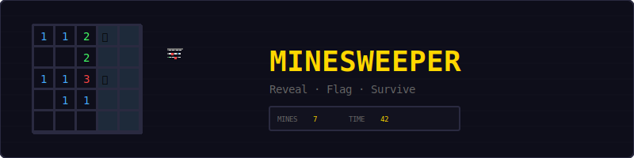
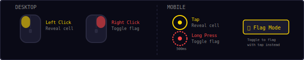
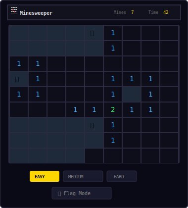
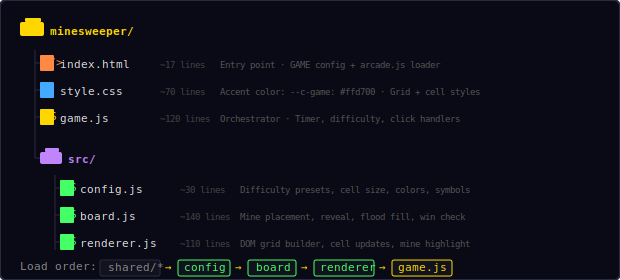
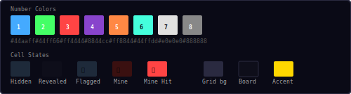
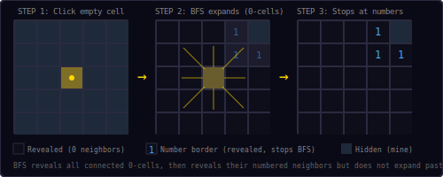
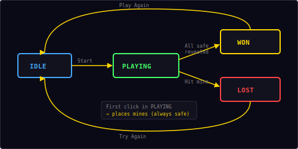

<p align="center">
  
</p>

<p align="center">
  A classic minesweeper game built with vanilla JavaScript and DOM rendering.<br/>
  Reveal cells, flag mines, clear the board without detonating.
</p>

---

## ▶ Controls

<p align="center">
  
</p>

| Action | Desktop | Mobile |
|--------|---------|--------|
| Reveal cell | Left click | Tap |
| Toggle flag | Right click | Long press (500ms) |
| Flag mode | — | 🚩 Flag Mode button |

On mobile, the **Flag Mode** toggle lets you tap to flag instead of reveal — useful since there's no right-click.

---

## 🎮 Gameplay

<p align="center">
  
</p>

**Rules:**
- Click any cell to reveal it — the first click is always safe
- Revealed cells show a number indicating how many of their 8 neighbors are mines
- Empty cells (0 neighbors) automatically flood-fill to reveal the entire connected region
- Right-click (or long-press) to flag cells you suspect are mines
- The mine counter shows `total mines − flags placed`
- Reveal all non-mine cells to win — time is your score (lower is better)
- Hit a mine and it's game over

---

## 📁 Project Structure

<p align="center">
  
</p>

---

## 🎨 Color Palette

<p align="center">
  
</p>

All colors are defined in `src/config.js`. Number colors follow the classic Minesweeper convention: 1=blue, 2=green, 3=red, 4=purple, 5=orange, 6=cyan, 7=white, 8=gray.

---

## 🌊 Flood Fill Algorithm

<p align="center">
  
</p>

When you click a cell with **0 neighboring mines**, the game uses BFS (breadth-first search) to reveal all connected empty cells:

```
queue = [clicked cell]
while queue is not empty:
    cell = queue.shift()
    if cell is already revealed or flagged: skip
    reveal cell
    if cell.neighbors === 0:
        add all 8 neighbors to queue
```

**Key behavior:**
- The BFS expands through all connected 0-cells
- When it reaches a numbered cell (neighbors > 0), it reveals that cell but does **not** expand past it
- This creates the characteristic "cleared region" bordered by numbers
- Mines are never added to the queue, so they stay hidden

This is why a single click can reveal a large portion of the board — the flood fill cascades through all safe empty space until it hits numbered borders.

---

## 💣 Mine Placement

Mines are placed **after the first click** to guarantee the first reveal is always safe:

1. Player clicks cell `(x, y)`
2. The game randomly places mines across the grid, **excluding** the clicked cell and its 8 neighbors (a 3×3 safe zone)
3. Neighbor counts are calculated for every non-mine cell
4. The clicked cell is then revealed normally (triggering flood fill if it has 0 neighbors)

This means the first click often opens a large area, giving the player information to work with.

**Random placement** uses rejection sampling: pick a random cell, skip if it's already a mine or in the safe zone, repeat until all mines are placed. This works well because the grid is much larger than the mine count.

---

## 📊 Difficulty Levels

| Difficulty | Grid Size | Mines | Mine Density |
|------------|-----------|-------|-------------|
| **Easy** | 9 × 9 (81 cells) | 10 | 12.3% |
| **Medium** | 16 × 16 (256 cells) | 40 | 15.6% |
| **Hard** | 16 × 20 (320 cells) | 60 | 18.8% |

Switching difficulty restarts the game with the new grid size. The difficulty buttons are always visible below the grid.

---

## 🔄 State Machine

<p align="center">
  
</p>

| State | What happens |
|-------|-------------|
| **Idle** | Start screen overlay shown, waiting for player |
| **Playing** | Grid active, timer running, clicks processed |
| **Won** | All safe cells revealed, timer stopped, score shown |
| **Lost** | Mine hit, all mines revealed, game over overlay |

The timer starts on the first cell reveal (not on game start), so thinking time before your first click doesn't count.

---

## 🔊 Sound & Effects

All sounds are synthesized in real-time using the Web Audio API — no audio files needed.

| Event | Sound |
|-------|-------|
| Reveal cell | Short click blip |
| Toggle flag | Short click blip |
| Hit mine | Descending three-note game over |
| Win (clear board) | Ascending four-note victory |

---

## 🛠 Customization

All tweaks happen in `src/config.js`:

**Add a custom difficulty:**
```js
Config.difficulties.extreme = { cols: 24, rows: 24, mines: 120 };
```

**Change cell size:**
```js
Config.cellSize: 32,  // larger cells
```

**Change symbols:**
```js
Config.mineSymbol: '💥',  // explosion instead of bomb
Config.flagSymbol: '⛳',  // golf flag
```

**Change number colors:**
```js
Config.numberColors: [
  '#00ffff', '#00ff00', '#ff0000', '#ff00ff',
  '#ffff00', '#00ffff', '#ffffff', '#808080'
],
```

---

## 🧩 Shared Modules Used

| Module | What Minesweeper uses it for |
|--------|------------------------------|
| `Shell` | HUD stats (mines, time), overlay screens, toast messages |
| `Audio8` | Click, game over, and win sounds |
| `Timer` | Stopwatch for tracking solve time |
| `utils.js` | `saveHighScore()`, `loadHighScore()` |

Note: Minesweeper is a **DOM game** — it does not use `Engine` (no canvas) or `Input` (click handlers are attached directly to cells). The grid is built with plain DOM elements styled via CSS Grid.

---

<p align="center">
  <sub>Part of the <a href="../README.md">Mini Arcade</a> collection · MIT License</sub>
</p>
