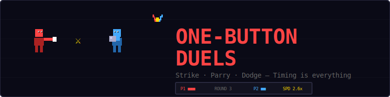
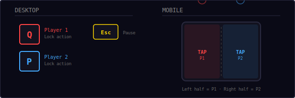
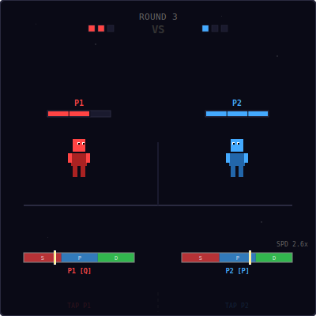
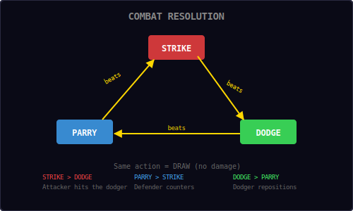
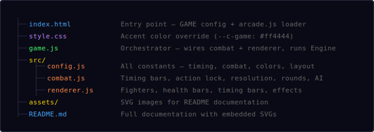
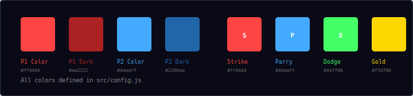
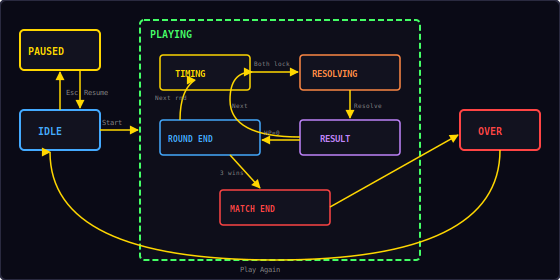

<p align="center">
  
</p>

<p align="center">
  A 2-player local multiplayer timing duel built with vanilla JavaScript and HTML5 Canvas.<br/>
  One button each. Strike, parry, or dodge — timing is everything.
</p>

---

## ▶ Controls

<p align="center">
  
</p>

| Action | Player 1 | Player 2 |
|--------|----------|----------|
| Lock action | `Q` | `P` |
| Pause | `Esc` | `Esc` |
| Mobile | Tap left half | Tap right half |

Each player has **one button**. Press it to lock in your action based on where the timing bar cursor is. The timing bar cycles through three zones: **Strike**, **Parry**, and **Dodge**.

---

## 🎮 Gameplay

<p align="center">
  
</p>

**How it works:**
- Two pixel-art fighters face each other on screen
- Each player has a timing bar that sweeps back and forth across three colored zones
- Press your button to lock in the action the cursor is currently on
- Once both players lock in, actions resolve using rock-paper-scissors logic
- The winner of each exchange deals 1 HP damage
- When a fighter reaches 0 HP, they lose the round
- First to win 3 rounds wins the match

**Single player:** If only one player presses their button within 3 seconds, the other side is controlled by AI with slightly randomized timing.

---

## ⚔ Combat System

<p align="center">
  
</p>

| Matchup | Result |
|---------|--------|
| **Strike** vs Dodge | Strike wins — attacker hits the dodger |
| **Parry** vs Strike | Parry wins — defender counters the attacker |
| **Dodge** vs Parry | Dodge wins — dodger repositions, parrier whiffs |
| Same vs Same | **Draw** — no damage dealt |

The combat triangle follows classic rock-paper-scissors logic:
```
STRIKE > DODGE > PARRY > STRIKE
```

---

## 📁 Project Structure

<p align="center">
  
</p>

---

## 🎨 Color Palette

<p align="center">
  
</p>

All colors are defined in `src/config.js`. The three action zones use distinct colors for instant recognition:
- **Strike** — Red (`#ff4444`) — aggressive, forward
- **Parry** — Blue (`#44aaff`) — defensive, steady
- **Dodge** — Green (`#44ff66`) — evasive, quick

---

## ⏱ Timing Bar Mechanics

Each player has an independent timing bar with a cursor that sweeps back and forth:

```
┌──────────┬──────────┬──────────┐
│  STRIKE  │  PARRY   │  DODGE   │
│  (red)   │  (blue)  │  (green) │
└──────────┴──────────┴──────────┘
      ▲ cursor sweeps ←→
```

**Speed scaling:**
```
speed = min(baseSpeed + (round - 1) × 0.3, maxSpeed)

Round 1: 2.0 cycles/sec
Round 2: 2.3 cycles/sec
Round 3: 2.6 cycles/sec
Round 4: 2.9 cycles/sec
Round 5: 3.2 cycles/sec (if reached)
```

The increasing speed creates mounting pressure as the match progresses. Later rounds demand faster reflexes and better reads on your opponent.

---

## 🏆 Match Structure

```
Match = Best of 5 rounds (first to 3 wins)
Round = Fight until one fighter reaches 0 HP
HP per round = 3
Damage per winning exchange = 1
```

| Phase | What happens |
|-------|-------------|
| **Timing** | Bars sweep, players press to lock actions |
| **Resolving** | Brief dramatic pause after both lock |
| **Result** | Actions compared, damage dealt, animations play |
| **Round End** | "Round X" announcement, fighters reset |
| **Match End** | Winner declared, game over screen |

---

## 🔄 State Machine

<p align="center">
  
</p>

The game has four top-level states managed by the shared `Engine`, with combat sub-states inside the Playing state:

| State | What happens |
|-------|-------------|
| **Idle** | Start screen, waiting for player |
| **Playing** | Combat loop running (timing → resolving → result → repeat) |
| **Paused** | Loop stopped, Esc to resume |
| **Over** | Match winner shown, Play Again button |

---

## 🤖 AI Behavior

When only one player is active (the other doesn't press within 3 seconds), the idle side switches to AI control:

- AI locks in at a random delay between 0.4s and 1.8s
- Slight bias (15%) toward picking the counter-action if the opponent already locked
- Otherwise locks at random timing, creating unpredictable but beatable play
- AI activates per-exchange, so a second player can jump in at any time

---

## 🔊 Sound & Effects

All sounds are synthesized in real-time using the Web Audio API.

| Event | Sound | Visual |
|-------|-------|--------|
| Lock action | `click` | Bar dims, action label shown |
| Successful strike | `hit` | Screen shake + flash + particles |
| Parry/counter | `move` | Shield animation |
| Dodge | `whoosh` | Fighter dashes back |
| Round win | `score` | Win pip fills |
| Match end | `win` | Victory pose animation |
| Draw | `move` | Both animate, no damage |

---

## 🛠 Customization

All tweaks happen in `src/config.js`:

**Change match length:**
```js
roundsToWin: 5,        // longer matches
hpPerRound: 5,         // more exchanges per round
exchangeDamage: 1,     // damage per hit
```

**Change timing difficulty:**
```js
barSpeed: 1.5,           // slower start
barSpeedIncrease: 0.5,   // ramps faster
barMaxSpeed: 6.0,        // higher top speed
```

**Change zone proportions:**
```js
zones: [
  { name: 'STRIKE', color: '#ff4444', width: 0.25 },  // smaller strike zone
  { name: 'PARRY',  color: '#44aaff', width: 0.50 },  // bigger parry zone
  { name: 'DODGE',  color: '#44ff66', width: 0.25 },  // smaller dodge zone
],
```

**Adjust AI difficulty:**
```js
aiBias: 0.4,           // smarter AI (higher = more counter-picks)
aiMinDelay: 0.2,       // faster reactions
aiMaxDelay: 1.0,       // less random delay
```

---

## 🧩 Shared Modules Used

| Module | What One-Button Duels uses it for |
|--------|-----------------------------------|
| `Engine` | Game loop, state machine, canvas auto-setup |
| `Input` | Keyboard input (Q, P, Esc) |
| `Audio8` | Click, hit, move, whoosh, score, win sounds |
| `Particles` | Hit impact particle bursts |
| `Shell` | HUD stats (P1 wins, P2 wins, round), overlay screens |

---

<p align="center">
  <sub>Part of the <a href="../README.md">Mini Arcade</a> collection · MIT License</sub>
</p>
