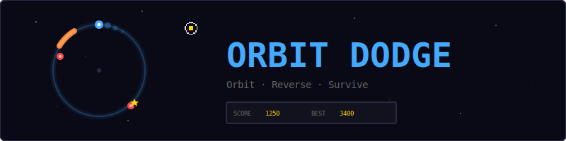
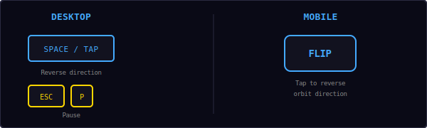
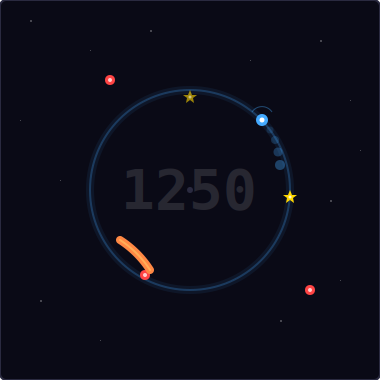
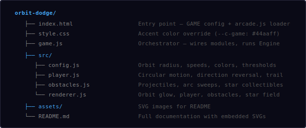
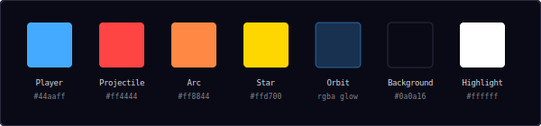
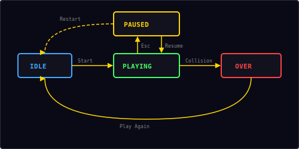

<p align="center">
  
</p>

<p align="center">
  A hypnotic one-button survival game built with vanilla JavaScript and HTML5 Canvas.<br/>
  Orbit a center point, reverse direction to dodge obstacles, collect stars.
</p>

---

## ▶ Controls

<p align="center">
  
</p>

| Action | Desktop | Mobile |
|--------|---------|--------|
| Reverse orbit direction | `Space` / `↑` `↓` `←` `→` / Tap | FLIP button |
| Pause / Resume | `Esc` / `P` | — |

> **Tip:** Timing is everything. Watch the obstacles approach and flip at the last moment to slip past them.

---

## 🎮 Gameplay

<p align="center">
  
</p>

**Rules:**
- Your player dot orbits a center point along a circular path (radius ~100px)
- The orbit moves at a constant angular speed — tap to **instantly reverse direction**
- **Projectile obstacles** fly through the orbit ring from random angles outside the screen
- **Arc obstacles** sweep along the orbit path itself — you must reverse to avoid them
- **Gold stars** appear on the orbit for bonus points (+50 each)
- Score ticks up continuously based on **time survived** plus star bonuses
- Obstacle frequency and speed **increase over time** — the longer you survive, the harder it gets
- A fading **trail** follows the player along the orbit for a hypnotic visual effect
- High score is saved locally in your browser

---

## 📁 Project Structure

<p align="center">
  
</p>

---

## 🎨 Color Palette

<p align="center">
  
</p>

All colors are defined in `src/config.js`. Change them there to reskin the entire game.

---

## 🔄 Circular Motion Math

The player moves along a circle using trigonometric functions:

```
x = centerX + cos(angle) × radius
y = centerY + sin(angle) × radius
```

Each frame, the angle updates:

```
angle += angularSpeed × direction × dt

where direction = 1 (clockwise) or -1 (counter-clockwise)
```

Tapping flips `direction` instantly: `direction *= -1`

The trail stores the last 18 positions, drawn with decreasing size and opacity to create the fading arc effect.

---

## 🎯 Obstacle Types

### Projectiles
- Spawn from a random angle **outside** the orbit ring (120–180px from center)
- Aimed to cross through the orbit path toward the center area
- Collision detected by distance: `dist(player, projectile) < hitDistance + projectileRadius`
- Speed increases over time via `speedMultiplier = 1 + elapsed × 0.08`

### Arc Sweeps
- Appear **on** the orbit ring as a colored arc segment (~0.6 radians wide)
- Rotate along the orbit at their own angular speed
- Collision detected by **angular overlap** between player angle and arc span
- Live for roughly one full orbit revolution before disappearing

### Difficulty Ramp

```
spawnInterval = max(0.4, 1.5 - elapsed × 0.02)
speedMultiplier = 1 + elapsed × 0.08
arcChance = min(0.45, 0.25 + elapsed × 0.005)
```

| Time | Spawn Rate | Speed | Arc Chance |
|------|-----------|-------|------------|
| 0s | 1.5s | 1.0× | 25% |
| 15s | 1.2s | 2.2× | 33% |
| 30s | 0.9s | 3.4× | 40% |
| 55s | 0.4s (max) | 5.4× | 45% (max) |

---

## ⭐ Star Collectibles

- Gold stars spawn on the orbit ring every 4 seconds
- Each star is worth **50 bonus points**
- Stars pulse with a glow animation and fade out after 3.5 seconds
- Pickup distance is slightly larger than collision distance for a forgiving feel
- Collecting a star triggers a gold particle burst and a toast notification

---

## 📈 Scoring

```
score = floor(timeAlive × 10) + (starsCollected × 50)
```

| Source | Points |
|--------|--------|
| Survival | 10 per second |
| Star pickup | +50 each |

---

## 🔄 State Machine

<p align="center">
  
</p>

The game has four states managed by the shared `Engine`:

| State | What happens |
|-------|-------------|
| **Idle** | Start screen overlay shown, waiting for player |
| **Playing** | Game loop running — player orbiting, obstacles spawning |
| **Paused** | Loop stopped, pause overlay with Resume + Restart |
| **Over** | Collision detected — final score shown, "Play Again" button |

---

## 🔊 Sound & Effects

All sounds are synthesized in real-time using the Web Audio API — no audio files needed.

| Event | Sound | Visual Effect |
|-------|-------|---------------|
| Reverse direction | Short click (`click`) | — |
| Star pickup | Rising two-note (`score`) | Gold particle burst + toast "+50" |
| Obstacle collision | Low thud (`hit`) + descending (`gameover`) | Red screen flash + blue particle burst |

### Visual Effects

- **Orbit ring glow:** Subtle blue ring with shadow blur for a neon look
- **Player trail:** 18 fading dots along the orbit path behind the player
- **Player glow:** Radial shadow blur around the bright player dot
- **Star pulse:** Gold stars pulse in brightness with a sine wave animation
- **Background stars:** 60 twinkling pixel stars across the dark space background
- **Screen flash:** Red flash on collision (0.2s fade)
- **Score watermark:** Large semi-transparent score number in the center

---

## 🛠 Customization

All tweaks happen in `src/config.js`:

**Change orbit:**
```js
orbitRadius: 120,        // larger orbit
angularSpeed: 3.0,       // faster rotation
```

**Change difficulty:**
```js
spawnInterval: 2.0,      // slower start
spawnIntervalMin: 0.6,   // less intense max
spawnRampRate: 0.01,     // slower ramp
speedRampRate: 0.05,     // gentler speed increase
```

**Change obstacles:**
```js
projectileSpeed: 200,    // faster projectiles
arcWidth: 0.8,           // wider arc obstacles
arcChance: 0.4,          // more arcs
```

**Change stars:**
```js
starPoints: 100,         // more valuable stars
starSpawnInterval: 2.0,  // more frequent stars
starLifetime: 5.0,       // stars last longer
```

**Change visuals:**
```js
trailLength: 24,         // longer trail
bgStarCount: 100,        // more background stars
playerRadius: 8,         // bigger player dot
```

---

## 🧩 Shared Modules Used

| Module | What Orbit Dodge uses it for |
|--------|------------------------------|
| `Engine` | Game loop, state machine, canvas auto-setup |
| `Input` | Space/tap for direction flip, Esc/P for pause |
| `Audio8` | Click, score, hit, and game over sounds |
| `Particles` | Star pickup and death particle bursts |
| `Shell` | HUD stats (Score, Best), overlay screens, toast |
| `utils.js` | `saveHighScore()`, `loadHighScore()` |

---

<p align="center">
  <sub>Part of the <a href="../README.md">Mini Arcade</a> collection · MIT License</sub>
</p>
