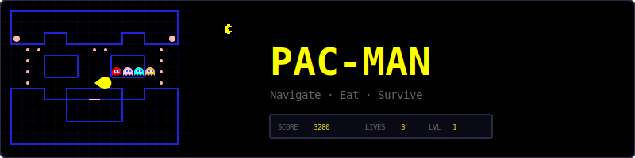
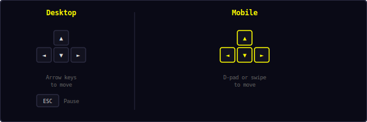
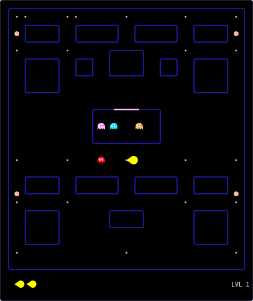
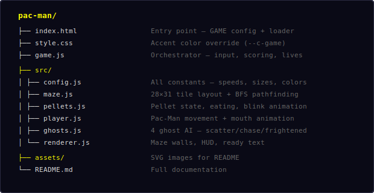
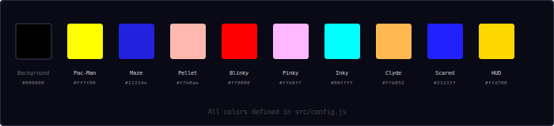
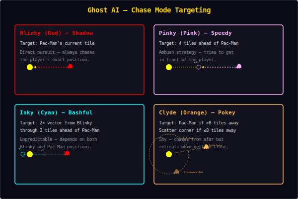
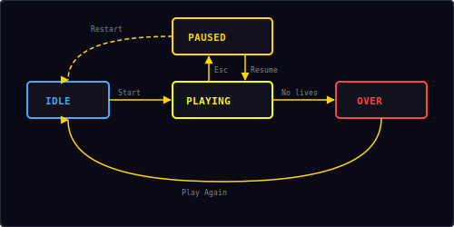

<p align="center">
  
</p>

<p align="center">
  The iconic maze-chase game built with vanilla JavaScript and HTML5 Canvas.<br/>
  Navigate the maze, eat all pellets, and outsmart four ghosts with unique AI personalities.
</p>

---

## ▶ Controls

<p align="center">
  
</p>

| Action | Desktop | Mobile |
|--------|---------|--------|
| Move up | `↑` | D-pad / swipe up |
| Move down | `↓` | D-pad / swipe down |
| Move left | `←` | D-pad / swipe left |
| Move right | `→` | D-pad / swipe right |
| Pause / Restart | `Esc` / `P` | — |

---

## 🎮 Gameplay

<p align="center">
  
</p>

**Rules:**
- Navigate Pac-Man through a classic 28×31 tile maze
- Eat all **pellets** (small dots) and **power pellets** (large dots) to clear the level
- Four ghosts patrol the maze — each with a unique AI personality
- **Power pellets** turn ghosts blue (frightened) for 8 seconds — eat them for bonus points
- Eaten ghosts return to the ghost house and respawn
- The maze has **tunnel passages** on the left and right edges that wrap around
- You have **3 lives** — lose one each time a ghost catches you
- Speed increases with each level — ghosts get faster and more aggressive
- High score is saved locally in your browser

---

## 📁 Project Structure

<p align="center">
  
</p>

---

## 🎨 Color Palette

<p align="center">
  
</p>

All colors are defined in `src/config.js`. Change them there to reskin the entire game.

---

## 👻 Ghost AI

<p align="center">
  
</p>

Each ghost has a unique targeting strategy during **Chase** mode:

| Ghost | Name | Color | Chase Target | Personality |
|-------|------|-------|-------------|-------------|
| Blinky | Shadow | Red `#ff0000` | Pac-Man's current tile | Direct pursuer — always on your tail |
| Pinky | Speedy | Pink `#ffb8ff` | 4 tiles ahead of Pac-Man | Ambusher — tries to cut you off |
| Inky | Bashful | Cyan `#00ffff` | 2× vector from Blinky through 2 tiles ahead | Unpredictable — depends on Blinky's position |
| Clyde | Pokey | Orange `#ffb852` | Pac-Man if >8 tiles away, else scatter corner | Shy — retreats when getting close |

### Ghost Modes

Ghosts alternate between three behavioral modes:

| Mode | Behavior | Duration |
|------|----------|----------|
| **Scatter** | Each ghost targets its home corner | 7s / 5s (alternating) |
| **Chase** | Each ghost uses its unique targeting AI | 20s (alternating) |
| **Frightened** | Ghosts turn blue, move randomly, edible | 8s (after power pellet) |
| **Eaten** | Eyes only — returns to ghost house at high speed | Until reaching house |

**Mode alternation pattern:** Scatter(7s) → Chase(20s) → Scatter(7s) → Chase(20s) → Scatter(5s) → Chase(20s) → Scatter(5s) → Chase(forever)

### Pathfinding

All ghosts use **BFS (Breadth-First Search)** to find the shortest path to their target tile. Key rules:
- Ghosts cannot reverse direction (except when mode changes)
- In frightened mode, ghosts pick random valid directions at intersections
- Ghosts move slower in tunnel passages
- Eaten ghosts move at 2× speed back to the ghost house

---

## 📊 Scoring

| Item | Points |
|------|--------|
| Pellet | 10 |
| Power pellet | 50 |
| 1st ghost eaten | 200 |
| 2nd ghost eaten | 400 |
| 3rd ghost eaten | 800 |
| 4th ghost eaten | 1,600 |

Ghost scores **double** for each successive ghost eaten during a single power pellet. Eating all 4 ghosts in one power-up yields **3,000 bonus points**.

---

## ⚡ Speed & Difficulty

Speed scales with each level:

```
playerSpeed = 80 + (level × 3)    // tiles/sec
ghostSpeed  = 75 + (level × 3)    // tiles/sec
frightenedSpeed = 40               // constant
tunnelSpeed     = 40               // constant
returnSpeed     = 150              // eaten ghost returning
```

| Level | Pac-Man Speed | Ghost Speed |
|-------|--------------|-------------|
| 1 | 80 | 75 |
| 3 | 86 | 81 |
| 5 | 92 | 87 |
| 10 | 107 | 102 |

---

## 🔄 State Machine

<p align="center">
  
</p>

The game has four states managed by the shared `Engine`:

| State | What happens |
|-------|-------------|
| **Idle** | Start screen overlay shown, waiting for player |
| **Playing** | Game loop running — Pac-Man moves, ghosts chase, pellets eaten |
| **Paused** | Loop stopped, pause overlay with Resume + Restart options |
| **Over** | All lives lost — final score shown, "Play Again" button |

Additional in-game sub-states:
- **Ready** — 2-second countdown before each life starts
- **Death** — 1.5-second death animation when caught by a ghost
- **Level Clear** — 2-second pause when all pellets are eaten before next level

---

## 🔊 Sound & Effects

All sounds are synthesized in real-time using the Web Audio API — no audio files needed.

| Event | Sound | Particles |
|-------|-------|-----------|
| Eat pellet | Short blip (`move`) | — |
| Eat power pellet | Rising two-note (`score`) | — |
| Eat ghost | Low thud (`hit`) | 8 blue pixels burst |
| Pac-Man dies | Descending three-note (`gameover`) | — |
| Level clear | Ascending fanfare (`win`) | — |

---

## 🛠 Customization

All tweaks happen in `src/config.js`:

**Change maze size:**
```js
cellSize: 16,        // larger tiles (wider canvas)
```

**Change difficulty:**
```js
playerSpeed: 100,           // faster Pac-Man
ghostSpeed: 60,             // slower ghosts
frightenedDuration: 12,     // longer power-up
startLives: 5,              // more forgiving
```

**Change ghost colors:**
```js
ghostColors: ['#ff4444', '#ff88ff', '#44ffff', '#ffaa44'],
```

**Change scoring:**
```js
pelletScore: 20,             // double pellet value
powerPelletScore: 100,       // double power pellet value
ghostScoreBase: 400,         // higher ghost bounty
```

---

## 🧩 Shared Modules Used

| Module | What Pac-Man uses it for |
|--------|------------------------|
| `Engine` | Game loop, state machine, canvas auto-setup |
| `Input` | Keyboard + swipe + mobile d-pad |
| `Audio8` | Pellet, power-up, ghost eat, and death sounds |
| `Particles` | Ghost eat visual effects |
| `Shell` | HUD stats, overlay screens, toast messages |
| `utils.js` | `saveHighScore()`, `loadHighScore()` |

---

<p align="center">
  <sub>Part of the <a href="../README.md">Mini Arcade</a> collection · MIT License</sub>
</p>
