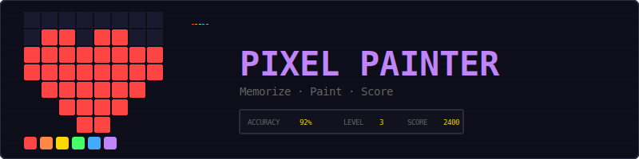
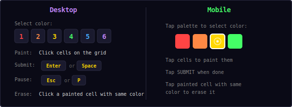
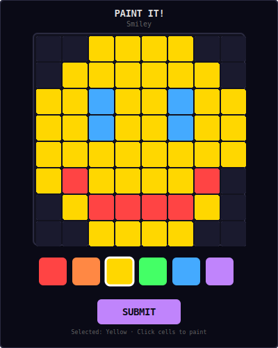
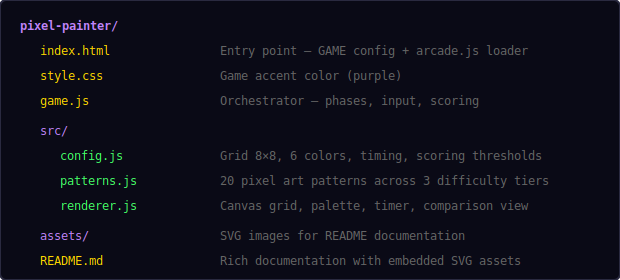
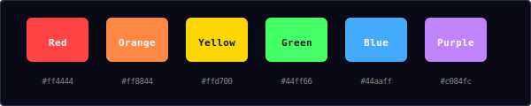
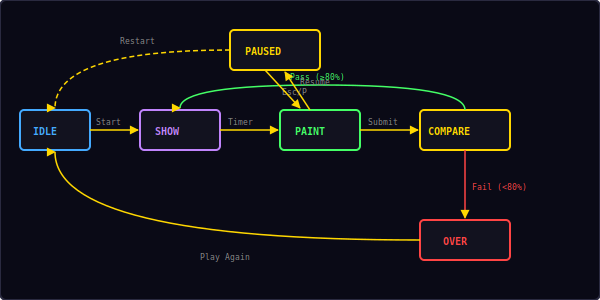

<p align="center">
  
</p>

<p align="center">
  A visual memory game built with vanilla JavaScript and HTML5 Canvas.<br/>
  Memorize a pixel art pattern, then recreate it from memory on an 8×8 grid.
</p>

---

## ▶ Controls

<p align="center">
  
</p>

| Action | Desktop | Mobile |
|--------|---------|--------|
| Select color | Click palette or press `1`–`6` | Tap palette button |
| Paint cell | Click grid cell | Tap grid cell |
| Erase cell | Click painted cell with same color | Tap painted cell with same color |
| Submit painting | Click SUBMIT or press `Enter`/`Space` | Tap SUBMIT button |
| Pause / Restart | `Esc` / `P` | — |

---

## 🎮 Gameplay

<p align="center">
  
</p>

**Rules:**
- Each round has three phases: **Show**, **Paint**, and **Compare**
- **Show phase:** A target pixel art pattern is displayed on the 8×8 grid for a limited time
- **Paint phase:** The grid goes blank — recreate the pattern from memory using the 6-color palette
- **Compare phase:** Your painting is compared side-by-side with the target
- **Accuracy** = correct cells ÷ total filled cells in the target × 100%
- Score **80% or higher** to pass and advance to the next level
- Score below 80% and it's game over
- Display time decreases as levels increase — Level 1 gets 5 seconds, Level 4+ only 2 seconds
- Patterns get more complex with higher levels (more colors, more detail)
- Click a painted cell with the same color to **erase** it
- 100% accuracy earns a **perfect bonus**

**Strategy tips:**
- Focus on the overall shape first, then fill in details
- Note which colors are used and where the boundaries are
- Start with the most distinctive features (eyes, borders, unique elements)
- Use the erase feature to correct mistakes before submitting

---

## 📁 Project Structure

<p align="center">
  
</p>

---

## 🎨 Color Palette

<p align="center">
  
</p>

All colors are defined in `src/config.js`. The same 6-color palette is shared with Color Flood for visual consistency across the arcade.

---

## 🧠 Pattern System

Pixel Painter includes 20 pre-defined pixel art patterns organized into three difficulty tiers:

### Easy (Levels 1–2) — 1–2 colors
Simple, recognizable shapes with bold outlines:
- Heart, Star, Arrow, Cross, Diamond, Circle

### Medium (Levels 3–5) — 3–4 colors
More detailed designs with multiple color regions:
- Smiley, House, Tree, Letter A, Boat, Crown, Umbrella

### Hard (Level 6+) — 5–6 colors
Complex pixel art with fine details:
- Rocket, Fish, Mushroom, Flower, Alien, Castle, Butterfly

Patterns are selected randomly within each tier, with tracking to avoid immediate repeats.

---

## ⏱ Display Time & Difficulty

The time you get to memorize the pattern decreases with level:

| Level | Display Time | Pattern Tier |
|-------|-------------|-------------|
| 1 | 5 seconds | Easy (1–2 colors) |
| 2 | 4 seconds | Easy (1–2 colors) |
| 3 | 3 seconds | Medium (3–4 colors) |
| 4 | 2 seconds | Medium (3–4 colors) |
| 5 | 2 seconds | Medium (3–4 colors) |
| 6+ | 2 seconds | Hard (5–6 colors) |

---

## 📊 Scoring

```
accuracy = (correct_cells / target_filled_cells) × 100%

points = accuracy × 10
       + level × 100          (level bonus)
       + 500                   (if 100% accuracy)
```

| Accuracy | Result | Points (Level 3) |
|----------|--------|-------------------|
| 100% | Perfect! | 1000 + 300 + 500 = 1800 |
| 92% | Passed | 920 + 300 = 1220 |
| 80% | Passed | 800 + 300 = 1100 |
| 75% | Failed | Game Over |

---

## 🔄 State Machine

<p align="center">
  
</p>

The game has six logical states:

| State | What happens |
|-------|-------------|
| **Idle** | Start screen overlay, waiting for player |
| **Show** | Target pattern displayed with countdown timer |
| **Countdown** | Brief pause before paint phase begins |
| **Paint** | Blank grid, player paints from memory |
| **Compare** | Side-by-side comparison with accuracy score |
| **Over** | Game over screen with final score |

Transitions:
- **Idle → Show**: Player clicks "Start"
- **Show → Paint**: Display timer expires (via brief countdown)
- **Paint → Compare**: Player clicks "Submit" or presses Enter/Space
- **Compare → Show**: Accuracy ≥ 80% (advance to next level)
- **Compare → Over**: Accuracy < 80%
- **Over → Idle**: Player clicks "Play Again"
- **Any → Paused**: Player presses Esc/P
- **Paused → Playing**: Player clicks "Resume"
- **Paused → Idle**: Player clicks "Restart"

---

## 🔊 Sound & Effects

All sounds are synthesized in real-time using the Web Audio API — no audio files needed.

| Event | Sound | Visual |
|-------|-------|--------|
| Paint / erase cell | Short click blip (`click`) | Cell color changes |
| Select palette color | Short click blip (`click`) | White border on selected |
| High accuracy (≥80%) | Rising two-note (`score`) | Green celebration particles |
| Low accuracy (<80%) | Buzz tone (`error`) | Red comparison highlights |
| Level complete | Four-note fanfare (`win`) | Toast with points |
| Game over | Descending three-note (`gameover`) | — |
| Phase transition | Swoosh (`whoosh`) | Grid clears |

---

## 🛠 Customization

All tweaks happen in `src/config.js`:

**Change display times:**
```js
showDurations: [8, 6, 4, 3],   // more time to memorize
```

**Change pass threshold:**
```js
passThreshold: 70,              // easier to pass
// or
passThreshold: 90,              // harder to pass
```

**Change scoring:**
```js
pointsPerPercent: 20,           // double points
perfectBonus: 1000,             // bigger perfect bonus
levelBonus: 200,                // more level scaling
```

**Change difficulty tiers:**
```js
easyMaxLevel: 3,                // easy patterns through level 3
mediumMaxLevel: 7,              // medium patterns through level 7
```

**Change colors:**
```js
colors: [
  '#ff0000',   // pure red
  '#ff8800',   // bright orange
  '#ffff00',   // pure yellow
  '#00ff00',   // lime green
  '#0088ff',   // sky blue
  '#ff00ff',   // magenta
],
```

---

## 🧩 Shared Modules Used

| Module | What Pixel Painter uses it for |
|--------|-------------------------------|
| `Engine` | Game loop, state machine, canvas auto-setup |
| `Input` | Keyboard shortcuts (1-6, Enter, Esc, P) |
| `Audio8` | Click, score, error, win, and game over sounds |
| `Particles` | Celebration effects on high accuracy |
| `Shell` | HUD stats, overlay screens, toast messages |

---

<p align="center">
  <sub>Part of the <a href="../README.md">Mini Arcade</a> collection · MIT License</sub>
</p>
