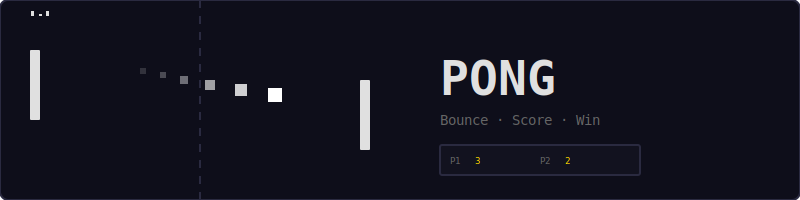
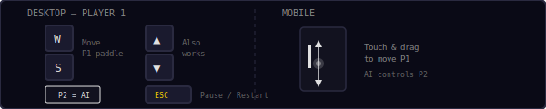
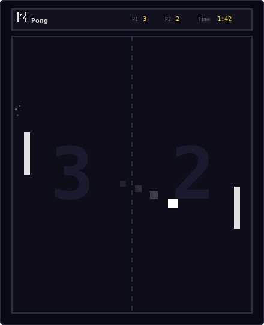
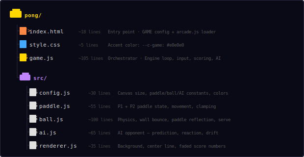
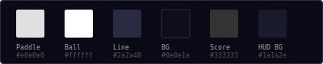
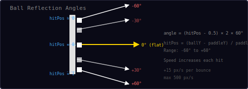
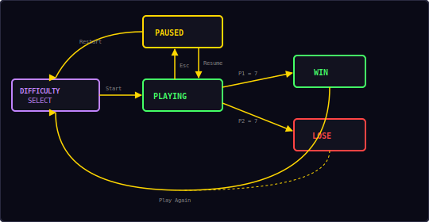

<p align="center">
  
</p>

<p align="center">
  Classic Pong — Player vs AI. Choose your difficulty. First to 7 wins.
</p>

---

## ▶ Controls

<p align="center">
  
</p>

| Action | Desktop | Mobile |
|--------|---------|--------|
| Move P1 paddle | `W` / `S` or `↑` / `↓` | Touch & drag on canvas |
| P2 (AI) | Automatic | Automatic |
| Pause / Restart | `Esc` / `P` | — |

Pressing `Esc` opens a pause menu with two options: **Resume** to continue, or **Restart** to go back to difficulty selection.

---

## 🎮 Gameplay

<p align="center">
  
</p>

**Rules:**
- Choose **Easy** or **Unbeatable** difficulty before each match
- Player 1 controls the left paddle, AI controls the right paddle
- First player to reach **7 points** wins the match
- A **match timer** tracks how long the game lasts
- The ball speeds up with every paddle hit (+15 px/s, up to 500 px/s max)
- After each point, the ball is served toward the player who lost the point
- Press `Esc` at any time to pause, resume, or restart

---

## 🎯 Difficulty Modes

| Mode | AI Speed | Reaction | Prediction | Behavior |
|------|----------|----------|------------|----------|
| **Easy** | 180 px/s | 45% | Off | Tracks ball Y directly, slow, makes mistakes, reaction delay |
| **Unbeatable** | 380 px/s | 97% | On | Predicts trajectory with wall bounces, near-perfect tracking |

**Easy AI weaknesses:**
- No trajectory prediction — just follows the ball's current Y, always late on angled shots
- Reaction delay (~0.275s) when ball changes direction
- Large wandering error (±80px) — paddle drifts off target
- Slow movement — can't reach steep angles in time

**Unbeatable AI strengths:**
- Predicts exactly where the ball will arrive, including wall bounces
- Near-instant reaction with minimal error
- Fast enough to reach any angle

---

## 📁 Project Structure

<p align="center">
  
</p>

---

## 🎨 Color Palette

<p align="center">
  
</p>

All colors are defined in `src/config.js`. Change them there to reskin the entire game.

---

## 🏓 Ball Reflection

<p align="center">
  
</p>

When the ball hits a paddle, the bounce angle depends on **where** it hits:

```
hitPos = (ballY - paddleTop) / paddleH    // 0 = top, 1 = bottom
angle  = (hitPos - 0.5) × 2 × 60°        // maps to -60° … +60°
```

| Hit position | Bounce angle |
|-------------|-------------|
| Top edge | -60° (steep up) |
| Center | 0° (flat) |
| Bottom edge | +60° (steep down) |

The collision uses **sweep detection**: it tracks the ball's position from the previous frame and checks if the ball crossed the paddle's face, preventing tunneling at high speeds.

---

## 🤖 AI Behavior

The AI controls the right paddle with three behaviors:

**1. Tracking** — When the ball moves toward the AI, it either predicts the landing position (Unbeatable) or simply follows the ball's current Y (Easy).

**2. Imperfection** — A wandering error term drifts the AI's target position. On Easy, this error is large (±80px) and accumulates fast. On Unbeatable, it's negligible.

**3. Reaction delay** — On Easy, the AI takes ~0.275s to react when the ball changes direction. On Unbeatable, reaction is near-instant.

**4. Drift to center** — When the ball moves away, the AI slowly returns to center court.

---

## 🔄 State Machine

<p align="center">
  
</p>

| State | What happens |
|-------|-------------|
| **Difficulty Select** | Choose Easy or Unbeatable |
| **Serving** | Brief pause, ball centered, then auto-served |
| **Playing** | Game loop + timer running, paddles move, ball bounces |
| **Paused** | Loop + timer stopped, Resume / Restart options |
| **Win/Lose** | Match over with time shown, Play Again → difficulty select |

---

## 🔊 Sound & Effects

| Event | Sound | Visual |
|-------|-------|--------|
| Paddle hit | Short blip | — |
| Score point | Rising two-note | 12 white particles burst |
| Win | Ascending four-note | "You Win!" + match time |
| Lose | Descending three-note | "AI Wins" + match time |

---

## 🛠 Customization

All tweaks happen in `src/config.js`:

**Change win score:**
```js
winScore: 11,        // longer matches
```

**Tweak Easy difficulty:**
```js
difficulties: {
  easy: {
    aiSpeed: 150,        // even slower
    aiReaction: 0.3,     // more mistakes
    aiPrediction: false,
  },
},
```

**Change ball speed:**
```js
ballBaseSpeed: 200,       // slower start
ballSpeedIncrement: 25,   // ramps faster per hit
ballMaxSpeed: 600,        // higher ceiling
```

**Add 2-player mode** — in `game.js`, replace the AI update with P2 keyboard input:
```js
// Replace: AI.update(dt, {...}, Paddle.getP2());
// With:
if (Input.held('ArrowUp')) {
  Paddle.moveP2(-Config.paddleSpeed * dt);
}
if (Input.held('ArrowDown')) {
  Paddle.moveP2(Config.paddleSpeed * dt);
}
```

---

## 🧩 Shared Modules Used

| Module | What Pong uses it for |
|--------|----------------------|
| `Engine` | Game loop, state machine, canvas auto-setup |
| `Input` | Keyboard input (W/S, arrows, Esc) |
| `Audio8` | Hit, score, and game over sounds |
| `Particles` | Score burst visual effects |
| `Shell` | HUD stats (P1/P2/Time), overlay screens |
| `Timer` | Match stopwatch |

---

<p align="center">
  <sub>Part of the <a href="../README.md">Mini Arcade</a> collection · MIT License</sub>
</p>
