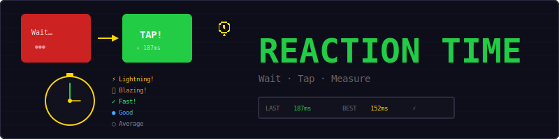
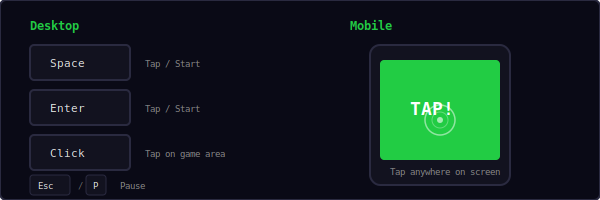
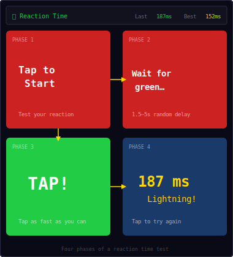
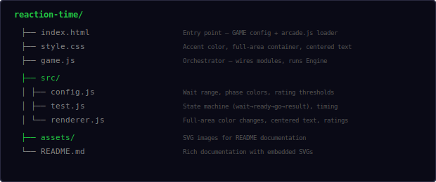
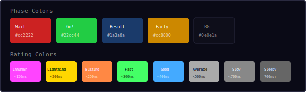
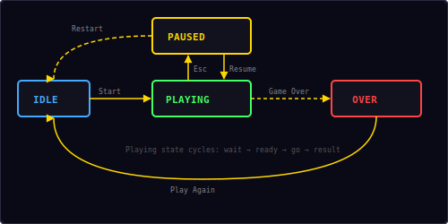

<p align="center">
  
</p>

<p align="center">
  A simple reaction time test built with vanilla JavaScript and DOM manipulation.<br/>
  Wait for green, tap as fast as you can, see your rating.
</p>

---

## ▶ Controls

<p align="center">
  
</p>

| Action | Desktop | Mobile |
|--------|---------|--------|
| Tap / Start | `Space` / `Enter` / Click | Tap anywhere |
| Pause / Restart | `Esc` / `P` | — |

---

## 🎮 Gameplay

<p align="center">
  
</p>

**How it works:**
- The screen starts **red** — tap or press Space to begin
- After tapping, the screen stays **red** for a random delay (1.5–5 seconds)
- When the screen turns **green**, tap as fast as you can
- Your reaction time is measured in milliseconds using `performance.now()`
- If you tap during the red "waiting" phase, you get a **"Too early!"** warning
- After each result, tap again to start a new round
- Your **best (lowest) time** is tracked and saved to localStorage
- Keep testing to improve your reaction time

---

## 📁 Project Structure

<p align="center">
  
</p>

---

## 🎨 Color Palette

<p align="center">
  
</p>

All colors are defined in `src/config.js`. Change them there to reskin the entire game.

---

## ⚡ Rating Thresholds

Your reaction time earns a rating based on these thresholds:

| Threshold | Rating | Color |
|-----------|--------|-------|
| < 150ms | Inhuman! | `#ff44ff` |
| < 200ms | Lightning! | `#ffd700` |
| < 250ms | Blazing! | `#ff8844` |
| < 300ms | Fast! | `#44ff66` |
| < 400ms | Good | `#44aaff` |
| < 500ms | Average | `#aaaaaa` |
| < 700ms | Slow | `#888888` |
| 700ms+ | Sleepy… | `#666666` |

**Average human reaction time** to a visual stimulus is around 250ms. Anything under 200ms is exceptional.

---

## ⏱ Timing Precision

Reaction time is measured using the [Performance API](https://developer.mozilla.org/en-US/docs/Web/API/Performance/now):

```
goTimestamp = performance.now()     // when green appears
tapTimestamp = performance.now()    // when player taps
reactionMs = tapTimestamp - goTimestamp
```

`performance.now()` provides sub-millisecond precision (microsecond resolution), making it ideal for reaction time measurement. The result is rounded to the nearest millisecond for display.

---

## 🔄 Inner State Machine

The game runs inside Engine's `playing` state and manages its own internal phases:

```
wait → ready → go → result
  ↑                    |
  └────────────────────┘
         (tap again)

ready → early → wait
         (tap too soon)
```

| Phase | Screen | What happens |
|-------|--------|-------------|
| **Wait** | Red | "Tap to Start" — waiting for player |
| **Ready** | Red | Random 1.5–5s delay — don't tap yet! |
| **Go** | Green | "TAP!" — timer starts, tap now |
| **Result** | Blue | Shows time in ms + rating |
| **Early** | Orange | "Too early!" — resets after 1.5s |

---

## 🔄 State Machine

<p align="center">
  
</p>

The outer game has four states managed by the shared `Engine`:

| State | What happens |
|-------|-------------|
| **Idle** | Start screen overlay shown, waiting for player |
| **Playing** | Game loop running, inner phase cycling active |
| **Paused** | Loop stopped, pause overlay shown with Resume + Restart |
| **Over** | Not typically reached — player keeps testing indefinitely |

---

## 🔊 Sound & Effects

All sounds are synthesized in real-time using the Web Audio API — no audio files needed.

| Event | Sound |
|-------|-------|
| Tap to start / next round | `click` |
| Reaction measured | `score` |
| New best time | `win` |
| Tapped too early | `error` |

---

## 🛠 Customization

All tweaks happen in `src/config.js`:

**Change wait range:**
```js
waitMin: 2.0,    // longer minimum wait
waitMax: 8.0,    // longer maximum wait
```

**Change rating thresholds:**
```js
ratings: [
  { max: 100,  label: 'Superhuman!', color: '#ff00ff' },
  { max: 180,  label: 'Lightning!',  color: '#ffd700' },
  // ...
],
```

**Change phase colors:**
```js
colors: {
  wait:   '#880000',   // darker red
  ready:  '#880000',
  go:     '#00ff00',   // brighter green
  result: '#000066',   // darker blue
  early:  '#ff6600',   // brighter orange
},
```

---

## 📊 Reaction Time Statistics

For context, here are typical human reaction times to visual stimuli:

| Percentile | Time | Notes |
|-----------|------|-------|
| Top 1% | < 160ms | Competitive gamers, athletes |
| Top 10% | 160–200ms | Very fast reflexes |
| Average | 200–300ms | Most people fall here |
| Below average | 300–400ms | Normal, especially on mobile |
| Slow | 400ms+ | Fatigue, distraction, or age factors |

Factors that affect reaction time: alertness, caffeine, age, device input lag, screen refresh rate, and whether you're using a mouse, keyboard, or touchscreen.

---

## 🧩 Shared Modules Used

| Module | What Reaction Time uses it for |
|--------|-------------------------------|
| `Engine` | State machine, pause/resume/restart, overlay management |
| `Input` | Keyboard (Space, Enter, Esc/P) input detection |
| `Audio8` | Click, score, win, and error sounds |
| `Shell` | HUD stats (Last, Best), overlay screens, toast messages |
| `utils.js` | `loadHighScore()` for persisting best time |

---

<p align="center">
  <sub>Part of the <a href="../README.md">Mini Arcade</a> collection · MIT License</sub>
</p>
