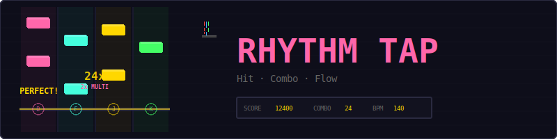
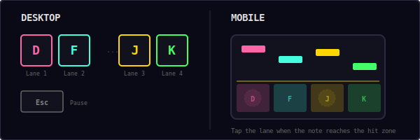
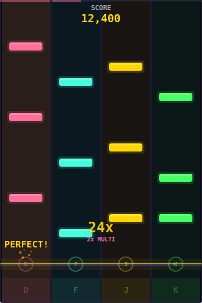
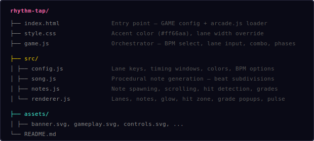
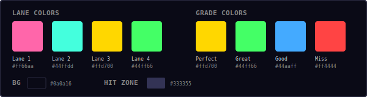
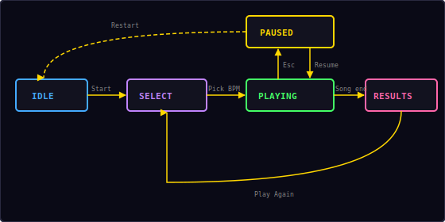

<p align="center">
  
</p>

<p align="center">
  A rhythm game built with vanilla JavaScript and HTML5 Canvas.<br/>
  Notes fall down 4 lanes — hit them on the beat for combos and high scores.
</p>

---

## ▶ Controls

<p align="center">
  
</p>

| Action | Desktop | Mobile |
|--------|---------|--------|
| Lane 1 (pink) | `D` | Tap left zone |
| Lane 2 (cyan) | `F` | Tap zone 2 |
| Lane 3 (gold) | `J` | Tap zone 3 |
| Lane 4 (green) | `K` | Tap right zone |
| Pause / Resume | `Esc` / `P` | — |
| Select BPM | `↑` `↓` + `Enter` | Tap option |

> **Tip:** D and F are left-hand keys, J and K are right-hand keys — the standard rhythm game layout. Keep your index fingers on F and J.

---

## 🎮 Gameplay

<p align="center">
  
</p>

**Rules:**
- Notes fall from the top of 4 colored lanes toward a hit zone near the bottom
- Press the matching key (D/F/J/K) when the note reaches the hit zone
- Timing determines your grade: **Perfect**, **Great**, **Good**, or **Miss**
- Build combos by hitting consecutive notes without missing
- Higher combos unlock score multipliers (2x, 3x, 4x)
- Choose from 3 BPM settings: 120 (chill), 140 (groove), 160 (intense)
- Each song lasts 60 seconds with procedurally generated note patterns
- Difficulty ramps up: quarter notes → eighth notes → sixteenth notes
- High score is saved locally in your browser

---

## 📁 Project Structure

<p align="center">
  
</p>

---

## 🎨 Color Palette

<p align="center">
  
</p>

All colors are defined in `src/config.js`. Change them there to reskin the entire game.

---

## ⏱ Timing Windows

The timing system judges how accurately you hit each note. The window is measured as the absolute time difference between your keypress and the note's target time:

```
timeDiff = |pressTime - noteTargetTime|

if timeDiff ≤ 40ms  → PERFECT  (gold)    — 300 pts
if timeDiff ≤ 80ms  → GREAT    (green)   — 200 pts
if timeDiff ≤ 120ms → GOOD     (blue)    — 100 pts
if timeDiff > 120ms → MISS     (red)     — 0 pts, combo breaks
```

| Grade | Window | Points | Color |
|-------|--------|--------|-------|
| **Perfect** | ±40ms | 300 × multiplier | `#ffd700` gold |
| **Great** | ±80ms | 200 × multiplier | `#44ff66` green |
| **Good** | ±120ms | 100 × multiplier | `#44aaff` blue |
| **Miss** | >120ms | 0 (combo breaks) | `#ff4444` red |

Notes that pass the hit zone without being pressed are automatically graded as a **Miss**.

---

## 🔥 Combo Multiplier

Consecutive non-miss hits build your combo. Higher combos unlock score multipliers:

| Combo | Multiplier | Effect |
|-------|-----------|--------|
| 0–9 | 1x | Base scoring |
| 10–24 | 2x | Double points |
| 25–49 | 3x | Triple points |
| 50+ | 4x | Quadruple points |

**Example:** A Perfect hit at combo 30 = 300 × 3 = **900 points**

Any **Miss** resets the combo to 0 and the multiplier back to 1x.

At combo 20+, particle effects trail from the hit zone on each beat — visual feedback that you're in the zone.

---

## 🎵 Note Generation Algorithm

Notes are procedurally generated based on BPM using beat subdivisions. The algorithm creates rhythmic patterns that feel musical rather than random.

### Beat Subdivisions

```
beatDuration = 60 / BPM

Quarter note  = 1 beat      (every beatDuration seconds)
Eighth note   = 1/2 beat    (every beatDuration/2 seconds)
Sixteenth note = 1/4 beat   (every beatDuration/4 seconds)
```

### Difficulty Ramp

| Time | Subdivisions | Patterns |
|------|-------------|----------|
| 0–10s | Quarter notes only | 85% single, 15% double |
| 10–30s | Quarter + eighth notes | Singles, doubles, runs |
| 30–60s | Quarter + eighth + sixteenth | All patterns including staircases |

### Pattern Types

1. **Single** — One note in a random lane
2. **Double** — Two simultaneous notes in different lanes
3. **Run** — 3–4 consecutive notes stepping across adjacent lanes
4. **Staircase** — Notes ascending or descending across all 4 lanes

### Constraints

- Never more than 3 simultaneous notes (all 4 lanes at once is impossible to hit)
- Minimum gap of half a beat between notes in the same lane
- Rest beats inserted randomly for breathing room (30% early, 10% late)
- 4-beat lead-in before the first note

---

## 🔄 State Machine

<p align="center">
  
</p>

The game has five logical states:

| State | What happens |
|-------|-------------|
| **Idle** | Start screen overlay shown, waiting for player |
| **Select** | BPM selection screen — pick 120, 140, or 160 BPM |
| **Playing** | Notes falling, input active, combo building |
| **Paused** | Loop stopped, pause overlay with Resume + Restart |
| **Results** | Song complete — grade breakdown, score, max combo |

---

## 🔊 Sound & Effects

All sounds are synthesized in real-time using the Web Audio API — no audio files needed.

| Event | Sound | Visual |
|-------|-------|--------|
| Perfect hit | Lane pitch (triangle wave, 150ms) | 12 gold particles + lane flash |
| Great hit | Lane pitch (triangle wave, 100ms) | 8 green particles + lane flash |
| Good hit | Lane pitch (triangle wave, 100ms) | 5 blue particles + lane flash |
| Miss | — | Red "MISS" popup, combo resets |
| Empty tap | Quiet blip (square wave, 30ms) | — |
| Combo 20+ | — | Beat-synced particles from all lanes |
| Song complete | Win fanfare | Results screen |
| BPM select | Click | Option highlight |

### Lane Pitches

| Lane | Note | Frequency |
|------|------|-----------|
| 1 (pink) | C4 | 261.63 Hz |
| 2 (cyan) | E4 | 329.63 Hz |
| 3 (gold) | G4 | 392.00 Hz |
| 4 (green) | B4 | 493.88 Hz |

---

## ✨ Visual Effects

- **Hit flash** — Lane background lights up with the grade color on each hit
- **Note glow** — Each note has a soft outer glow matching its lane color
- **Hit zone pulse** — The hit zone line pulses brighter on each beat
- **Background pulse** — Subtle white flash on each beat downbeat
- **Grade popup** — "PERFECT!" / "GREAT!" / "GOOD" / "MISS" text rises and fades
- **Combo fire** — At 20+ combo, particles emit from the hit zone on each beat
- **Progress bar** — Rainbow gradient bar at the top shows song progress

---

## 🛠 Customization

All tweaks happen in `src/config.js`:

**Change timing difficulty:**
```js
timingPerfect: 0.060,  // more forgiving perfect window
timingGreat: 0.100,    // wider great window
timingGood: 0.150,     // wider good window
```

**Change note speed:**
```js
noteSpeed: 250,        // slower falling notes (easier to read)
noteSpeed: 450,        // faster falling notes (harder)
```

**Change scoring:**
```js
scorePerPerfect: 500,  // reward precision more
comboThresholds: [
  { combo: 30, multiplier: 4 },  // harder to reach max multiplier
  { combo: 15, multiplier: 3 },
  { combo: 5,  multiplier: 2 },
  { combo: 0,  multiplier: 1 },
],
```

**Change lane colors:**
```js
laneColors: ['#ff4444', '#44aaff', '#ffd700', '#c084fc'],
```

**Change song duration:**
```js
songDuration: 90,      // longer songs
```

**Change difficulty ramp:**
```js
eighthNoteTime: 15,    // eighth notes appear later
sixteenthNoteTime: 45, // sixteenth notes appear much later
```

---

## 🧩 Shared Modules Used

| Module | What Rhythm Tap uses it for |
|--------|---------------------------|
| `Engine` | Game loop, state machine, canvas auto-setup |
| `Input` | Keyboard input for lane keys + pause |
| `Audio8` | Lane hit tones, click sounds, win/lose |
| `Particles` | Hit effects, combo fire particles |
| `Shell` | HUD stats (score, combo), overlay screens |
| `utils.js` | `saveHighScore()`, `loadHighScore()` |

---

<p align="center">
  <sub>Part of the <a href="../README.md">Mini Arcade</a> collection · MIT License</sub>
</p>
