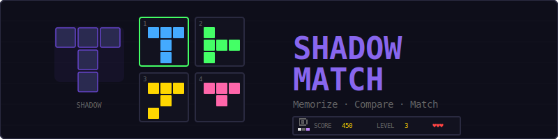
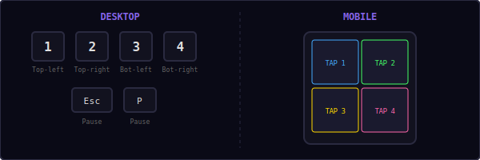
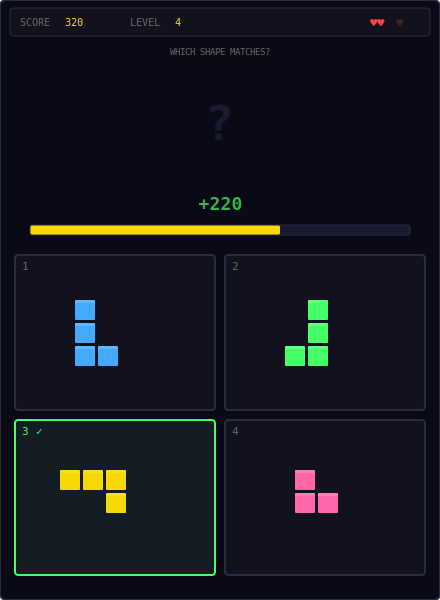
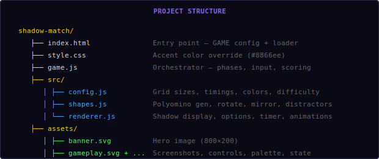
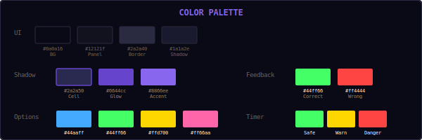
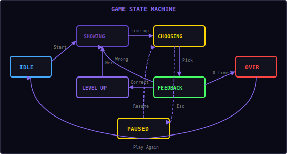

<p align="center">
  
</p>

<p align="center">
  A visual memory puzzle built with vanilla JavaScript and HTML5 Canvas.<br/>
  Memorize a shadow shape, then pick the matching one from four options before time runs out.
</p>

---

## ▶ Controls

<p align="center">
  
</p>

| Action | Desktop | Mobile |
|--------|---------|--------|
| Select option 1 (top-left) | `1` | Tap option |
| Select option 2 (top-right) | `2` | Tap option |
| Select option 3 (bottom-left) | `3` | Tap option |
| Select option 4 (bottom-right) | `4` | Tap option |
| Pause / Restart | `Esc` / `P` | — |

---

## 🎮 Gameplay

<p align="center">
  
</p>

**Rules:**
- A **shadow shape** is briefly displayed at the top of the screen — a dark silhouette with a purple glow
- The shape disappears, and **4 options** appear in a 2×2 grid below
- One option matches the shadow **exactly** — the other 3 are similar but different (rotated, mirrored, or slightly altered)
- Pick the matching shape before the **timer bar** runs out
- **Correct** = score points + advance to the next level
- **Wrong** or **timeout** = lose a life (you start with 3)
- As levels increase: shapes get more complex, display time gets shorter, and distractors become harder to distinguish
- High score is saved locally in your browser

---

## 📁 Project Structure

<p align="center">
  
</p>

---

## 🎨 Color Palette

<p align="center">
  
</p>

All colors are defined in `src/config.js`. Change them there to reskin the entire game.

---

## 🔄 Shape Generation & Transforms

Shapes are **polyominoes** — connected groups of cells on a small grid, similar to Tetris pieces but more varied. The game uses pre-defined polyomino sets for each cell count (3 through 7) to ensure high-quality, interesting shapes.

### Transforms

All transforms normalize the result so the shape's top-left cell is at position (0, 0):

**Rotation 90° clockwise:**
```
(row, col) → (col, maxRow - row)
```

**Mirror horizontal:**
```
(row, col) → (row, maxCol - col)
```

**Mirror vertical:**
```
(row, col) → (maxRow - row, col)
```

### Distractor Generation

Distractors are created from the original shape using transforms that depend on the difficulty mode:

| Mode | Levels | Distractor types |
|------|--------|-----------------|
| Easy | 1–3 | 90°, 180°, 270° rotations only |
| Medium | 4–6 | Rotations + horizontal/vertical mirrors |
| Hard | 7–10 | Rotations + mirrors + single cell add/remove |
| Expert | 11+ | Mirrors + multiple cell modifications (very subtle) |

The system ensures all 3 distractors are unique and different from the original. A connectivity check (BFS) prevents cell removal from creating disconnected shapes.

---

## 📈 Difficulty Ramp

| Level | Cells | Display time | Answer time | Distractor mode |
|-------|-------|-------------|-------------|-----------------|
| 1–3 | 3 | 3.0s → 2.8s | 6.0s → 5.7s | Easy (rotations) |
| 4–6 | 4 | 2.5s → 2.3s | 5.6s → 5.2s | Medium (mirror + rotation) |
| 7–10 | 5 | 2.0s → 1.8s | 5.1s → 4.7s | Hard (cell modifications) |
| 11+ | 6–7 | 1.5s | 4.5s → 3.5s | Expert (minimal differences) |

**Scoring formula:**
```
points = basePoints + timeBonus + levelBonus
       = 100 + floor(timeRemaining × 50) + (level × 20)
```

A fast correct answer on level 10 with 4 seconds remaining could earn: `100 + 200 + 200 = 500 points`.

---

## 🔄 State Machine

<p align="center">
  
</p>

The game has six phases managed by the Engine and internal phase logic:

| State | What happens |
|-------|-------------|
| **Idle** | Start screen overlay, waiting for player |
| **Showing** | Shadow shape displayed with countdown — memorize it |
| **Choosing** | Shape hidden, 4 options shown, timer counting down |
| **Feedback** | Correct (green flash + particles) or wrong (red shake + highlight correct) |
| **Level Up** | Brief "Level X" text before next round |
| **Paused** | Loop stopped, Resume + Restart options |
| **Over** | Game over screen with final score |

---

## 🔊 Sound & Effects

All sounds are synthesized in real-time using the Web Audio API — no audio files needed.

| Event | Sound | Visual |
|-------|-------|--------|
| Option selected | Short click blip (`click`) | — |
| Correct answer | Rising two-note (`score`) | Green flash + 20 colored particles |
| Wrong answer | Low buzz (`error`) | Red shake + correct option highlighted |
| Timer warning | Quick tick (`tick`) | Timer bar turns yellow → red |
| Game over | Descending three-note (`gameover`) | — |
| Shape disappears | Swoosh (`whoosh`) | Shape fades out |

---

## 🛠 Customization

All tweaks happen in `src/config.js`:

**Change difficulty:**
```js
// More lives
maxLives: 5,

// Slower timer
answerTime: 8.0,
answerTimeMin: 4.0,

// Longer shape display
levels: [
  { cells: 3, displayTime: 4.0, distractorMode: 'easy' },
  // ...
],
```

**Change scoring:**
```js
basePoints: 150,
timeBonusMultiplier: 80,
levelBonusMultiplier: 30,
```

**Change colors:**
```js
shadowCellColor: '#3a3a60',
shadowCellGlow: '#aa88ff',
cellColors: ['#ff6666', '#66ff66', '#6666ff', '#ffff66'],
```

**Change shape complexity:**
```js
// Edit the levels array to control cells per level
levels: [
  { cells: 4, displayTime: 3.0, distractorMode: 'easy' },
  // Start with 4-cell shapes instead of 3
],
```

---

## 🧩 Shared Modules Used

| Module | What Shadow Match uses it for |
|--------|-------------------------------|
| `Engine` | Game loop, state machine, canvas auto-setup |
| `Input` | Keyboard (1-4 keys, Esc/P) + touch input |
| `Audio8` | Click, score, error, tick, whoosh, gameover sounds |
| `Particles` | Correct answer celebration + wrong answer burst |
| `Shell` | HUD stats (score, level), overlay screens |
| `utils.js` | `randInt()`, `clamp()`, `saveHighScore()`, `loadHighScore()` |

---

<p align="center">
  <sub>Part of the <a href="../README.md">Mini Arcade</a> collection · MIT License</sub>
</p>
