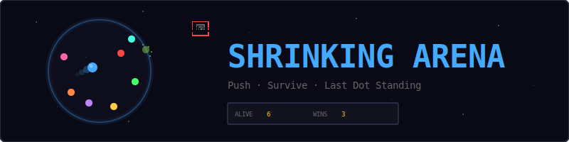
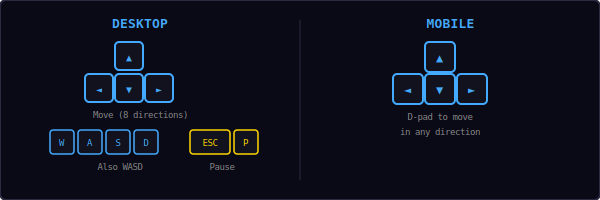
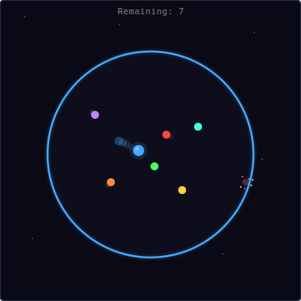
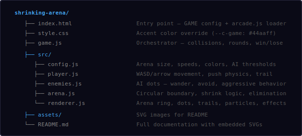
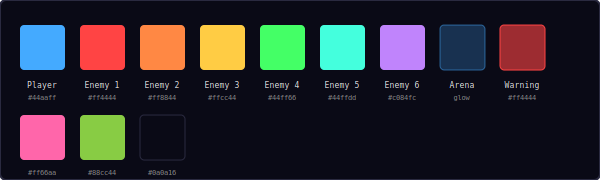
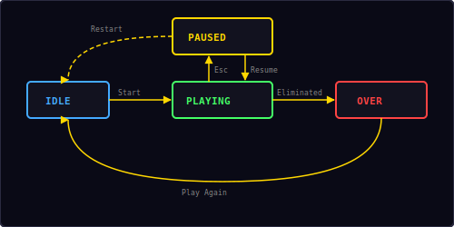

<p align="center">
  
</p>

<p align="center">
  A battle royale survival game built with vanilla JavaScript and HTML5 Canvas.<br/>
  Push enemies out of a shrinking circular arena. Last dot standing wins.
</p>

---

## ▶ Controls

<p align="center">
  
</p>

| Action | Desktop | Mobile |
|--------|---------|--------|
| Move (8 directions) | `WASD` / Arrow keys | D-pad |
| Pause / Resume | `Esc` / `P` | — |

> **Tip:** Use your momentum to bump enemies toward the shrinking edge. Time your pushes when they're already near the boundary.

---

## 🎮 Gameplay

<p align="center">
  
</p>

**Rules:**
- You're a bright blue dot in a circular arena with 10 AI enemy dots
- The arena **shrinks steadily over time** — the boundary gets smaller every second
- Any dot whose center crosses the arena boundary is **eliminated** with a particle burst
- Bump into enemies to **push them** toward the edge — elastic collisions push both dots apart
- The round ends when only you remain (**you win**) or you get eliminated (**game over**)
- Score tracks your total **wins across rounds**
- The arena border **pulses red** as a warning when it gets dangerously small
- At **sudden death** (radius ≤ 50px), chaotic push forces shove all dots around — the arena keeps shrinking to nearly zero, guaranteeing a winner

---

## 📁 Project Structure

<p align="center">
  
</p>

---

## 🎨 Color Palette

<p align="center">
  
</p>

All colors are defined in `src/config.js`. Change them there to reskin the entire game.

---

## ⚙ Arena Shrink Mechanics

The arena starts at full size and shrinks at an accelerating rate:

```
radius = startRadius - integral(shrinkRate × dt)
shrinkRate = baseShrinkRate + time × shrinkAccel
```

| Parameter | Value |
|-----------|-------|
| Start radius | 180px |
| Base shrink rate | 3 px/s |
| Shrink acceleration | 0.15 px/s² |
| Max shrink rate | 20 px/s |
| Warning threshold | radius < 80px |
| Sudden death | radius ≤ 50px |
| Minimum radius | 5px |

### Timeline

| Time | Radius | Shrink Rate | Phase |
|------|--------|-------------|-------|
| 0s | 180px | 3.0 px/s | Normal |
| 10s | ~165px | 4.5 px/s | Normal |
| 20s | ~140px | 6.0 px/s | Normal |
| 30s | ~105px | 7.5 px/s | Warning |
| 40s | ~60px | 9.0 px/s | Warning (pulsing red) |
| ~45s | 50px | ~9.8 px/s | Sudden death — chaotic push forces |
| ~55s | ~5px | ~11 px/s | Arena nearly gone — guaranteed winner |

---

## 🤖 AI Behavior

Each enemy dot has one of two personalities:

### Passive (70%)
- **Wander:** Move in a random direction, change every 1–3 seconds
- **Avoid boundary:** When close to the edge, steer toward the center
- **Dodge player:** If the player is nearby and moving toward them, try to evade

### Aggressive (30%)
- Same as passive, plus:
- **Chase player:** Move toward the player when within range
- More dangerous but also more predictable

### Steering Forces

```
wanderForce = randomDirection × speed
avoidForce  = -toEdge × avoidStrength × (1 - distFromEdge / avoidDist)
dodgeForce  = awayFromPlayer × dodgeStrength
chaseForce  = towardPlayer × aggressiveStrength  (aggressive only)
```

---

## 💥 Collision Physics

When two dots overlap, they experience an elastic push:

```
normal = normalize(posA - posB)
overlap = (radiusA + radiusB) - distance

// Separate immediately
posA += normal × overlap × 0.5
posB -= normal × overlap × 0.5

// Apply push velocity
pushVelA += normal × pushForce
pushVelB -= normal × pushForce

// Push velocity decays each frame
pushVel *= max(0, 1 - friction × dt)
```

| Parameter | Value |
|-----------|-------|
| Push force | 250 px/s |
| Push friction | 4.0 (fast decay) |
| Player radius | 7px |
| Enemy radius | 5px |

---

## 🔄 State Machine

<p align="center">
  
</p>

The game has four states managed by the shared `Engine`:

| State | What happens |
|-------|-------------|
| **Idle** | Start screen overlay shown, waiting for player |
| **Playing** | Round active — arena shrinking, dots moving, collisions happening |
| **Paused** | Loop stopped, pause overlay with Resume + Restart |
| **Over** | Player eliminated or last one standing — score shown, "Play Again" |

---

## 🔊 Sound & Effects

All sounds are synthesized in real-time using the Web Audio API — no audio files needed.

| Event | Sound | Visual Effect |
|-------|-------|---------------|
| Dot collision | Low thud (`hit`) | Both dots pushed apart |
| Enemy eliminated | Rising two-note (`score`) | Colored particle burst |
| Player eliminated | Thud + descending (`gameover`) | Red screen flash + blue particles |
| Round won | Ascending fanfare (`win`) | Toast "You win!" |

### Visual Effects

- **Arena glow:** Blue ring with subtle outer glow, pulses red when shrinking fast
- **Player trail:** 12 fading dots behind the player for motion feedback
- **Enemy trails:** 6 fading dots per enemy (smaller, dimmer)
- **Elimination burst:** 16 colored particles when a dot crosses the boundary
- **Background stars:** 50 twinkling pixel stars across the dark background
- **Screen flash:** Red flash on player death (0.2s fade)

---

## 🛠 Customization

All tweaks happen in `src/config.js`:

**Change arena:**
```js
arenaStartRadius: 200,     // bigger starting arena
arenaShrinkRate: 2,         // slower shrink
arenaShrinkAccel: 0.1,      // gentler acceleration
arenaWarningRadius: 100,    // earlier warning
```

**Change enemies:**
```js
enemyCount: 15,             // more enemies
enemySpeed: 80,             // faster AI
aggressiveRatio: 0.5,       // half aggressive
enemyBoundaryAvoidDist: 40, // smarter edge avoidance
```

**Change physics:**
```js
playerSpeed: 150,           // faster player
pushForce: 300,             // stronger bumps
pushFriction: 3.0,          // longer push slides
```

**Change visuals:**
```js
playerTrailLength: 20,      // longer trail
enemyTrailLength: 10,       // longer enemy trails
eliminationParticles: 24,   // bigger bursts
```

---

## 🧩 Shared Modules Used

| Module | What Shrinking Arena uses it for |
|--------|----------------------------------|
| `Engine` | Game loop, state machine, canvas auto-setup |
| `Input` | WASD/arrows + mobile d-pad, Esc/P for pause |
| `Audio8` | Hit, score, game over, and win sounds |
| `Particles` | Elimination bursts and death effects |
| `Shell` | HUD stats (Alive, Wins), overlay screens, toast |
| `utils.js` | `clamp()`, `randInt()` |

---

<p align="center">
  <sub>Part of the <a href="../README.md">Mini Arcade</a> collection · MIT License</sub>
</p>
