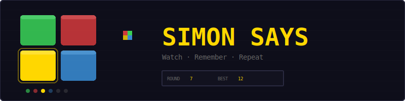
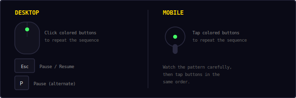
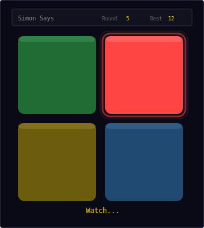
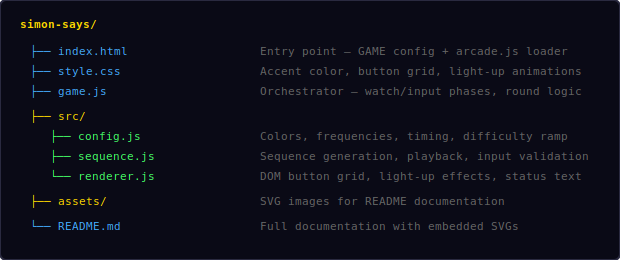
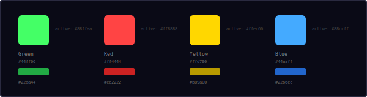
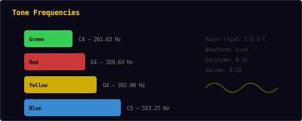
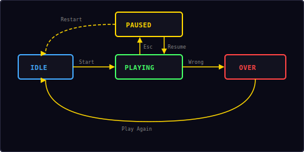

<p align="center">
  
</p>

<p align="center">
  A classic memory game built with vanilla JavaScript and DOM elements.<br/>
  Watch the sequence, remember the pattern, repeat it back.
</p>

---

## ▶ Controls

<p align="center">
  
</p>

| Action | Desktop | Mobile |
|--------|---------|--------|
| Press button | Click colored button | Tap colored button |
| Pause / Resume | `Esc` / `P` | — |

> **Tip:** Watch the full sequence before trying to repeat it. Each button plays a unique tone to help you remember.

---

## 🎮 Gameplay

<p align="center">
  
</p>

**Rules:**
- Four colored buttons are arranged in a 2×2 grid: Green, Red, Yellow, Blue
- Each round, the game adds one more step to the sequence
- **Watch phase:** The sequence plays back with visual highlights and audio tones
- **Input phase:** Repeat the sequence by clicking/tapping buttons in the same order
- A wrong button press ends the game immediately
- You have 5 seconds to press each button before timing out
- The playback speed increases as rounds progress
- Your best round is saved locally in your browser

---

## 📁 Project Structure

<p align="center">
  
</p>

---

## 🎨 Color Palette

<p align="center">
  
</p>

All colors are defined in `src/config.js`. Each button has three color states:
- **Normal:** Dimmed base color (60% brightness)
- **Active:** Bright lit-up color with glow effect
- **Dark:** Border/shadow color

---

## 🎵 Tone Frequencies

<p align="center">
  
</p>

Each button plays a distinct musical note using the Web Audio API's oscillator:

| Button | Note | Frequency | Color |
|--------|------|-----------|-------|
| Green (top-left) | C4 | 261.63 Hz | `#44ff66` |
| Red (top-right) | E4 | 329.63 Hz | `#ff4444` |
| Yellow (bottom-left) | G4 | 392.00 Hz | `#ffd700` |
| Blue (bottom-right) | C5 | 523.25 Hz | `#44aaff` |

The four notes form a **C major triad** (C-E-G) plus the octave (C5), creating a pleasant and memorable set of tones. All tones use a sine waveform for a clean, pure sound.

```
Audio8.note(freq, 0.3, 'sine', 0.18)
```

---

## 🔢 Sequence Algorithm

The sequence grows by one random step each round:

```
Round 1: [green]
Round 2: [green, blue]
Round 3: [green, blue, red]
Round 4: [green, blue, red, red]
...
```

Each new step is chosen uniformly at random from the 4 buttons (0-3). The same button can appear consecutively. The full sequence replays from the beginning each round, so the player must remember the entire history.

**Playback timing:**
```
interval = max(0.6 - (round - 1) × 0.03, 0.25)
```

| Round | Playback interval | Total playback time |
|-------|------------------|-------------------|
| 1 | 0.60s | 0.60s |
| 5 | 0.48s | 2.40s |
| 10 | 0.33s | 3.30s |
| 12+ | 0.25s (min) | 3.00s+ |

---

## 📈 Difficulty Ramp

As rounds increase, the game gets harder in two ways:

1. **Longer sequences** — more steps to remember each round
2. **Faster playback** — the interval between steps decreases by 0.03s per round, down to a minimum of 0.25s

The input timeout remains constant at 5 seconds per step, giving the player consistent time to think.

---

## 🔄 State Machine

<p align="center">
  
</p>

The game has four states managed by the shared `Engine`:

| State | What happens |
|-------|-------------|
| **Idle** | Start screen overlay shown, waiting for player |
| **Playing** | Watch phase → Input phase → next round loop |
| **Paused** | Loop stopped, timers paused, overlay shown with Resume + Restart |
| **Over** | Wrong button or timeout — score shown, "Play Again" button |

Within the **Playing** state, the game alternates between two phases:
1. **Watch** — sequence plays back, buttons disabled
2. **Input** — player repeats sequence, buttons enabled

---

## 🔊 Sound & Effects

All sounds are synthesized in real-time using the Web Audio API — no audio files needed.

| Event | Sound |
|-------|-------|
| Button played (watch) | Sine tone at button's frequency |
| Button pressed (input) | Same sine tone |
| Round complete | Rising two-note blip (`score`) |
| Wrong button | Descending three-note (`gameover`) |

---

## 🛠 Customization

All tweaks happen in `src/config.js`:

**Change button tones:**
```js
buttons: [
  { id: 'green', freq: 261.63, ... },  // C4
  { id: 'red',   freq: 329.63, ... },  // E4
  { id: 'yellow', freq: 392.00, ... }, // G4
  { id: 'blue',  freq: 523.25, ... },  // C5
],
toneDuration: 0.3,
toneType: 'sine',
```

**Change difficulty:**
```js
playbackInterval: 0.6,       // starting speed
speedRamp: 0.03,             // speed increase per round
minPlaybackInterval: 0.25,   // fastest speed
inputTimeout: 5.0,           // seconds to press each button
```

**Change button size:**
```js
buttonSize: 130,   // px per button
buttonGap: 12,     // px gap between buttons
buttonRadius: 12,  // px border radius
```

---

## 🧩 Shared Modules Used

| Module | What Simon Says uses it for |
|--------|-----------------------------|
| `Engine` | State machine, pause/resume/restart, overlay management |
| `Input` | Keyboard (Esc/P for pause) |
| `Audio8` | Button tones via `note()`, round complete and game over sounds |
| `Shell` | HUD stats (Round, Best), overlay screens |
| `utils.js` | `saveHighScore()`, `loadHighScore()` |

---

<p align="center">
  <sub>Part of the <a href="../README.md">Mini Arcade</a> collection · MIT License</sub>
</p>
