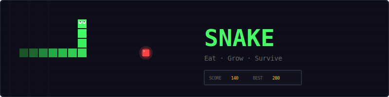
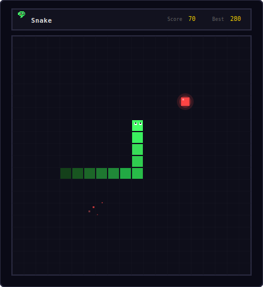
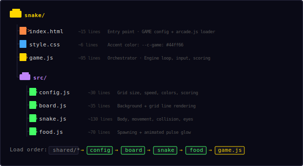
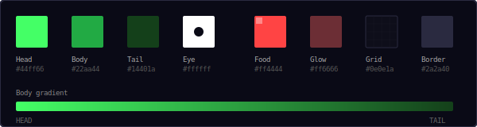
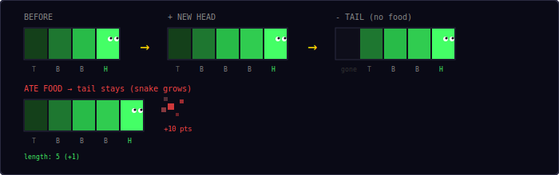
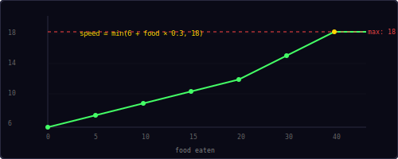
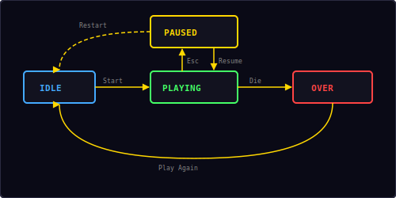

<p align="center">
  
</p>

<p align="center">
  A classic snake game built with vanilla JavaScript and HTML5 Canvas.<br/>
  Eat food, grow longer, don't hit the walls or yourself.
</p>

---

## ▶ Controls

<p align="center">
  
</p>

| Action | Desktop | Mobile |
|--------|---------|--------|
| Move | Arrow keys | Swipe or D-pad |
| Pause / Restart | `Esc` / `P` | — |

---

## 🎮 Gameplay

<p align="center">
  
</p>

**Rules:**
- The snake moves continuously in the current direction
- Eating food grows the snake by 1 cell and awards **+10 points**
- Every **5th food** gives a **+20 bonus**
- Hitting a wall or your own body ends the game
- Speed increases as you eat — the longer you survive, the harder it gets
- High score is saved locally in your browser

---

## 📁 Project Structure

<p align="center">
  
</p>

---

## 🎨 Color Palette

<p align="center">
  
</p>

All colors are defined in `src/config.js`. Change them there to reskin the entire game.

---

## 🐍 How Movement Works

<p align="center">
  
</p>

The snake is stored as an array of `{x, y}` grid positions. Index `0` is always the head.

**Each tick:**
1. Compute new head position: `newHead = head + direction`
2. Insert `newHead` at the front of the array
3. Remove the tail — **unless** the snake just ate food (this is how it grows)

**Direction buffering** prevents 180° reversals. If you're moving right, pressing left is ignored. The next direction is queued and applied on the next tick, so rapid key presses don't cause self-collision.

**Collision checks:**
- **Wall:** `if (x < 0 || x >= cols || y < 0 || y >= rows)` → dead
- **Self:** loop through body segments; if any match the new head position → dead. The tail segment is excluded from this check because it will move away on the same tick (unless the snake is growing).

---

## 📈 Speed Curve

<p align="center">
  
</p>

Speed is measured in **cells per second** and increases linearly with each food eaten, capped at a maximum:

```
speed = min(baseSpeed + foodEaten × speedIncrement, maxSpeed)
      = min(6 + food × 0.3, 18)
```

| Food eaten | Speed (cells/sec) | Tick interval |
|------------|-------------------|---------------|
| 0 | 6.0 | 167ms |
| 5 | 7.5 | 133ms |
| 10 | 9.0 | 111ms |
| 20 | 12.0 | 83ms |
| 30 | 15.0 | 67ms |
| 40+ | 18.0 (max) | 56ms |

The game loop uses a **tick accumulator**: real time (`dt`) is added to `moveTimer` each frame, and a step fires whenever it exceeds `1 / speed`. This keeps movement consistent regardless of frame rate.

---

## 🔄 State Machine

<p align="center">
  
</p>

The game has four states managed by the shared `Engine`:

| State | What happens |
|-------|-------------|
| **Idle** | Start screen overlay shown, waiting for player |
| **Playing** | Game loop running, input active |
| **Paused** | Loop stopped, pause overlay shown with Resume + Restart options |
| **Over** | Death screen with score, "Play Again" button |

---

## 🍎 Food Mechanics

Food spawns at a random grid cell not occupied by the snake (up to 200 attempts). This brute-force approach works well because the 20×20 grid has 400 cells and the snake rarely fills more than 10-15%.

The food has a **breathing glow** driven by a sine wave:

```
pulse += dt × 4
glowRadius = cellSize × 0.6 + sin(pulse) × cellSize × 0.08
glowAlpha  = 0.3 + sin(pulse) × 0.1
```

This creates a subtle pulsing circle behind the food square, making it easy to spot on the grid.

---

## 🔊 Sound & Effects

All sounds are synthesized in real-time using the Web Audio API — no audio files needed.

| Event | Sound | Particles |
|-------|-------|-----------|
| Eat food | Rising two-note blip | 8 red pixels burst outward |
| Bonus (every 5th) | Three-note ascending | 8 red pixels + toast message |
| Die | Descending three-note | 25 green/white pixels explode |

---

## 🛠 Customization

All tweaks happen in `src/config.js`:

**Change grid size:**
```js
cols: 30,        // wider
rows: 15,        // shorter
cellSize: 16,    // smaller cells
```

**Change difficulty:**
```js
baseSpeed: 4,         // easier start
speedIncrement: 0.5,  // ramps faster
maxSpeed: 25,         // higher ceiling
```

**Change colors:**
```js
snakeHead: '#00ffff',  // cyan
snakeBody: '#0088aa',
food: '#ffaa00',       // orange food
```

**Add wrap-around walls** — in `src/snake.js`, replace the wall collision in `step()`:
```js
if (nx < 0) nx = Config.cols - 1;
if (nx >= Config.cols) nx = 0;
if (ny < 0) ny = Config.rows - 1;
if (ny >= Config.rows) ny = 0;
```

---

## 🧩 Shared Modules Used

| Module | What Snake uses it for |
|--------|----------------------|
| `Engine` | Game loop, state machine, canvas auto-setup |
| `Input` | Keyboard + swipe + mobile d-pad |
| `Audio8` | Score, bonus, and game over sounds |
| `Particles` | Eat and death visual effects |
| `Shell` | HUD stats, overlay screens, toast messages |
| `utils.js` | `randInt()`, `saveHighScore()`, `loadHighScore()` |

---

<p align="center">
  <sub>Part of the <a href="../README.md">Mini Arcade</a> collection · MIT License</sub>
</p>
