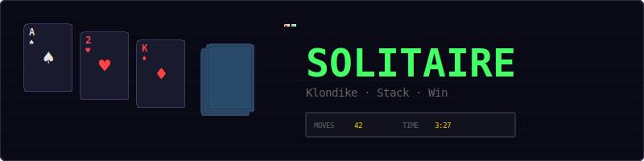
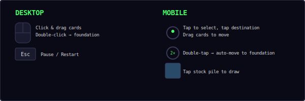
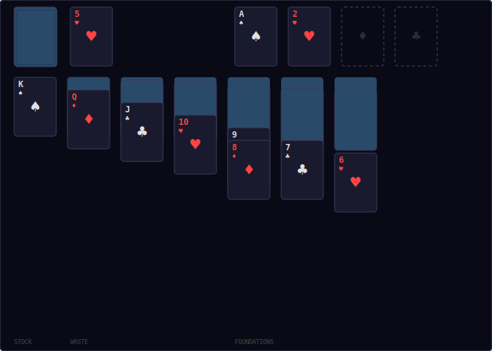
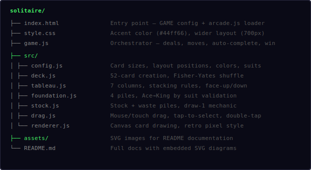
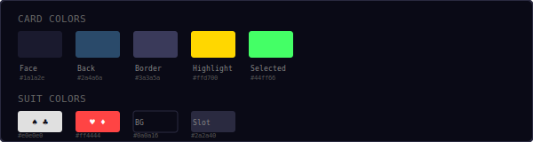
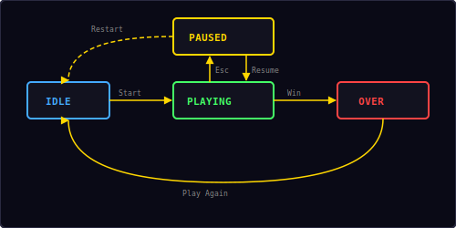

<p align="center">
  
</p>

<p align="center">
  Classic Klondike Solitaire built with vanilla JavaScript and HTML5 Canvas.<br/>
  Deal, stack, and sort all 52 cards into four foundation piles.
</p>

---

## ▶ Controls

<p align="center">
  
</p>

| Action | Desktop | Mobile |
|--------|---------|--------|
| Move card | Click & drag | Touch & drag |
| Select card | Click | Tap |
| Move to destination | Click card, click target | Tap card, tap target |
| Auto-move to foundation | Double-click | Double-tap |
| Draw from stock | Click stock pile | Tap stock pile |
| Pause / Restart | `Esc` / `P` | — |

---

## 🎮 Gameplay

<p align="center">
  
</p>

**Klondike Rules:**
- A standard 52-card deck is shuffled and dealt into 7 tableau columns
- Column 1 gets 1 card, column 2 gets 2, and so on up to column 7 with 7 cards
- Only the top card of each column is face-up; the rest are face-down
- The remaining 24 cards form the **stock pile** (top-left)
- Click the stock to draw one card at a time to the **waste pile**
- The top waste card is always playable
- Build **tableau columns** in descending rank with alternating colors (red on black, black on red)
- Build **foundation piles** (top-right) in ascending rank by suit, starting with Ace
- Only **Kings** can fill empty tableau columns
- Move single cards or entire face-up stacks between tableau columns
- When the stock is empty, click it to recycle the waste pile back to stock
- **Win** when all 4 foundations are complete (Ace through King)

**Auto-complete:** When all remaining cards are face-up and the stock/waste are empty, cards automatically move to the foundations.

---

## 📁 Project Structure

<p align="center">
  
</p>

---

## 🎨 Color Palette

<p align="center">
  
</p>

All colors are defined in `src/config.js`. Change them there to reskin the entire game.

---

## 🃏 Card Rendering

Cards are drawn on an HTML5 Canvas with a retro pixel aesthetic:

**Face-up cards** display:
- Rank and suit symbol in the top-left corner
- Large centered suit symbol
- Inverted rank and suit in the bottom-right corner
- Dark card face (`#1a1a2e`) with subtle border

**Face-down cards** display:
- Solid blue-teal back (`#2a4a6a`)
- Cross-hatch pattern for texture
- Inner border frame

**Suit colors:**
- ♠ Spades and ♣ Clubs: light gray (`#e0e0e0`)
- ♥ Hearts and ♦ Diamonds: red (`#ff4444`)

---

## ♠ Valid Move Logic

### Tableau stacking
```
canPlace(card, column):
  if column is empty → card must be King
  else → card.color ≠ top.color AND card.value = top.value - 1
```

| Move | Valid? | Reason |
|------|--------|--------|
| 7♥ on 8♠ | ✅ | Red on black, descending |
| 7♥ on 8♦ | ❌ | Same color (both red) |
| 7♥ on 9♠ | ❌ | Not consecutive rank |
| K♠ on empty | ✅ | Kings fill empty columns |
| Q♥ on empty | ❌ | Only Kings allowed |

### Foundation building
```
canPlace(card, pile):
  if pile is empty → card must be Ace
  else → card.suit = top.suit AND card.value = top.value + 1
```

| Move | Valid? | Reason |
|------|--------|--------|
| A♠ on empty | ✅ | Aces start foundations |
| 2♠ on A♠ | ✅ | Same suit, ascending |
| 2♥ on A♠ | ❌ | Different suit |
| 3♠ on A♠ | ❌ | Not consecutive |

---

## 🔄 State Machine

<p align="center">
  
</p>

The game has four states managed by the shared `Engine`:

| State | What happens |
|-------|-------------|
| **Idle** | Start screen overlay shown, waiting for player |
| **Playing** | Game loop running, cards dealt, input active, timer counting |
| **Paused** | Loop stopped, timer paused, overlay with Resume + Restart |
| **Over** | Win screen with move count and time, "Play Again" button |

---

## 🔊 Sound & Effects

All sounds are synthesized in real-time using the Web Audio API — no audio files needed.

| Event | Sound | Particles |
|-------|-------|-----------|
| Card placed on tableau | Short blip (`move`) | — |
| Card placed on foundation | Rising two-note (`score`) | 6 green pixels burst |
| Draw from stock | Click blip (`click`) | — |
| Auto-complete step | Rising blip (`score`) | 4 green pixels per card |
| Win | Ascending fanfare (`win`) | Continuous colored burst |
| Auto-complete toast | — | — |

---

## 🛠 Customization

All tweaks happen in `src/config.js`:

**Change card size:**
```js
cardW: 50,          // narrower cards
cardH: 70,          // shorter cards
```

**Change animation speed:**
```js
animSpeed: 800,           // faster card movement
autoCompleteDelay: 50,    // faster auto-complete
```

**Change card colors:**
```js
cardFace: '#2a1a1a',      // dark red card face
cardBack: '#4a2a2a',      // red card back
suitRed: '#ff6666',       // brighter red suits
suitBlack: '#ffffff',     // white suits
```

**Change canvas size:**
```js
canvasW: 800,             // wider canvas
canvasH: 600,             // taller canvas
```

---

## 🧩 Shared Modules Used

| Module | What Solitaire uses it for |
|--------|---------------------------|
| `Engine` | Game loop, state machine, canvas auto-setup |
| `Input` | Keyboard (Esc/P for pause) |
| `Audio8` | Card move, score, click, and win sounds |
| `Particles` | Foundation placement and win celebration effects |
| `Shell` | HUD stats (moves, time), overlay screens, toast |
| `Timer` | Stopwatch for elapsed game time |

---

<p align="center">
  <sub>Part of the <a href="../README.md">Mini Arcade</a> collection · MIT License</sub>
</p>
