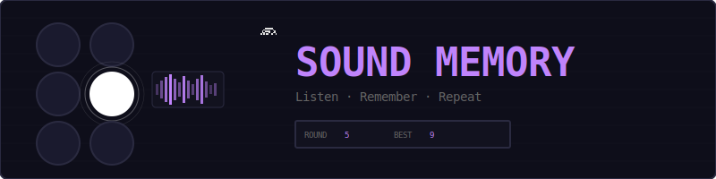
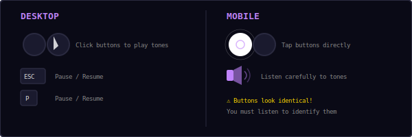
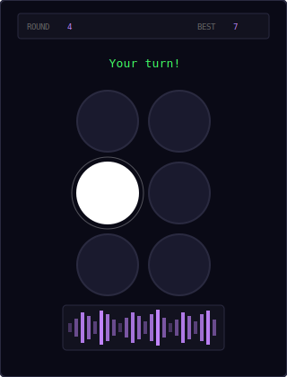
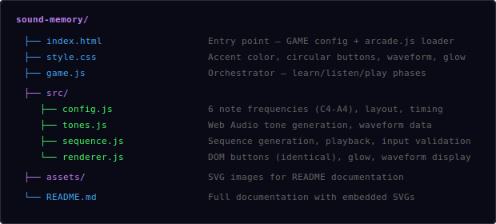
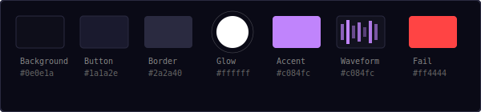
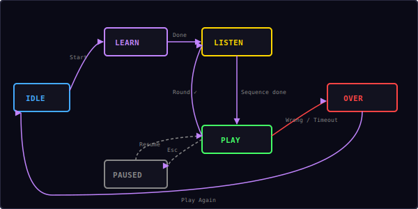

<p align="center">
  
</p>

<p align="center">
  An audio-only memory game. Six identical buttons, six unique tones.<br/>
  Listen to the sequence, then reproduce it — by ear alone.
</p>

---

## ▶ Controls

<p align="center">
  
</p>

| Action | Desktop | Mobile |
|--------|---------|--------|
| Press a button | Click | Tap |
| Pause / Resume | `Esc` / `P` | — |

**The twist:** All six buttons look identical. You can only tell them apart by the tone they play. No colors, no labels — pure audio memory.

---

## 🎮 Gameplay

<p align="center">
  
</p>

**How it works:**

1. **Learn phase** — At the start of each game, all 6 buttons highlight one by one and play their unique tone (C4 through A4). This is your chance to memorize which button plays which note.

2. **Listen phase** — A sequence of tones plays. No visual cues — you only hear the notes. The waveform display shows audio activity.

3. **Play phase** — Reproduce the sequence by pressing the correct buttons in order. Buttons glow white when pressed and play their tone as feedback.

4. **Next round** — Each round adds one more tone to the sequence. How far can you go?

**Rules:**
- 6 circular buttons arranged in a 2×3 grid
- Each button plays a distinct musical note (C4, D4, E4, F4, G4, A4)
- All buttons look the same — no visual distinction
- Wrong button = game over
- Score = highest round reached
- High score is saved locally in your browser

---

## 📁 Project Structure

<p align="center">
  
</p>

---

## 🎨 Color Palette

<p align="center">
  
</p>

All colors are defined in `src/config.js`. The dark theme with identical buttons is intentional — the challenge is purely auditory.

---

## 🎵 Musical Notes

Each of the 6 buttons is mapped to a note in the C major scale:

| Button | Note | Frequency |
|--------|------|-----------|
| 1 (top-left) | C4 | 261.63 Hz |
| 2 (top-right) | D4 | 293.66 Hz |
| 3 (mid-left) | E4 | 329.63 Hz |
| 4 (mid-right) | F4 | 349.23 Hz |
| 5 (bottom-left) | G4 | 392.00 Hz |
| 6 (bottom-right) | A4 | 440.00 Hz |

Tones are generated using the Web Audio API with a sine wave oscillator and smooth attack/release envelope for a clean, musical sound.

---

## 🔄 State Machine

<p align="center">
  
</p>

| State | What happens |
|-------|-------------|
| **Idle** | Start screen overlay shown, waiting for player |
| **Learn** | Each button highlights and plays its tone sequentially |
| **Listen** | Sequence plays back (audio only — no visual cues) |
| **Play** | Player reproduces the sequence by pressing buttons |
| **Paused** | Timers frozen, overlay shown with Resume + Restart |
| **Over** | Wrong button or timeout — final score shown |

**Phase flow per round:**
```
Learn → Listen → Play → Listen → Play → Listen → Play → ...
         ↑                  |
         └──────────────────┘  (round complete)
```

The learn phase only happens once at the start. After that, each round cycles between Listen and Play, adding one more tone each time.

---

## 🔊 Sound & Effects

All sounds are synthesized in real-time using the Web Audio API.

| Event | Sound |
|-------|-------|
| Button tone | Sine wave at button's frequency (C4-A4) |
| Learn phase | Each button plays its tone sequentially |
| Listen phase | Sequence tones play (audio only) |
| Button press | Button's tone plays as feedback |
| Round complete | `score` preset (ascending beep) |
| Wrong button | `gameover` preset (descending tones) |

**Waveform visualization:** A frequency bar display shows real-time audio activity using the Web Audio AnalyserNode. Bars pulse with the tones being played.

---

## 🛠 Customization

All tweaks happen in `src/config.js`:

**Change note frequencies:**
```js
buttons: [
  { id: 0, freq: 261.63, note: 'C4' },
  { id: 1, freq: 293.66, note: 'D4' },
  // ... change to any frequencies you like
],
```

**Adjust difficulty:**
```js
inputTimeout: 6.0,       // more/less time to respond
speedRamp: 0.02,         // how much faster each round
minListenInterval: 0.35, // fastest playback speed
```

**Change tone character:**
```js
toneType: 'sine',        // try 'triangle', 'square', 'sawtooth'
toneDuration: 0.4,       // longer/shorter tones
toneVolume: 0.2,         // louder/quieter
```

**Adjust learn phase:**
```js
learnToneDuration: 0.5,  // how long each button highlights
learnGap: 0.3,           // gap between learn steps
```

---

## 🧩 Shared Modules Used

| Module | What Sound Memory uses it for |
|--------|-------------------------------|
| `Engine` | State machine, pause/resume/restart (no canvas) |
| `Input` | Keyboard (Esc/P for pause) |
| `Audio8` | Score and game over preset sounds |
| `Shell` | HUD stats, overlay screens |
| `utils.js` | `saveHighScore()`, `loadHighScore()` |

---

<p align="center">
  <sub>Part of the <a href="../README.md">Mini Arcade</a> collection · MIT License</sub>
</p>
