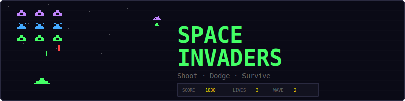
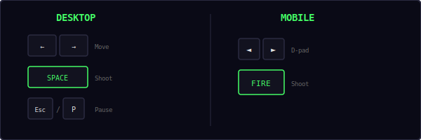
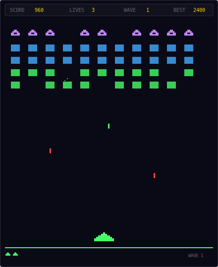
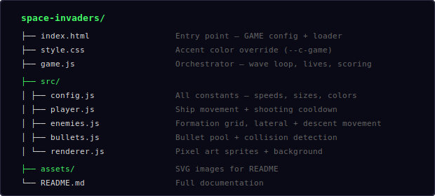
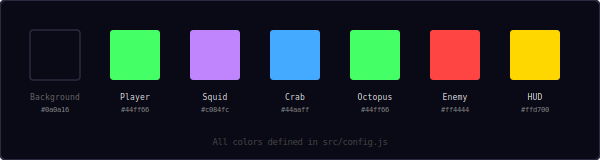
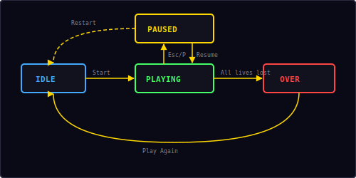

<p align="center">
  
</p>

<p align="center">
  A classic alien-shooting game built with vanilla JavaScript and HTML5 Canvas.<br/>
  Defend Earth from waves of descending invaders before they reach the ground.
</p>

---

## ▶ Controls

<p align="center">
  
</p>

| Action | Desktop | Mobile |
|--------|---------|--------|
| Move left / right | `←` `→` | D-pad |
| Shoot | `Space` | FIRE button |
| Pause / Restart | `Esc` / `P` | — |

---

## 🎮 Gameplay

<p align="center">
  
</p>

**Rules:**
- 55 enemies arranged in a 5×11 grid descend from the top of the screen
- Three enemy types with different point values and pixel art designs
- Enemies move laterally as a group — when the formation hits a wall, it drops one row and reverses direction
- Only the bottom-most enemy in each column can fire downward
- You have **3 lives** — lose one each time an enemy bullet hits your ship
- Enemy speed increases as you destroy more of them — the last few are fast
- Clearing all enemies starts a new wave with faster base speed and more aggressive shooting
- If any enemy reaches the bottom, you lose a life
- High score is saved locally in your browser

---

## 📁 Project Structure

<p align="center">
  
</p>

---

## 🎨 Color Palette

<p align="center">
  
</p>

All colors are defined in `src/config.js`. Change them there to reskin the entire game.

---

## 👾 Enemy Types & Scoring

Three enemy types fill the formation from top to bottom:

| Row | Type | Color | Points | Sprite |
|-----|------|-------|--------|--------|
| 1 (top) | Squid | Purple `#c084fc` | 30 | 8×8 pixel art |
| 2–3 | Crab | Blue `#44aaff` | 20 | 8×8 pixel art |
| 4–5 (bottom) | Octopus | Green `#44ff66` | 10 | 8×8 pixel art |

Each enemy type has two animation frames that alternate as the formation moves, creating the classic marching effect.

**Maximum score per wave:** (11 × 30) + (22 × 20) + (22 × 10) = **990 points**

---

## ⚡ Speed & Difficulty

Enemy speed scales dynamically based on two factors:

```
currentSpeed = baseSpeed + (enemiesKilled × speedIncrease)
baseSpeed    = 30 + (wave × 10)     // faster each wave
speedIncrease = 2 px/s per kill     // accelerates as formation thins
maxSpeed     = 200 px/s             // hard cap
```

| Enemies remaining | Approximate speed (Wave 1) |
|-------------------|---------------------------|
| 55 (full) | 30 px/s |
| 30 | 80 px/s |
| 10 | 120 px/s |
| 3 | 134 px/s |
| 1 | 138 px/s |

Enemy shooting also scales per wave:

```
shootChance = 0.008 + (wave × 0.002)   // per frame, per bottom enemy
```

---

## 🔫 Shooting Mechanics

- **Player cooldown:** 0.35 seconds between shots — prevents bullet spam
- **Max player bullets:** 3 on screen at once
- **Player bullet speed:** 350 px/s upward
- **Max enemy bullets:** 8 on screen at once
- **Enemy bullet speed:** 180 px/s downward
- Only the **bottom-most alive enemy** in each column can shoot
- Enemy shooting is random — each eligible enemy has a small per-frame chance to fire

---

## 🌊 Wave Progression

Clearing all 55 enemies triggers a new wave:

1. Formation resets to full 5×11 grid
2. Base enemy speed increases by 10 px/s
3. Enemy shoot chance increases by 0.002
4. All bullets are cleared
5. A "Wave N" toast appears

The game continues indefinitely — waves get progressively harder until you run out of lives.

---

## 🔄 State Machine

<p align="center">
  
</p>

The game has four states managed by the shared `Engine`:

| State | What happens |
|-------|-------------|
| **Idle** | Start screen overlay shown, waiting for player |
| **Playing** | Game loop running, enemies moving, bullets flying |
| **Paused** | Loop stopped, pause overlay with Resume + Restart |
| **Over** | All lives lost — final score shown, "Play Again" button |

---

## 🔊 Sound & Effects

All sounds are synthesized in real-time using the Web Audio API — no audio files needed.

| Event | Sound | Particles |
|-------|-------|-----------|
| Player shoots | Short blip (`move`) | — |
| Enemy destroyed | Low thud (`hit`) | 10 colored pixels burst |
| Wave cleared | Rising two-note (`score`) | — |
| Player hit | Buzz (`error`) | 20 white/green/red pixels |
| Game over | Descending three-note (`gameover`) | — |

---

## 🛠 Customization

All tweaks happen in `src/config.js`:

**Change player speed:**
```js
playerSpeed: 300,        // faster ship
shootCooldown: 0.2,      // faster shooting
maxPlayerBullets: 5,     // more bullets on screen
```

**Change difficulty:**
```js
enemyBaseSpeed: 20,          // slower start
enemySpeedIncrease: 1,       // gentler ramp
enemyShootChance: 0.004,     // less aggressive
lives: 5,                    // more forgiving
```

**Change formation:**
```js
enemyRows: 4,               // fewer rows
enemyCols: 9,               // fewer columns
enemyDropDistance: 8,        // smaller descent steps
```

**Change enemy colors:**
```js
enemyTypes: [
  { name: 'squid',   points: 30, color: '#ff4444' },  // red squids
  { name: 'crab',    points: 20, color: '#ffd700' },   // gold crabs
  { name: 'crab',    points: 20, color: '#ffd700' },
  { name: 'octopus', points: 10, color: '#44aaff' },   // blue octopi
  { name: 'octopus', points: 10, color: '#44aaff' },
],
```

---

## 🧩 Shared Modules Used

| Module | What Space Invaders uses it for |
|--------|-------------------------------|
| `Engine` | Game loop, state machine, canvas auto-setup |
| `Input` | Keyboard + d-pad + mobile FIRE button |
| `Audio8` | Shoot, hit, wave clear, and game over sounds |
| `Particles` | Enemy destruction and player hit visual effects |
| `Shell` | HUD stats, overlay screens, toast messages |
| `utils.js` | `clamp()`, `collides()`, `saveHighScore()`, `loadHighScore()` |

---

<p align="center">
  <sub>Part of the <a href="../README.md">Mini Arcade</a> collection · MIT License</sub>
</p>
