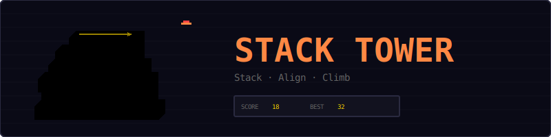
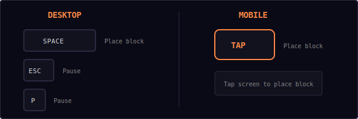
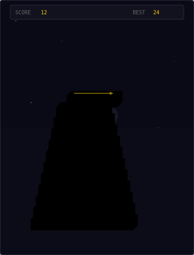
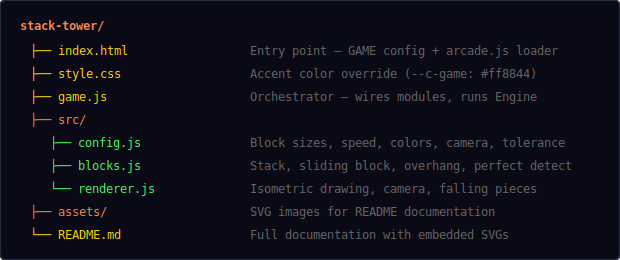
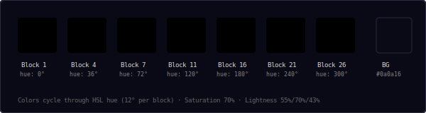
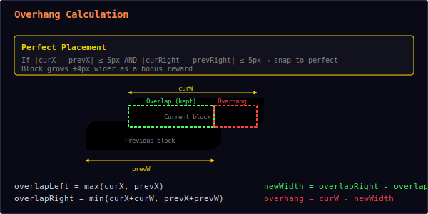
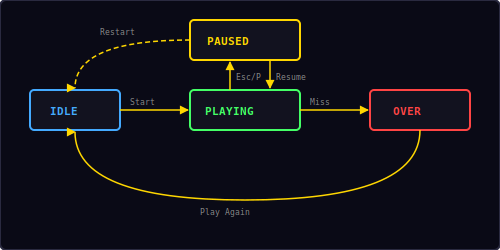

<p align="center">
  
</p>

<p align="center">
  A timing-based stacking game built with vanilla JavaScript and HTML5 Canvas.<br/>
  Tap to place blocks, align them perfectly, build the tallest tower.
</p>

---

## ▶ Controls

<p align="center">
  
</p>

| Action | Desktop | Mobile |
|--------|---------|--------|
| Place block | `Space` | Tap |
| Pause / Restart | `Esc` / `P` | — |

---

## 🎮 Gameplay

<p align="center">
  
</p>

**Rules:**
- A block slides back and forth across the screen
- Tap or press Space to drop the block onto the stack
- The block is trimmed to only the portion that overlaps with the block below
- The overhanging part falls off as a separate piece
- If the block doesn't overlap at all, it's game over
- **Perfect placement** (within 5px tolerance) snaps the block and makes it slightly wider
- Score = number of blocks successfully stacked
- Block speed increases as the tower grows
- Camera scrolls up to keep the top of the tower visible
- Colors cycle through a rainbow gradient as blocks stack higher
- High score is saved locally in your browser

---

## 📁 Project Structure

<p align="center">
  
</p>

---

## 🎨 Color Palette

<p align="center">
  
</p>

Colors are generated dynamically using HSL. Each block shifts the hue by 12°, cycling through the full spectrum as the tower grows. The three faces of each isometric block use different lightness values:

| Face | Lightness | Purpose |
|------|-----------|---------|
| Top | 70% | Brightest — catches the "light" |
| Front | 55% | Base color |
| Side | 43% | Darkest — shadow face |

---

## 📐 Overhang Calculation

<p align="center">
  
</p>

When a block is placed, the overlap with the previous block determines the new block width:

```
overlapLeft  = max(currentX, previousX)
overlapRight = min(currentX + currentW, previousX + previousW)
newWidth     = overlapRight - overlapLeft
overhang     = currentW - newWidth
```

| Scenario | Result |
|----------|--------|
| `newWidth > 0` | Block is trimmed, overhang falls off |
| `newWidth ≤ 0` | Complete miss — game over |
| Perfect (within 5px) | Block snaps to previous position + grows 4px wider |

**Perfect placement detection:**
```
leftDiff  = |currentX - previousX|
rightDiff = |currentRight - previousRight|
isPerfect = leftDiff ≤ 5 AND rightDiff ≤ 5
```

Consecutive perfect placements are tracked and displayed as combo multipliers.

---

## 📈 Speed Scaling

Block sliding speed increases linearly with each block stacked:

```
speed = startSpeed + (blocksStacked - 1) × speedIncrement
speed = clamp(speed, startSpeed, maxSpeed)
```

| Blocks | Speed (px/s) |
|--------|-------------|
| 1 | 120 |
| 5 | 136 |
| 10 | 156 |
| 20 | 196 |
| 50 | 316 |
| 70+ | 400 (max) |

---

## 🔄 State Machine

<p align="center">
  
</p>

The game has four states managed by the shared `Engine`:

| State | What happens |
|-------|-------------|
| **Idle** | Start screen overlay shown, waiting for player |
| **Playing** | Block slides, tap to place, tower grows |
| **Paused** | Loop stopped, pause overlay with Resume + Restart |
| **Over** | Miss screen with final score, "Play Again" button |

---

## 🎨 Isometric 3D Effect

Each block is drawn with three faces to create a pseudo-3D isometric look:

1. **Front face** — a simple filled rectangle at the block's position
2. **Top face** — a parallelogram offset up and to the right (lighter color)
3. **Right side face** — a parallelogram on the right edge (darker color)

The depth offsets are controlled by `blockDepthTop` (10px up) and `blockDepthSide` (10px right).

---

## 🔊 Sound & Effects

All sounds are synthesized in real-time using the Web Audio API — no audio files needed.

| Event | Sound | Particles |
|-------|-------|-----------|
| Block placed | Short blip (`move`) | — |
| Perfect placement | Rising two-note (`score`) | 16 gold/white burst |
| Overhang falls | Low thud (`drop`) | — |
| Complete miss | Descending three-note (`gameover`) | — |

---

## 🛠 Customization

All tweaks happen in `src/config.js`:

**Change block size:**
```js
startWidth: 160,       // narrower starting block
blockHeight: 18,       // shorter blocks
```

**Change difficulty:**
```js
startSpeed: 80,        // slower start
speedIncrement: 2,     // gentler ramp
maxSpeed: 300,         // lower ceiling
perfectTolerance: 8,   // more forgiving perfect detection
```

**Change colors:**
```js
baseHue: 180,          // start from cyan instead of red
hueStep: 20,           // faster color cycling
saturation: 80,        // more vivid colors
```

**Change isometric depth:**
```js
blockDepthTop: 14,     // taller top face
blockDepthSide: 14,    // wider side face
```

---

## 🧩 Shared Modules Used

| Module | What Stack Tower uses it for |
|--------|------------------------------|
| `Engine` | Game loop, state machine, canvas auto-setup |
| `Input` | Keyboard + tap + mobile action button |
| `Audio8` | Place, perfect, and game over sounds |
| `Particles` | Perfect placement visual effects |
| `Shell` | HUD stats, overlay screens, toast messages |
| `utils.js` | `saveHighScore()`, `loadHighScore()` |

---

<p align="center">
  <sub>Part of the <a href="../README.md">Mini Arcade</a> collection · MIT License</sub>
</p>
