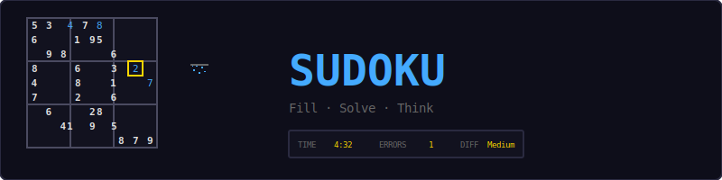
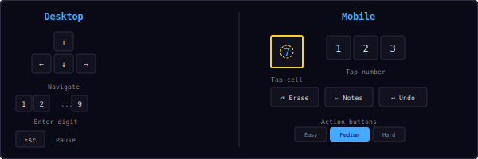
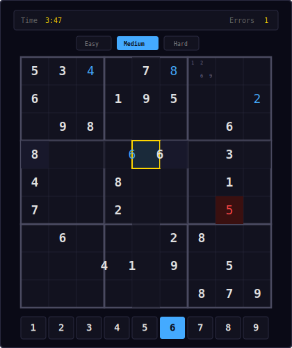
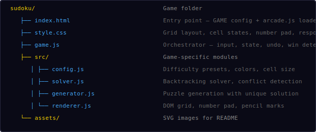
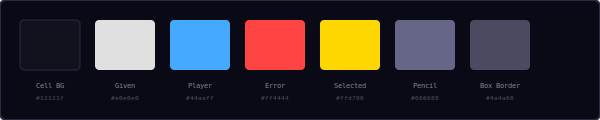
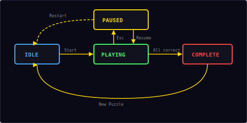

<p align="center">
  
</p>

<p align="center">
  Classic number-placement puzzle — fill every row, column, and 3×3 box with digits 1-9.<br/>
  Three difficulty levels, pencil marks, undo, and error highlighting.
</p>

---

## ▶ Controls

<p align="center">
  
</p>

| Action | Desktop | Mobile |
|--------|---------|--------|
| Select cell | Click cell | Tap cell |
| Enter digit | `1`–`9` keys | Tap number pad |
| Navigate | `←` `→` `↑` `↓` | Tap cell directly |
| Erase | `Backspace` / `Delete` | Tap ⌫ Erase |
| Toggle pencil mode | Click ✏ Notes | Tap ✏ Notes |
| Undo | Click ↩ Undo | Tap ↩ Undo |
| Pause | `Esc` | — |

---

## 🎮 Gameplay

<p align="center">
  
</p>

**Rules:**
- The board is a 9×9 grid divided into nine 3×3 boxes
- Fill every cell with a digit from 1 to 9
- Each row, column, and 3×3 box must contain all digits exactly once
- Pre-filled cells (givens) are shown in bold white and cannot be edited
- Player-entered numbers appear in accent blue
- Conflicting numbers are highlighted in red
- Use pencil marks (notes) to track candidate digits in empty cells
- The puzzle is complete when all cells match the unique solution

**Difficulty levels:**

| Level | Givens | Empty cells |
|-------|--------|-------------|
| Easy | 40 | 41 |
| Medium | 30 | 51 |
| Hard | 24 | 57 |

**Features:**
- Every generated puzzle has exactly one valid solution
- Error highlighting shows conflicts in real-time
- Same-number highlighting — selecting a cell highlights all cells with the same digit
- Row/column/box highlighting shows the selected cell's groups
- Pencil marks auto-clear when a number is placed in the same row, column, or box
- Full undo support for all moves
- Timer tracks elapsed time

---

## 📁 Project Structure

<p align="center">
  
</p>

---

## 🎨 Color Palette

<p align="center">
  
</p>

All colors are defined in `src/config.js`. Change them there to reskin the entire game.

---

## 🧩 Puzzle Generation

The generator creates puzzles with guaranteed unique solutions:

1. **Build a solved grid** — fill the three diagonal 3×3 boxes (they're independent), then solve the rest with backtracking
2. **Remove cells** — shuffle all 81 positions, then remove cells one at a time
3. **Verify uniqueness** — after each removal, count solutions (up to 2). If more than one solution exists, put the cell back
4. **Stop** when the target number of empty cells is reached

This ensures every puzzle has exactly one valid solution, regardless of difficulty.

**Solver algorithm:**
- Backtracking with constraint propagation
- For each empty cell, try digits 1-9
- Check row, column, and box constraints before placing
- Recurse; backtrack on dead ends

---

## 🔄 State Machine

<p align="center">
  
</p>

| State | What happens |
|-------|-------------|
| **Idle** | Start screen overlay, waiting for player |
| **Playing** | Grid active, timer running, input accepted |
| **Paused** | Timer stopped, overlay with Resume + Restart |
| **Complete** | Puzzle solved, final time and error count shown |

---

## 🔊 Sound & Effects

All sounds are synthesized using the Web Audio API — no audio files needed.

| Event | Sound |
|-------|-------|
| Select cell | `click` — short blip |
| Enter number | `move` — soft tone |
| Conflict detected | `error` — low buzz |
| Puzzle complete | `win` — ascending fanfare |

---

## 🛠 Customization

All tweaks happen in `src/config.js`:

**Change difficulty presets:**
```js
difficulties: {
  easy:   { givens: 45, label: 'Easy' },    // more givens = easier
  medium: { givens: 32, label: 'Medium' },
  hard:   { givens: 20, label: 'Hard' },     // fewer givens = harder
},
```

**Change colors:**
```js
colorGiven:  '#ffffff',   // brighter givens
colorPlayer: '#66ccff',   // lighter player numbers
colorError:  '#ff6666',   // softer error red
accent:      '#66ccff',   // match player color
```

**Change cell size:**
```js
cellSize: 48,   // larger cells (default 44)
```

---

## 🧩 Shared Modules Used

| Module | What Sudoku uses it for |
|--------|------------------------|
| `Engine` | State machine (idle/playing/paused/over), pause toggle |
| `Input` | Keyboard number entry, arrow navigation, Esc to pause |
| `Audio8` | Cell click, number entry, error, and win sounds |
| `Timer` | Stopwatch for elapsed time tracking |
| `Shell` | HUD stats (time, errors), overlay screens, controls area |

---

<p align="center">
  <sub>Part of the <a href="../README.md">Mini Arcade</a> collection · MIT License</sub>
</p>
