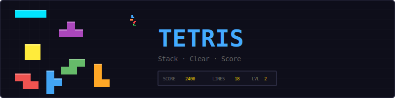
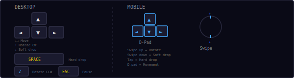
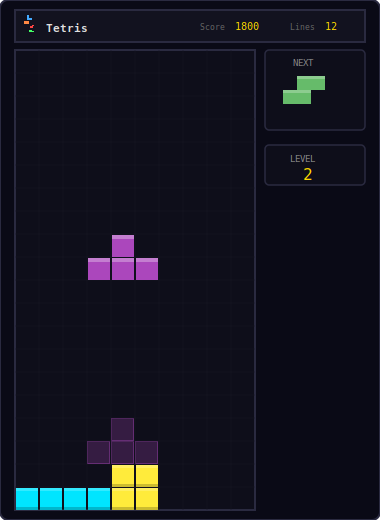
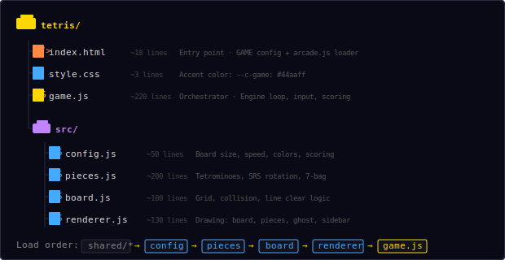
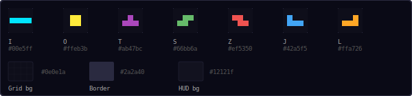
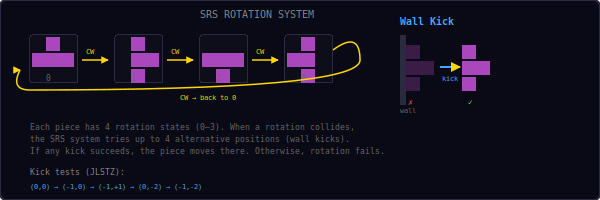
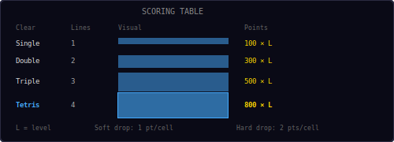
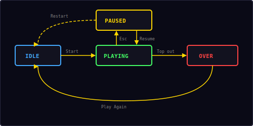

<p align="center">
  
</p>

<p align="center">
  A classic Tetris game built with vanilla JavaScript and HTML5 Canvas.<br/>
  Stack tetrominoes, clear lines, climb levels.
</p>

---

## ▶ Controls

<p align="center">
  
</p>

| Action | Desktop | Mobile |
|--------|---------|--------|
| Move left / right | `←` `→` | D-pad or swipe |
| Rotate clockwise | `↑` | Swipe up |
| Rotate counter-clockwise | `Z` | — |
| Soft drop | `↓` (hold) | Swipe down |
| Hard drop | `Space` | Tap |
| Pause / Restart | `Esc` / `P` | — |

---

## 🎮 Gameplay

<p align="center">
  
</p>

**Rules:**
- Tetrominoes fall from the top of a 10×20 board
- Move and rotate pieces to fill complete horizontal rows
- Completed rows are cleared and award points
- Clearing 4 rows at once is a **Tetris** — the highest-scoring move
- The game ends when new pieces can no longer spawn (top out)
- Speed increases with each level — the longer you survive, the harder it gets
- A **ghost piece** shows where the current piece will land
- The **next piece** is previewed in the sidebar
- High score is saved locally in your browser

---

## 📁 Project Structure

<p align="center">
  
</p>

---

## 🎨 Color Palette

<p align="center">
  
</p>

All colors are defined in `src/config.js`. Change them there to reskin the entire game.

---

## 🔄 Rotation System

<p align="center">
  
</p>

Tetris uses the **Super Rotation System (SRS)**, the modern standard for piece rotation:

- Each piece has **4 rotation states** (0, 1, 2, 3)
- Pressing `↑` rotates clockwise; pressing `Z` rotates counter-clockwise
- When a rotation would cause a collision, the system tries up to **4 wall kick offsets**
- If any kick position is valid, the piece moves there; otherwise the rotation is rejected
- The I-piece has its own kick table; all other pieces (J, L, S, Z, T) share one

**Wall kicks** allow pieces to "tuck" into tight spaces near walls and other blocks, enabling advanced techniques like T-spins.

---

## 📈 Scoring & Levels

<p align="center">
  
</p>

Line clear scores are multiplied by the current level:

| Clear | Lines | Base Points |
|-------|-------|-------------|
| Single | 1 | 100 × level |
| Double | 2 | 300 × level |
| Triple | 3 | 500 × level |
| **Tetris** | **4** | **800 × level** |

**Drop scoring:**
- Soft drop: **1 point per cell** dropped
- Hard drop: **2 points per cell** dropped

**Speed & leveling:**
```
level = floor(lines / 10) + 1
speed = max(0.8 - (level - 1) × 0.02, 0.05)
```

| Level | Drop interval | Lines needed |
|-------|--------------|-------------|
| 1 | 0.80s | 0 |
| 5 | 0.72s | 40 |
| 10 | 0.62s | 90 |
| 20 | 0.42s | 190 |
| 38+ | 0.05s (max) | 370+ |

---

## 🔄 State Machine

<p align="center">
  
</p>

The game has four states managed by the shared `Engine`:

| State | What happens |
|-------|-------------|
| **Idle** | Start screen overlay shown, waiting for player |
| **Playing** | Game loop running, pieces falling, input active |
| **Paused** | Loop stopped, pause overlay shown with Resume + Restart options |
| **Over** | Top-out screen with final score, "Play Again" button |

---

## 🍎 7-Bag Randomizer

Tetris doesn't use pure random piece selection — that would allow long droughts of needed pieces. Instead it uses the **7-bag system**:

1. Take all 7 piece types (I, O, T, S, Z, J, L) and put them in a bag
2. Shuffle the bag using **Fisher-Yates shuffle**
3. Deal pieces one at a time from the bag
4. When the bag is empty, refill and reshuffle

This guarantees you'll see every piece type at least once every 7 pieces. The worst-case gap between two of the same piece is 12 (end of one bag → start of next bag after the new shuffle).

---

## 🔊 Sound & Effects

All sounds are synthesized in real-time using the Web Audio API — no audio files needed.

| Event | Sound | Particles |
|-------|-------|-----------|
| Move / rotate | Short click blip | — |
| Piece locks | Low thud | — |
| Line clear | Rising sweep | 12 colored pixels per row |
| Tetris (4 lines) | Ascending fanfare + toast | 48 colored pixels burst |
| Game over | Descending three-note | — |

---

## 🛠 Customization

All tweaks happen in `src/config.js`:

**Change board size:**
```js
cols: 12,        // wider board
rows: 24,        // taller board
cellSize: 20,    // smaller cells
```

**Change difficulty:**
```js
initialInterval: 1.0,    // slower start
speedFactor: 0.03,       // ramps faster per level
minInterval: 0.03,       // higher top speed
```

**Change piece colors:**
```js
colors: [
  '#00ffff',   // I — brighter cyan
  '#ffff00',   // O — pure yellow
  '#ff00ff',   // T — magenta
  '#00ff00',   // S — lime
  '#ff0000',   // Z — pure red
  '#0000ff',   // J — pure blue
  '#ff8800',   // L — bright orange
],
```

**Adjust lock delay** (time before a landed piece locks):
```js
lockDelay: 0.8,   // more time to slide pieces
```

---

## 🧩 Shared Modules Used

| Module | What Tetris uses it for |
|--------|------------------------|
| `Engine` | Game loop, state machine, canvas auto-setup |
| `Input` | Keyboard + swipe + mobile d-pad |
| `Audio8` | Move, drop, clear, and game over sounds |
| `Particles` | Line clear visual effects |
| `Shell` | HUD stats, overlay screens, toast messages |
| `utils.js` | `saveHighScore()`, `loadHighScore()` |

---

<p align="center">
  <sub>Part of the <a href="../README.md">Mini Arcade</a> collection · MIT License</sub>
</p>
