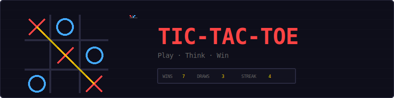
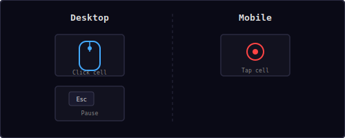
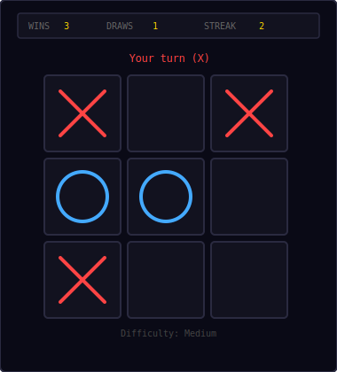
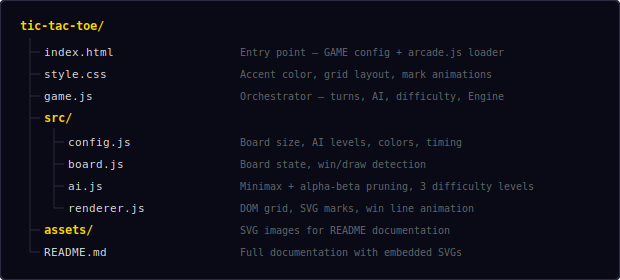
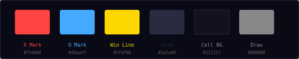
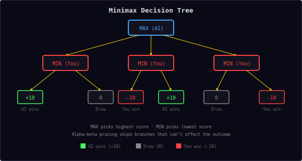
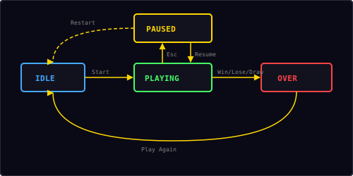

<p align="center">
  
</p>

<p align="center">
  A classic Tic-Tac-Toe game built with vanilla JavaScript and DOM elements.<br/>
  Play as X against an AI opponent with three difficulty levels.
</p>

---

## ▶ Controls

<p align="center">
  
</p>

| Action | Desktop | Mobile |
|--------|---------|--------|
| Place mark | Click cell | Tap cell |
| Pause / Restart | `Esc` / `P` | — |

Click or tap any empty cell to place your X. The AI responds with O. Press `Esc` or `P` to pause — the overlay includes Resume and Restart buttons.

---

## 🎮 Gameplay

<p align="center">
  
</p>

**Rules:**
- 3×3 grid — you are **X**, the AI is **O**
- You always go first
- Get three in a row (horizontal, vertical, or diagonal) to win
- If all 9 cells are filled with no winner, it's a draw
- Choose from three AI difficulty levels before each game
- Win streak is tracked — consecutive wins without a loss
- High score (best streak) is saved locally in your browser

---

## 🤖 AI Difficulty Levels

| Level | Strategy | Description |
|-------|----------|-------------|
| **Easy** | Random | Picks any empty cell at random |
| **Medium** | Tactical | Blocks your wins, takes its own wins, prefers center |
| **Hard** | Minimax | Full minimax with alpha-beta pruning — unbeatable |

Choose difficulty at the start of each game. Medium is selected by default.

---

## 📁 Project Structure

<p align="center">
  
</p>

---

## 🎨 Color Palette

<p align="center">
  
</p>

All colors are defined in `src/config.js`. Change them there to reskin the entire game.

---

## 🧠 Minimax Algorithm

<p align="center">
  
</p>

The Hard AI uses the **minimax algorithm** with **alpha-beta pruning** to play optimally:

1. The AI simulates every possible move recursively
2. At each level, it alternates between maximizing (AI's turn) and minimizing (player's turn)
3. Terminal states are scored: **+10** for AI win, **-10** for player win, **0** for draw
4. Depth is subtracted from the score so the AI prefers faster wins and delays losses
5. Alpha-beta pruning skips branches that can't change the outcome, reducing computation

```
score(AI wins)  = 10 - depth    // prefer faster wins
score(You win)  = depth - 10    // delay losses
score(draw)     = 0
```

**Alpha-beta pruning** maintains two values:
- **α (alpha)**: best score the maximizer can guarantee
- **β (beta)**: best score the minimizer can guarantee
- When β ≤ α, the remaining branches are pruned (they can't affect the result)

On a 3×3 board, minimax explores at most 9! = 362,880 positions without pruning. With alpha-beta pruning, this drops significantly — typically examining only a few hundred nodes.

---

## 🏆 Win Detection

The board checks 8 possible winning lines:

| Type | Patterns |
|------|----------|
| Rows | `[0,1,2]` `[3,4,5]` `[6,7,8]` |
| Columns | `[0,3,6]` `[1,4,7]` `[2,5,8]` |
| Diagonals | `[0,4,8]` `[2,4,6]` |

A win is detected when all three cells in any pattern contain the same mark. A draw occurs when all 9 cells are filled and no winning pattern exists.

---

## 🔄 State Machine

<p align="center">
  
</p>

| State | What happens |
|-------|-------------|
| **Idle** | Difficulty selection overlay, waiting for player |
| **Playing** | Board active, alternating turns between player and AI |
| **Paused** | Board frozen, pause overlay with Resume + Restart |
| **Over** | Result screen (win/lose/draw) with score, "Play Again" button |

This is a DOM game — it uses `Engine.create()` without a canvas option to get the shared state machine, pause/resume, restart, and overlay management.

---

## 🔊 Sound & Effects

All sounds are synthesized in real-time using the Web Audio API — no audio files needed.

| Event | Sound | Preset |
|-------|-------|--------|
| Place mark (X or O) | Short click blip | `click` |
| Player wins | Ascending two-note | `score` |
| Draw | Low buzz | `error` |
| AI wins | Descending three-note | `gameover` |

---

## 🛠 Customization

All tweaks happen in `src/config.js`:

**Change AI delay:**
```js
aiDelay: 0.8,            // slower AI (more dramatic)
```

**Change colors:**
```js
xColor: '#ff66aa',       // pink X marks
oColor: '#44ffdd',       // cyan O marks
winLineColor: '#44ff66', // green win line
```

**Change mark style:**
```js
markStroke: 6,            // thicker marks
markPadding: 12,          // marks fill more of the cell
```

**Change cell sizing:**
```js
cellSize: 120,            // larger cells
cellGap: 12,              // wider gaps
cellRadius: 8,            // rounder corners
```

---

## 🧩 Shared Modules Used

| Module | What Tic-Tac-Toe uses it for |
|--------|------------------------------|
| `Engine` | State machine, pause/resume/restart (no canvas) |
| `Input` | Keyboard for pause (`Esc`/`P`) |
| `Shell` | HUD stats (wins, draws, streak), overlay screens |
| `Audio8` | Click, win, draw, and game over sounds |
| `utils.js` | `saveHighScore()`, `loadHighScore()` |

Note: Tic-Tac-Toe is a **DOM game** — it uses `Engine.create()` without the `canvas` option. The board is built with plain DOM elements and SVG marks. Click handlers are attached directly to cell elements.

---

<p align="center">
  <sub>Part of the <a href="../README.md">Mini Arcade</a> collection · MIT License</sub>
</p>
