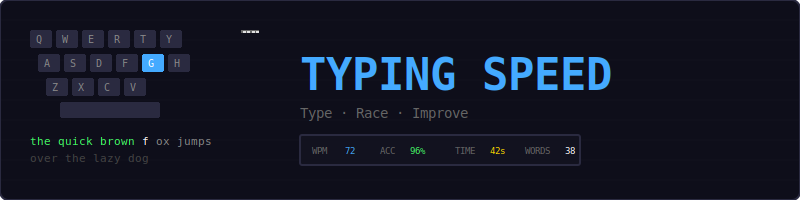
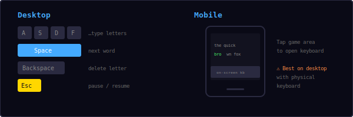
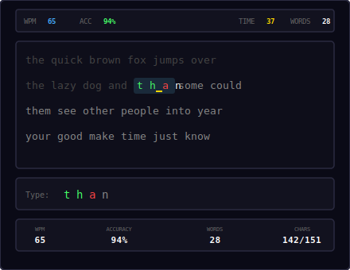
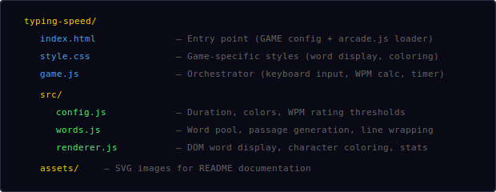
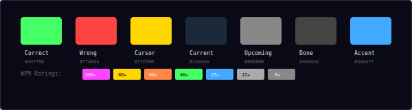
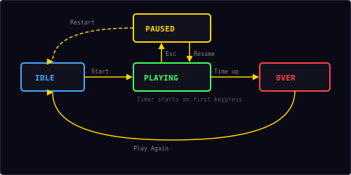

<p align="center">
  
</p>

<p align="center">
  A 60-second typing test built with vanilla JavaScript and DOM rendering.<br/>
  Type words as fast as you can — track your WPM, accuracy, and beat your best.
</p>

---

## ▶ Controls

<p align="center">
  
</p>

| Action | Desktop | Mobile |
|--------|---------|--------|
| Type letters | Keyboard | On-screen keyboard |
| Next word | `Space` | Space on keyboard |
| Delete letter | `Backspace` | Backspace |
| Pause / Resume | `Esc` | — |

> **Note:** This game is designed for desktop with a physical keyboard. Mobile works via the on-screen keyboard but the experience is limited.

---

## 🎮 Gameplay

<p align="center">
  
</p>

**Rules:**
- A passage of random common English words is displayed
- You have **60 seconds** to type as many words as possible
- The current word is highlighted — type it character by character
- **Green** characters are correct, **red** characters are wrong
- Words advance automatically when you type the last letter correctly, or press `Space`
- The timer starts on your **first keypress** — take your time to read before starting
- WPM and accuracy are calculated in real-time and shown in the HUD
- At the end, your final WPM, accuracy, and word count are displayed
- Best WPM is saved locally in your browser

---

## 📁 Project Structure

<p align="center">
  
</p>

---

## 🎨 Color Palette

<p align="center">
  
</p>

All colors are defined in `src/config.js`. Change them there to reskin the entire game.

---

## ⌨ WPM Calculation

Words Per Minute uses the standard formula where **5 characters = 1 word**:

```
WPM = (correctCharacters / 5) / elapsedMinutes
```

| Typed correctly | Time elapsed | WPM |
|----------------|-------------|-----|
| 250 chars | 60s (1 min) | 50 |
| 375 chars | 60s (1 min) | 75 |
| 500 chars | 60s (1 min) | 100 |

This is the **net WPM** — only correctly typed characters count. Mistakes don't add to your score.

---

## 📊 Accuracy Calculation

Accuracy tracks the ratio of correct keystrokes to total keystrokes:

```
Accuracy = (correctCharacters / totalCharacters) × 100%
```

Every keypress counts — including wrong letters and spaces. Backspace doesn't reduce the total count, so accuracy reflects your true first-attempt precision.

---

## 🏆 WPM Ratings

| WPM | Rating | Color |
|-----|--------|-------|
| 100+ | Blazing! | `#ff44ff` |
| 80+ | Lightning! | `#ffd700` |
| 60+ | Fast! | `#ff8844` |
| 40+ | Good | `#44ff66` |
| 25+ | Average | `#44aaff` |
| 15+ | Slow | `#aaaaaa` |
| 0+ | Beginner | `#888888` |

---

## 🔄 State Machine

<p align="center">
  
</p>

The game has four states managed by the shared `Engine`:

| State | What happens |
|-------|-------------|
| **Idle** | Start screen overlay shown, waiting for player |
| **Playing** | Words displayed, keyboard input active, timer counting down |
| **Paused** | Timer paused, overlay shown with Resume + Restart options |
| **Over** | Final stats shown — WPM, accuracy, words typed |

The countdown timer starts on the **first keypress**, not when the game enters the Playing state. This gives the player time to read the first few words before the clock starts.

---

## 🔊 Sound & Effects

All sounds are synthesized in real-time using the Web Audio API — no audio files needed.

| Event | Sound |
|-------|-------|
| Correct keystroke | Short click blip (`click`) |
| Wrong keystroke | Low buzz (`error`) |
| Word completed | Rising two-note (`score`) |
| New best WPM | Ascending fanfare (`win`) |
| Time's up | Descending three-note (`gameover`) |

---

## 🛠 Customization

All tweaks happen in `src/config.js`:

**Change round duration:**
```js
roundDuration: 30,        // shorter test
```

**Change display:**
```js
linesVisible: 6,          // show more lines
lineWidthChars: 70,       // wider lines
```

**Change rating thresholds:**
```js
ratings: [
  { min: 120, label: 'Godlike!', color: '#ff00ff' },
  { min: 90,  label: 'Pro',      color: '#ffd700' },
  // ...
],
```

**Change colors:**
```js
textCorrect: '#00ff00',   // brighter green
textWrong:   '#ff0000',   // pure red
textCursor:  '#00ffff',   // cyan cursor
```

---

## 🧩 Shared Modules Used

| Module | What Typing Speed uses it for |
|--------|-------------------------------|
| `Engine` | State machine, pause/resume/restart, overlay management |
| `Input` | Esc key detection for pause (letter input via direct keydown) |
| `Audio8` | Keystroke, word complete, win, and game over sounds |
| `Timer` | 60-second countdown with pause/resume support |
| `Shell` | HUD stats (WPM, accuracy, time), overlay screens |
| `utils.js` | `saveHighScore()`, `loadHighScore()` |

---

<p align="center">
  <sub>Part of the <a href="../README.md">Mini Arcade</a> collection · MIT License</sub>
</p>
