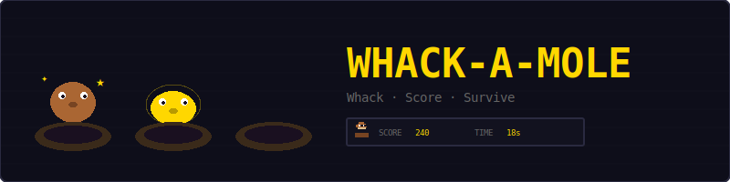
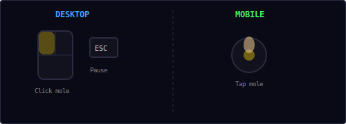
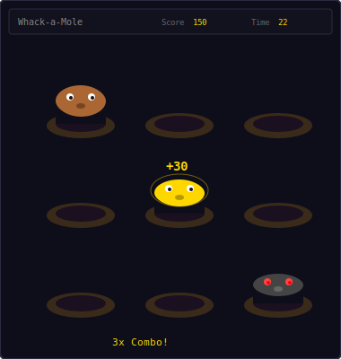
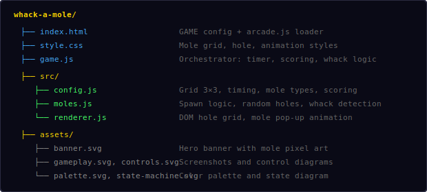
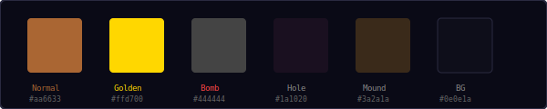
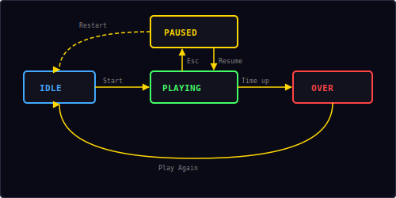

<p align="center">
  
</p>

<p align="center">
  A classic whack-a-mole game built with vanilla JavaScript and DOM elements.<br/>
  Tap moles as they pop up from holes, score points, beat the clock.
</p>

---

## ▶ Controls

<p align="center">
  
</p>

| Action | Desktop | Mobile |
|--------|---------|--------|
| Whack a mole | Click | Tap |
| Pause / Resume | `Esc` / `P` | — |
| Restart | Via pause menu | — |

Click or tap any mole that pops up from a hole. Press `Esc` or `P` to pause — the pause overlay includes Resume and Restart buttons.

---

## 🎮 Gameplay

<p align="center">
  
</p>

**Rules:**
- 9 holes arranged in a 3×3 grid
- Moles pop up randomly from holes for a limited time
- You have **30 seconds** to score as many points as possible
- Three mole types appear with different point values
- Moles get faster as time passes — difficulty ramps up throughout the round
- Chain quick hits for a **combo multiplier** (up to 5x)
- High score is saved locally in your browser

---

## 🐹 Mole Types

| Type | Color | Points | Spawn Chance | Description |
|------|-------|--------|-------------|-------------|
| **Normal** | Brown `#aa6633` | 10 | 75% | Standard mole — bread and butter |
| **Golden** | Gold `#ffd700` | 30 | 15% | Rare golden mole — triple points |
| **Bomb** | Dark `#444444` | -15 | 10% | Red-eyed bomb — lose points and combo |

---

## 📁 Project Structure

<p align="center">
  
</p>

---

## 🎨 Color Palette

<p align="center">
  
</p>

All colors are defined in `src/config.js`. Change them there to reskin the entire game.

---

## ⚡ Combo System

Chain quick hits within a **1.5-second window** to build combos:

| Combo | Multiplier | Example (Normal Mole) |
|-------|-----------|----------------------|
| 1 hit | 1.0× | 10 pts |
| 2 hits | 1.5× | 15 pts |
| 3 hits | 2.0× | 20 pts |
| 4 hits | 2.5× | 25 pts |
| 5 hits | 3.0× | 30 pts |

- Hitting a **bomb** resets your combo to zero
- Missing a mole (letting it escape) does not break your combo
- Golden moles also benefit from the combo multiplier

---

## 📈 Difficulty Ramp

As the round progresses, moles get faster:

```
adjustedTime = baseTime - elapsed × 0.02
minimum = baseTime × 0.3
```

| Elapsed | Mole Show Time | Spawn Interval |
|---------|---------------|----------------|
| 0s | 0.6–1.4s | 0.4–1.2s |
| 10s | 0.4–1.2s | 0.2–1.0s |
| 20s | 0.2–1.0s | 0.12–0.84s |
| 30s | 0.18–0.42s | 0.12–0.36s |

Up to **2 moles** can be active simultaneously. The game avoids spawning in the same hole twice in a row.

---

## 🔄 State Machine

<p align="center">
  
</p>

| State | What happens |
|-------|-------------|
| **Idle** | Start screen overlay shown, waiting for player |
| **Playing** | 30-second countdown, moles spawning, clicks active |
| **Paused** | Timer and animation stopped, pause overlay with Resume + Restart |
| **Over** | Time's up screen with score, "Play Again" button |

This is a DOM game — it uses `Engine.create()` without a canvas option to get the shared state machine, pause/resume, restart, and overlay management. `Timer.countdown()` handles the 30-second round timer. Press `Esc`/`P` to pause — the overlay shows Resume + Restart buttons, same as every other game.

---

## 🔊 Sound & Effects

All sounds are synthesized in real-time using the Web Audio API — no audio files needed.

| Event | Sound | Preset |
|-------|-------|--------|
| Whack normal mole | Ascending two-note blip | `score` |
| Whack golden mole | Four-note victory fanfare | `win` |
| Whack bomb | Low thud | `hit` |
| Countdown tick (≤5s) | Short tick | `tick` |
| Time's up | Descending three-note | `gameover` |

---

## 🛠 Customization

All tweaks happen in `src/config.js`:

**Change round duration:**
```js
roundDuration: 60,       // longer round
```

**Change difficulty:**
```js
moleShowMin: 0.8,        // moles stay longer
moleShowMax: 2.0,
spawnIntervalMin: 0.6,   // slower spawning
maxActiveMoles: 3,       // more moles at once
difficultyRamp: 0.01,    // gentler ramp
```

**Change scoring:**
```js
moleTypes: {
  normal: { points: 10, color: '#aa6633', chance: 0.80 },
  golden: { points: 50, color: '#ffd700', chance: 0.10 },
  bomb:   { points: -20, color: '#ff4444', chance: 0.10 },
},
comboWindow: 2.0,        // more time to chain
maxCombo: 10,            // higher combo ceiling
```

**Change grid size:**
```js
cols: 4,
rows: 3,                 // 4×3 = 12 holes
```

---

## 🧩 Shared Modules Used

| Module | What Whack-a-Mole uses it for |
|--------|-------------------------------|
| `Engine` | Game loop, state machine, pause/resume/restart (no canvas) |
| `Input` | Keyboard for pause (`Esc`/`P`) |
| `Shell` | HUD stats (score, time), overlay screens |
| `Audio8` | Whack, bomb, tick, and game over sounds |
| `Timer` | 30-second countdown with per-second tick callback |
| `utils.js` | `saveHighScore()`, `loadHighScore()` |

Note: Whack-a-Mole is a **DOM game** — it uses `Engine.create()` without the `canvas` option. The mole grid is built with plain DOM elements and CSS transitions for the pop-up animation. Click handlers are attached directly to hole elements.

---

<p align="center">
  <sub>Part of the <a href="../README.md">Mini Arcade</a> collection · MIT License</sub>
</p>
