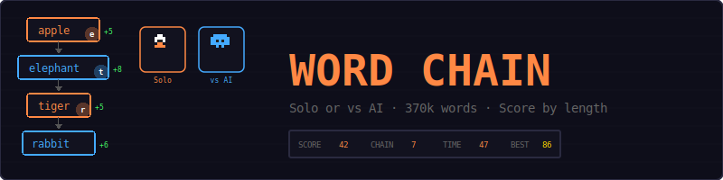
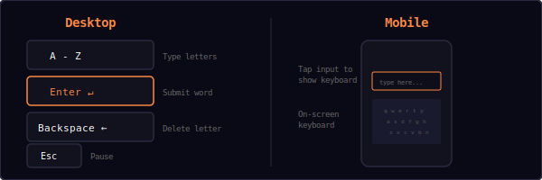
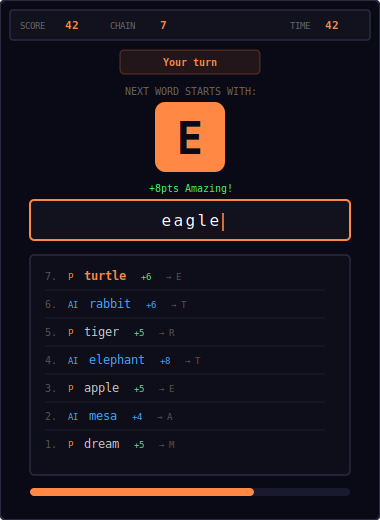
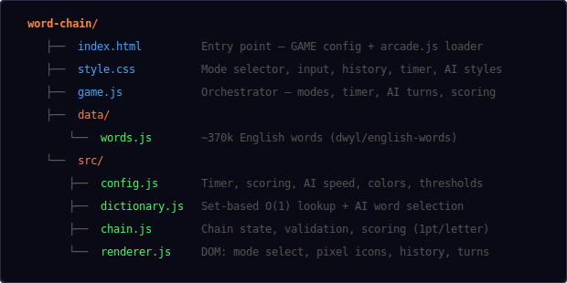
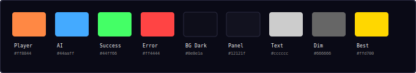
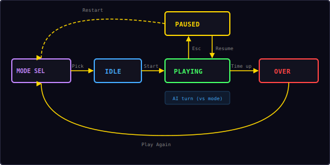

<p align="center">
  
</p>

<p align="center">
  A fast-paced word game where each word must start with the last letter of the previous one.<br/>
  Play solo against the clock or go head-to-head with an AI opponent. 370k-word dictionary.
</p>

---

## ▶ Controls

<p align="center">
  
</p>

| Action | Desktop | Mobile |
|--------|---------|--------|
| Type letters | `A` – `Z` | On-screen keyboard |
| Submit word | `Enter` | On-screen Enter |
| Delete letter | `Backspace` | On-screen Backspace |
| Pause | `Esc` | — |

---

## 🎮 Game Modes

### Solo Mode

Race against a 60-second countdown. Build the longest chain and highest score possible.

### vs AI Mode

Take turns with an AI opponent. You play a word, the AI responds instantly. The timer still runs — keep up the pace. If the AI can't find a valid word, you win.

---

## 🎮 Gameplay

<p align="center">
  
</p>

**Rules:**
- Choose Solo or vs AI mode before each game
- Type a word and press Enter to submit
- The first word can be anything valid
- Every subsequent word must **start with the last letter** of the previous word
- Words are validated against a **370,000-word English dictionary** (dwyl/english-words)
- Words cannot be reused within the same chain
- Minimum word length is 3 letters
- A 60-second countdown starts on your first word submission
- Each valid word adds **+2 seconds** to the timer
- Score = **1 point per letter** (longer words score more)
- In vs AI mode, player and AI alternate turns

**Scoring examples:**
| Word | Letters | Points |
|------|---------|--------|
| cat | 3 | +3 |
| tiger | 5 | +5 |
| elephant | 8 | +8 |
| extraordinary | 13 | +13 |

**Bonus messages** appear for long words:
- 7+ letters: "Great!"
- 9+ letters: "Amazing!"
- 11+ letters: "Incredible!"

**Example chain:**
```
dream → mesa → apple → elephant → tiger → rabbit → turtle → eagle → ...
```

---

## 📁 Project Structure

<p align="center">
  
</p>

---

## 🎨 Color Palette

<p align="center">
  
</p>

All colors are defined in `src/config.js`. The player color (orange) and AI color (blue) are used throughout the UI to distinguish turns.

---

## 🔗 Chain Mechanics

1. **First word** — any valid dictionary word
2. **Subsequent words** — must start with the last letter of the previous word
3. **Validation checks** (in order):
   - Minimum length (3+ letters)
   - In dictionary (370k English words, Set-based O(1) lookup)
   - Starts with the required letter
   - Not already used in this chain

**Bonus time formula:**
```
remaining_time = remaining_time + 2 seconds (per valid word)
```

**Error types:**
| Error | Message |
|-------|---------|
| Word too short | "Too short (min 3 letters)" |
| Not in dictionary | "Not in dictionary" |
| Wrong starting letter | "Must start with X" |
| Already used | "Already used" |

---

## 🤖 AI Opponent

In vs AI mode, the AI picks words from the same 370k dictionary:

- Responds in 100–300ms (near-instant)
- 30% chance of picking a longer word (7+ letters) to challenge you
- Uses random selection from all valid words starting with the required letter
- Excludes already-used words
- If no valid word exists for the required letter, the AI loses and you win

The AI uses the same `Dictionary.getRandomWord()` function with the per-letter word buckets built at startup.

---

## 🔄 State Machine

<p align="center">
  
</p>

| State | What happens |
|-------|-------------|
| **Mode Select** | Choose Solo or vs AI mode |
| **Idle** | Ready screen, waiting for player to start |
| **Playing** | Input active, timer running, turns alternating (vs mode) |
| **Paused** | Timer paused, overlay with Resume + Restart |
| **Over** | Final score shown — time ran out or AI stumped |

---

## 📖 Dictionary

The game uses the [dwyl/english-words](https://github.com/dwyl/english-words) word list (public domain), containing approximately 370,000 English words. The list is:

- Loaded as a JavaScript file (`data/words.js`) — no network requests needed
- Parsed into a `Set` for O(1) lookup at startup
- Also indexed by first letter for AI word selection
- Filtered to 3+ letter words matching `Config.minWordLength`

---

## 🔊 Sound & Effects

All sounds are synthesized in real-time using the Web Audio API — no audio files needed.

| Event | Sound |
|-------|-------|
| Type a letter | Short click blip |
| Valid word submitted | Rising score chime |
| Long word (6+ letters) | Ascending fanfare |
| Invalid word | Low error buzz |
| Time runs out | Descending game over |
| New best score | Win fanfare |
| AI plays a word | Click blip |
| AI stumped (you win) | Win fanfare |

---

## 🛠 Customization

All tweaks happen in `src/config.js`:

**Change timer duration:**
```js
timerDuration: 90,    // longer rounds
bonusTime: 3,         // more bonus per word
```

**Change difficulty:**
```js
minWordLength: 4,     // harder — no 3-letter words
```

**Change AI speed:**
```js
aiDelayMin: 50,       // near-instant
aiDelayMax: 150,
aiPreferLong: 0.5,    // AI picks long words more often
```

**Change colors:**
```js
accent:      '#44aaff',   // blue theme
playerColor: '#44aaff',
aiColor:     '#ff8844',
```

---

## 🧩 Shared Modules Used

| Module | What Word Chain uses it for |
|--------|-----------------------------|
| `Engine` | State machine, pause/resume/restart, overlay management |
| `Input` | Esc key detection for pause |
| `Audio8` | Click, score, error, clear, gameover, and win sounds |
| `Timer` | 60-second countdown with pause/resume |
| `Shell` | HUD stats (score, chain, time), overlay screens |
| `utils.js` | `saveHighScore()`, `loadHighScore()` |

---

<p align="center">
  <sub>Part of the <a href="../README.md">Mini Arcade</a> collection · MIT License</sub>
</p>
