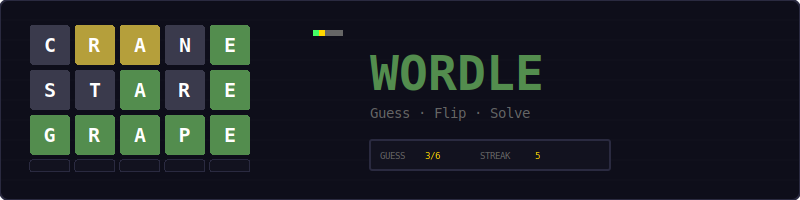
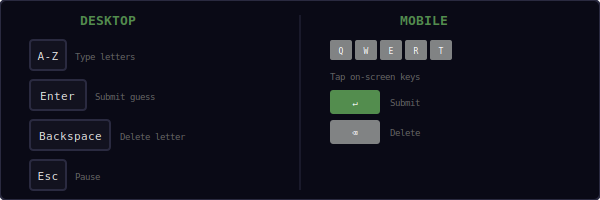
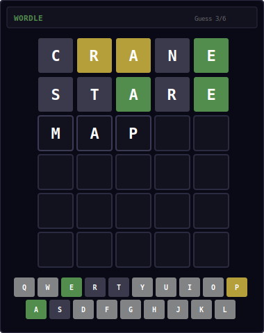
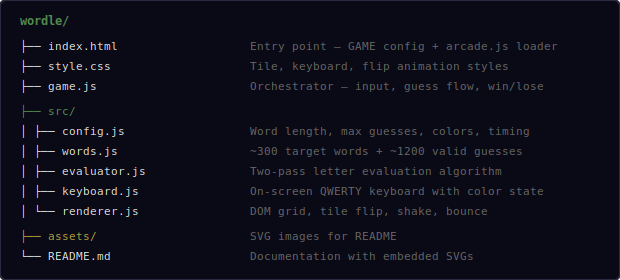
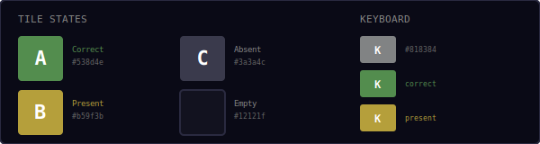
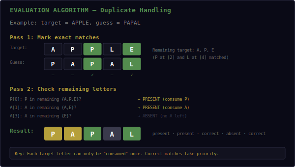
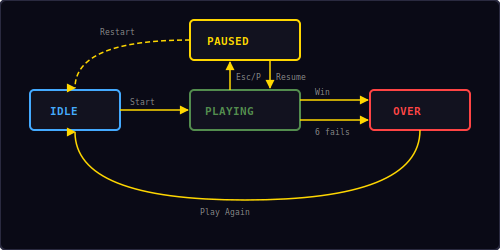

<p align="center">
  
</p>

<p align="center">
  A word-guessing game built with vanilla JavaScript and DOM manipulation.<br/>
  Guess the hidden 5-letter word in 6 tries with color-coded feedback.
</p>

---

## ▶ Controls

<p align="center">
  
</p>

| Action | Desktop | Mobile |
|--------|---------|--------|
| Type letter | `A`–`Z` keys | Tap on-screen keyboard |
| Submit guess | `Enter` | Tap ↵ key |
| Delete letter | `Backspace` | Tap ⌫ key |
| Pause | `Esc` / `P` | — |

> Both physical keyboard and on-screen keyboard work simultaneously on desktop.

---

## 🎮 Gameplay

<p align="center">
  
</p>

**Rules:**
- A random 5-letter word is chosen as the target
- You have **6 guesses** to find it
- Type a valid 5-letter word and press Enter to submit
- After each guess, tiles flip to reveal color-coded feedback:
  - 🟩 **Green** — letter is in the correct position
  - 🟨 **Yellow** — letter is in the word but wrong position
  - ⬛ **Gray** — letter is not in the word
- The on-screen keyboard updates to show which letters you've used and their best known state
- Keyboard colors only upgrade: green beats yellow beats gray
- Win by guessing the word within 6 tries
- A new random word is chosen each game
- Win streak is tracked and saved locally

---

## 📁 Project Structure

<p align="center">
  
</p>

---

## 🎨 Color Palette

<p align="center">
  
</p>

All colors are defined in `src/config.js`. The three tile states use distinct, accessible colors that work well on the dark background.

---

## 🔍 Evaluation Algorithm

<p align="center">
  
</p>

The evaluator uses a **two-pass algorithm** to correctly handle duplicate letters:

```
function evaluate(guess, target):
    // Count all letters in target
    counts = letterCounts(target)

    // Pass 1: Mark exact matches
    for i = 0 to 4:
        if guess[i] == target[i]:
            result[i] = CORRECT
            counts[guess[i]]--

    // Pass 2: Mark present or absent
    for i = 0 to 4:
        if result[i] is set: continue
        if counts[guess[i]] > 0:
            result[i] = PRESENT
            counts[guess[i]]--
        else:
            result[i] = ABSENT
```

**Why two passes?** A single pass would incorrectly mark letters as "present" before checking if they're actually "correct" later in the word. The two-pass approach ensures:

1. Exact matches always take priority
2. Each target letter is only "consumed" once
3. Duplicate guess letters are handled correctly — only as many are marked present/correct as actually exist in the target

**Example with duplicates:**

| Target | Guess | Result |
|--------|-------|--------|
| `APPLE` | `PAPAL` | present · present · correct · absent · correct |
| `HELLO` | `LLAMA` | absent · present · absent · absent · absent |
| `SPEED` | `GEESE` | absent · present · correct · absent · absent |

---

## 🔄 State Machine

<p align="center">
  
</p>

The game has four states managed by the shared `Engine`:

| State | What happens |
|-------|-------------|
| **Idle** | Start screen overlay shown, waiting for player |
| **Playing** | Grid visible, keyboard active, accepting input |
| **Paused** | Input frozen, pause overlay with Resume + Restart |
| **Over** | Win or lose screen with result and "Play Again" button |

---

## 🔊 Sound & Effects

All sounds are synthesized in real-time using the Web Audio API — no audio files needed.

| Event | Sound | Visual |
|-------|-------|--------|
| Type letter | Short click (`click`) | Tile pop animation |
| Submit guess | Move blip (`move`) | Sequential tile flip |
| Correct letter | Rising score (`score`) | Green tile reveal |
| Invalid word | Low buzz (`error`) | Row shake animation |
| Win | Ascending fanfare (`win`) | Row bounce animation |
| Game over | Descending notes (`gameover`) | Target word revealed |

---

## 📊 Word Lists

The game includes two word lists:

| List | Count | Purpose |
|------|-------|---------|
| Target words | ~300 | Common, well-known words used as puzzle answers |
| Valid guesses | ~1200 | Additional words accepted as valid guesses |

All words are lowercase 5-letter English words. The target word is picked randomly from the target list. A guess is accepted if it appears in either list (~1500 total valid words).

---

## 🛠 Customization

All tweaks happen in `src/config.js`:

**Change difficulty:**
```js
wordLength: 6,       // longer words (requires new word lists)
maxGuesses: 8,       // more attempts
```

**Change timing:**
```js
flipDelay: 0.2,      // faster tile reveals
flipDuration: 0.3,   // quicker flip animation
winDelay: 1.0,       // shorter win celebration
```

**Change colors:**
```js
tileCorrect: '#6aaa64',   // classic Wordle green
tilePresent: '#c9b458',   // classic Wordle yellow
tileAbsent:  '#787c7e',   // classic Wordle gray
```

---

## ⌨ Keyboard Color Priority

When a letter appears in multiple guesses, the keyboard key keeps the **best** state:

```
Priority: correct (3) > present (2) > absent (1) > default (0)
```

For example, if you guess "CRANE" and R is yellow, then guess "RIVER" and R is green in position 1, the R key upgrades from yellow to green and stays green.

---

## 🧩 Shared Modules Used

| Module | What Wordle uses it for |
|--------|------------------------|
| `Engine` | State machine, pause/resume/restart (no canvas) |
| `Input` | Physical keyboard detection, Esc/P for pause |
| `Audio8` | Click, move, score, error, win, gameover sounds |
| `Shell` | HUD stats, overlay screens |
| `utils.js` | `saveHighScore()`, `loadHighScore()` |

---

<p align="center">
  <sub>Part of the <a href="../README.md">Mini Arcade</a> collection · MIT License</sub>
</p>
